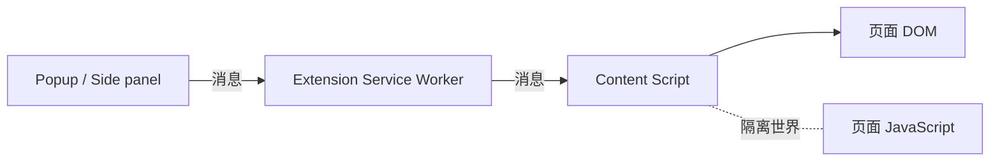

# Manifest V3 浏览器扩展架构

扩展要读取当前网页标题，并在弹窗中展示。Popup 无法直接访问页面 DOM，后台 Service Worker 也没有网页 DOM；真正运行在页面上下文旁边的是 Content Script。三个环境有不同权限和生命周期，需要通过消息连接。

最小链路是“点击扩展 -> 请求标题 -> 页面读取 -> 返回结果”，随后再加入最小权限、存储与后台休眠。示例以 Chromium Manifest V3 公共 API 为基础，其他浏览器差异要按目标平台核对。

## 四个常见运行环境



Popup 是短生命周期扩展页面；Service Worker 处理事件与跨页面协调，空闲后会被终止；Content Script 可访问 DOM，但与页面 JavaScript 处于隔离世界；注入 page script 才进入页面主世界，风险和通信成本更高。
## Manifest 权限的最小边界

只读取用户主动点击的当前页，可以考虑 `activeTab` 与 `scripting`，而不是申请所有网站的永久访问。需要长期匹配特定站点时，再使用精确 host permissions。权限文案会影响用户信任，也决定商店审核风险。

下面的 Content Script 只响应一个已知消息并返回页面标题。输入来自扩展消息，输出是短字符串；它不读取正文、不执行任意选择器，也不把页面内容上传。

```ts
chrome.runtime.onMessage.addListener((message, _sender, sendResponse) => {
  if (message?.type !== 'page.read-title') return

  sendResponse({
    type: 'page.title-result',
    title: document.title.slice(0, 200)
  })
})
```

消息到达时先检查 `message.type`，不匹配就返回，让其他监听器继续处理；匹配后从当前页面读取 `document.title`，用 `slice(0, 200)` 限制返回长度，再通过 `sendResponse` 返回固定类型。

输入是扩展内部消息，输出是 `{ type, title }`，异常时应通过 `chrome.runtime.lastError` 或明确错误消息通知调用方。消息处理器使用白名单类型并限制输出大小。真实扩展还要验证 sender、目标 tab 和错误状态，避免任何扩展页面都能触发高权限动作。## 扩展消息的安全契约

定义带版本的判别联合，校验输入和输出，不接受 `action + payload:any`。Content Script 传来的网页数据是不可信输入，即使消息来自自己的脚本，DOM 内容仍由网页控制。

Service Worker 只暴露明确能力，例如读取当前 Tab、写入受限存储或发起允许域名请求。远端响应、页面文本和文件都不能被当作代码执行。Manifest V3 限制远程托管代码，依赖应随扩展包发布并满足商店政策。
## Service Worker 的休眠与状态恢复

后台不应依赖内存变量长期存在。需要恢复的状态写入 `chrome.storage` 或其他合适存储；Timer 与长连接也不具备永久调度保证。事件处理尽快完成，异步响应按 API 要求保持通道或返回 Promise。

状态分为：Popup 局部 UI、Tab 级临时状态、扩展持久设置和可重建缓存。敏感 Token 尽量避免存储；确需认证时缩小权限、生命周期和暴露面，不把凭证发送给 Content Script。
## 页面导航与内容脚本失效

Tab 会刷新、导航和销毁，Content Script 可能尚未注入。Popup 请求失败时展示可操作状态，例如“当前页面不支持”或重新注入，而不是无限重试。SPA 内部导航可能改变 DOM，需要按目标场景监听可靠事件，不用高频全页面扫描。

| 场景 | 预期 |
| --- | --- |
| 用户在允许页面点击扩展 | 返回受限标题 |
| 系统页或未授权页面 | 明确不支持，不扩大权限 |
| Content Script 未就绪 | 受控注入或提示重试 |
| 后台休眠后再唤醒 | 从持久状态恢复 |
| 页面返回恶意字符串 | 作为文本渲染，不使用 innerHTML |
| 扩展更新 | 消息与存储 Schema 有兼容迁移 |

测试覆盖权限安装提示、无权限页面、Worker 重启、多个 Tab、导航和扩展升级。使用打包后的扩展运行浏览器测试，确认 Manifest、CSP 和资源路径，而不是只测试普通网页组件。
## 跟踪一次“读取当前页标题”

用户点击扩展按钮后，页面 UI 请求 Service Worker 获取当前活动 Tab。Worker 校验消息类型和发送方，确认扩展拥有当前页的临时或声明权限，再向 Content Script 请求 `document.title`。Content Script 只返回标题字符串，不返回整页 HTML。

| 运行环境 | 能访问什么 | 生命周期特点 |
| --- | --- | --- |
| 扩展页面 | 扩展 API 与自己的 DOM | 页面关闭后销毁 |
| Service Worker | 事件、权限和网络协调 | 空闲会休眠，无长期内存保证 |
| Content Script | 受限扩展 API、页面 DOM | 随页面导航变化 |
| 页面脚本 | 网站自身 JavaScript 世界 | 不可信，无法直接获得扩展权限 |

消息契约包含类型、版本、最小数据和稳定错误。每个接收端验证 `sender`、目标 Tab 和权限，不能把来自页面的任意 URL 交给高权限网络请求。需要与页面世界交换数据时，显式序列化并再次校验。

在浏览器里测试普通页面、无权限页面、导航后旧消息、Worker 休眠后首次调用和权限撤销。持久状态放 `chrome.storage` 或服务端，不能依赖 Worker 全局变量。权限从 `activeTab` 等最小能力开始，只有功能确实需要时再请求更广 Host Permission。
