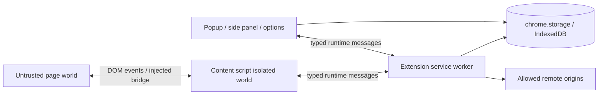
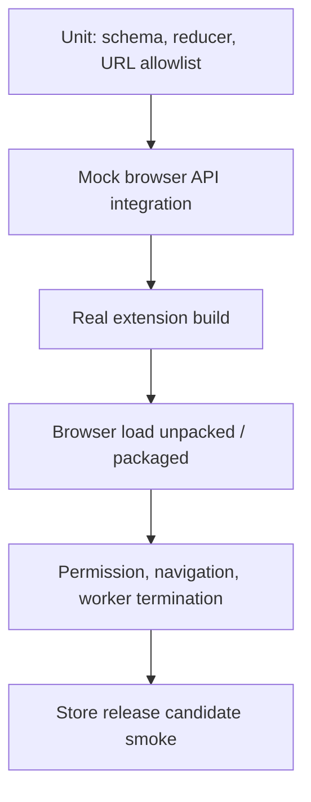

# Manifest V3 浏览器扩展架构

浏览器扩展不是一个带 popup 的普通 SPA。它同时运行在扩展页面、Content Script、页面世界和事件驱动 Service Worker 中，每个上下文拥有不同 Origin、DOM 能力、网络权限和生命周期。架构的首要问题是“哪段代码被允许看到什么、消息能否被伪造、Worker 被终止后状态如何恢复”，而不是先选择 React 状态库。

Manifest V3 将后台页改为 Service Worker，并强化远程代码与权限约束。Worker 可以在事件结束后随时终止，全局变量、Timer 和打开的连接都不是持久事实。一个只在内存 Map 保存任务、Token 或页面快照的扩展，会在浏览器回收 Worker 后随机失效。

## 四个执行上下文



| 上下文 | 能做什么 | 主要风险 |
| --- | --- | --- |
| 页面世界 | 访问页面 JS 对象与 DOM | 完全不可信，可伪造事件和污染原型 |
| Content Script | 访问页面 DOM、扩展 runtime | DOM 内容不可信；权限不应过大 |
| Service Worker | 协调权限、网络、事件 | 短生命周期、重入、并发消息 |
| Extension UI | 可信扩展页面和用户交互 | XSS 会获得扩展权限；状态可能过期 |

Content Script 通常处在 isolated world，JavaScript 全局与页面隔离，但共享 DOM。隔离不等于 DOM 可信：页面可以构造任意节点、属性、文本和 Mutation，Content Script 解析结果必须视为外部输入。

若必须读取页面 JS 变量，需要注入桥到 MAIN world，再通过 DOM event/postMessage 等通道通信。所有来自桥的数据都可被页面伪造，必须带严格 Schema、来源检查和能力限制，绝不能把通用“执行任意扩展命令”暴露给页面。

## 权限是可审计能力集合

`permissions` 控制 tabs、storage、scripting 等扩展 API，`host_permissions` 控制页面/网络 Origin。最小权限意味着初装只申请核心能力，可选站点在用户触发功能时用 optional permission 请求。

```json
{
  "manifest_version": 3,
  "name": "Example Assistant",
  "version": "1.0.0",
  "permissions": ["storage", "scripting"],
  "optional_host_permissions": ["https://*.example.org/*"],
  "background": { "service_worker": "background.js", "type": "module" },
  "action": { "default_popup": "popup.html" },
  "content_security_policy": {
    "extension_pages": "script-src 'self'; object-src 'self'"
  }
}
```

示例域名是中性占位。生产配置按明确 Origin 列表生成，不能默认 `<all_urls>`。activeTab 适合用户点击后临时访问当前标签，但能力和持续时间有边界；不能用它假设任意后台页面都可访问。

权限请求要解释当前动作需要什么，而非营销话术。拒绝后功能降级，不能重复骚扰。权限变化事件会让既有任务失去能力，执行前和恢复时都重新检查。

## 消息协议必须版本化和验证

`chrome.runtime.sendMessage({ type: 'scan' })` 看似简单，但对象来自哪个上下文、字段是否完整、响应如何关联、取消和超时如何表达都需要协议。

```ts
type RequestMessage =
  | { version: 1; type: 'CAPTURE_PAGE'; requestId: string; tabId: number }
  | { version: 1; type: 'GET_TASK'; requestId: string; taskId: string }
  | { version: 1; type: 'CANCEL_TASK'; requestId: string; taskId: string }

type ResponseMessage =
  | { version: 1; requestId: string; ok: true; result: unknown }
  | { version: 1; requestId: string; ok: false; error: 'FORBIDDEN' | 'INVALID' | 'UNAVAILABLE' }

function isRequestMessage(value: unknown): value is RequestMessage {
  return RequestMessageSchema.safeParse(value).success
}
```

接收端先校验 Schema，再验证 `sender.id`、tab/frame、允许 Origin 和当前权限。消息 type 不能直接映射任意函数名，使用显式 handler registry。页面能够影响 Content Script 发出的数据，因此 Worker 不因 sender 是自己的 Content Script 就信任 payload。

异步 `onMessage` 的响应生命周期随 API 版本与浏览器实现有细节，按目标浏览器文档实现并测试 Promise/return true 语义。所有请求有超时、requestId 和幂等键；端口断开不代表业务任务失败。

## Service Worker 设计成可恢复事件处理器

Worker 的正确心智模型是：收到事件，读取持久状态，执行有限工作，原子写入新状态，结束。不要依赖顶层：

```ts
// 错误：Worker 重启后丢失，多个事件还可能并发修改。
const taskProgress = new Map<string, number>()
```

持久任务保存到 IndexedDB 或服务器，storage 只放适合的数据：

```ts
type ExtensionTask = {
  id: string
  status: 'queued' | 'running' | 'succeeded' | 'failed' | 'cancelled'
  version: number
  createdAt: number
  updatedAt: number
  resultRef?: string
  errorCode?: string
}
```

恢复时扫描非终态任务，基于幂等协议查询服务端或重新排队。每次转换使用 expected version，避免两个事件覆盖。Alarm 可以安排延后工作，但不保证精确时间；事件未发生时 Worker 不应靠 setInterval 常驻。

长连接、流式响应和大任务受 Worker 生命周期影响。可将持久事实放服务端/IndexedDB，UI 打开时查询快照并订阅；对必须保持的特殊场景按平台提供的 offscreen document 等能力评估，但不能把它当通用后台页替代，且权限/生命周期仍需治理。

## 数据采集先缩小页面信息

Content Script 不应把 `document.documentElement.outerHTML` 整页上传。先在页面本地提取允许字段：标题、用户明确选择区域、结构化元数据或受控可见文本；移除 input value、隐藏内容、脚本、Token 和无关 DOM。用户需要预览并确认高敏感发送。

```ts
interface PageExcerpt {
  title: string
  canonicalUrl?: string
  sections: readonly {
    heading: string
    text: string
  }[]
}

function collectExcerpt(root: Element): PageExcerpt {
  const clone = root.cloneNode(true) as Element
  clone.querySelectorAll('script, style, input, textarea, [contenteditable]').forEach((node) => node.remove())
  return PageExcerptSchema.parse(extractVisibleSections(clone))
}
```

clone 只是第一层示意。真实提取还要限制总字符、节点数、URL 协议，处理 shadow DOM/iframe 边界，不读取跨 Origin frame。页面内容视为提示注入/不可信文本，若交给 AI，只作为引用数据，不能解释为扩展命令。

采集规则按 Origin 和版本管理，默认拒绝未知页面。不要用用户不可见的隐藏层覆盖页面或绕过站点安全。涉及登录、支付、医疗等敏感页面应默认排除。

## DOM 变化与性能

MutationObserver 可以发现 SPA 导航和内容变化，但监听整个 document subtree 后每次全量扫描会拖慢页面。观察最小容器，批量 mutation，按稳定特征定位，使用 Abort/cleanup 在路由或功能关闭时断开。

```ts
function observeContainer(
  container: Element,
  onDirty: () => void
): () => void {
  let queued = false
  const observer = new MutationObserver(() => {
    if (queued) return
    queued = true
    queueMicrotask(() => {
      queued = false
      onDirty()
    })
  })
  observer.observe(container, { childList: true, subtree: true, characterData: true })
  return () => observer.disconnect()
}
```

不要为每个节点挂监听器；事件委托并校验 target。所有注入 UI 使用 Shadow DOM 或命名空间时仍需测试页面 CSS、z-index、缩放和可访问性，避免遮挡站点操作。Content Script 失败不得破坏页面原功能。

## 存储按敏感度和生命周期分层

`chrome.storage.sync` 容量有限且可能同步到账户其他设备，适合小型非敏感偏好，不适合页面内容、Token 或任务大对象。`storage.local` 仍在设备长期存在；`storage.session` 生命周期较短但支持范围按平台确认；IndexedDB 适合结构化较大状态。

| 数据 | 推荐 | 约束 |
| --- | --- | --- |
| 主题/功能偏好 | sync/local | 白名单、版本迁移、无敏感值 |
| 临时连接票据 | 内存/session | 短期、单用途、可撤销 |
| OAuth refresh credential | 优先服务端/受控身份流 | 不暴露 Content Script，轮换与撤销 |
| 页面摘录 | 默认不持久或短期 local | 用户可见、删除、容量和保留期 |
| 任务状态 | IndexedDB/服务端 | 版本、幂等、恢复 |

扩展端“加密后保存”若密钥也在扩展代码/存储，不能抵御扩展执行上下文被攻破，只降低静态查看。高价值凭证应尽量不下发；认证使用浏览器身份/OAuth PKCE、短期访问令牌和服务器会话，避免把长期 Secret 烘进扩展包。

账号退出、权限撤销和扩展卸载需要清理。升级迁移必须可恢复：先复制/转换到新版本，验证成功后切换指针；不要启动时无事务地原地改大对象。

## 网络请求和认证

Service Worker 只向 allowlist Origin 请求，URL 由受控 base 和路径构造，不接受页面提供完整 URL，避免扩展权限成为 SSRF 代理。重定向后也验证最终 Origin，限制响应大小和内容类型。

Content Script 不读取页面 Cookie/Token用于扩展后端认证。扩展自己的登录流应绑定 state、PKCE、redirect URI 和账号；Access Token 短期，撤销后请求失败触发重新认证。日志和消息不能含 Authorization。

若使用 Cookie 会话，从扩展 Origin 发请求还要理解 SameSite、CORS/credentials 与 CSRF。更清晰的是短期 bearer + 后端严格 Origin/客户端身份，不过具体取决于威胁模型。无论方式，服务端执行认证、授权、限流与审计，不能信任扩展客户端“高级权限”字段。

## CSP 与远程代码

Manifest V3 扩展页面 CSP 限制脚本来源，远程托管 JavaScript、`eval` 和运行时下载执行代码通常不允许且破坏商店审核边界。所有可执行代码随扩展包发布；远程配置只能是经过 Schema 验证的数据，不能包含表达式、HTML/JS 模板或任意规则代码。

扩展 UI 不用 `innerHTML` 渲染页面内容；富文本用严格 Sanitizer 和 URL allowlist。React/Vue 默认文本转义仍不能保护 `dangerouslySetInnerHTML/v-html`。第三方依赖拥有扩展权限，锁版本、审计 install script、生成 SBOM，构建从干净环境完成。

Web Accessible Resources 让页面可读取扩展资源，按资源和匹配 Origin 最小声明。不要把配置、Source Map、内部数据或通用桥脚本全部暴露。

## 多标签页、Frame 与导航竞态

tabId 可能被复用，Frame 有 frameId/documentId，页面导航后旧 Content Script/消息仍可能返回。任务应绑定 tab + document identity + captured URL/Origin + sequence；提交前确认仍对应同一文档。仅靠 tabId 会把旧页面结果显示到新页面。

同一标签多个 iframe 可能都注入 Content Script。接收端根据 frame 和 top-frame 策略去重，跨 Origin frame 不越权读取。页面进入 bfcache、冻结或恢复时，连接和 observer 生命周期需要测试。

## UI 状态不等于后台事实

Popup 随关闭销毁，不能承载长任务。Side Panel 虽更持久，也不应成为唯一状态源。UI 打开时：

1. 读取当前 tab/document；
2. 向 Worker 请求持久任务快照；
3. 订阅增量事件，带 sequence；
4. 断线重连后从最后 sequence 或重新取快照；
5. 关闭时只解除 UI 监听，不取消业务，除非用户明确取消。

消息端口断开只说明显示通道消失，不把任务标 failed。Worker 与远程服务同样使用持久状态和幂等恢复。

## 构建与发布

Manifest 按 Chrome/Edge/Firefox 目标差异生成，但共享权限源。禁止构建时把本机路径、测试 Origin、密钥写入包。发布制品不可变、生成内容摘要和 SBOM；商店提交的 zip 就是验收过的那个制品，不重新构建。

版本升级要兼容存储 Schema、消息协议和服务端 API。浏览器可能保留旧版本一段时间，服务端支持窗口明确。撤回发布不能立即让所有客户端降级，危险 Feature 需要服务器 kill switch，但 kill switch 只能关闭受控能力，不能下发代码。

Source Map 私有上传并绑定扩展版本；包内不带 `.map`。错误事件只记录版本、上下文类型、受控 Origin 类别，不含页面 URL 查询和正文。

## 验证与故障演练



| 场景 | 操作 | 必须证明 |
| --- | --- | --- |
| Worker 终止 | 任务中强制停止后台再触发事件 | 从持久状态恢复，不重复副作用 |
| 权限拒绝/撤销 | 用户拒绝或运行中移除站点权限 | 功能降级、无循环请求、状态可解释 |
| 恶意页面 | 伪造 bridge 消息、巨大 DOM、脚本 URL | Schema/Origin/大小限制生效，不执行命令 |
| SPA 导航 | 同 tab 快速切两个页面 | 旧 document 结果不会提交到新页面 |
| 多 frame | 页面含同源/跨源 iframe | 只处理允许 frame，不重复 |
| 离线/429 | 网络失败和限流 | 有界重试，Worker 重启后预算仍存在 |
| 账号切换 | A 登出后 B 登录 | 缓存、任务和页面摘录不串账号 |
| CSP/包扫描 | 生产 zip 静态检查 | 无远程代码、eval、Secret、Source Map |

Playwright/目标浏览器自动化加载真实构建目录，检查 popup/side panel、权限请求、Content Script 注入、消息、Worker 重启和升级。单元 Mock 不能模拟真实生命周期。截图放临时目录，不把站点/用户数据放入仓库。

故意让任务只存 Map、移除 sender 验证、允许任意 URL、在 Content Script 中插入未清洗 HTML，确认测试或静态门禁失败。权限清单与代码 API 使用做差异检查：声明未使用权限告警，使用未声明权限构建失败。

## 常见误区

- **Content Script 与页面完全隔离所以可信**：共享 DOM，页面可控制输入；MAIN world bridge 更完全不可信。
- **Service Worker 是常驻后台进程**：它随时可终止，持久状态和恢复协议是必需的。
- **消息来自本扩展就无需校验**：页面能影响 Content Script payload，扩展页面也可能被 XSS。
- **存储在 chrome.storage 就安全**：它是持久介质，不自动加密、分账号或实现保留治理。
- **客户端扩展可以保护 API 权限**：包和消息都可被检查/篡改，最终授权只能在服务端。
- **远程配置可以下发任意规则**：配置必须是数据；远程可执行代码违反安全与商店边界。
- **tabId 唯一代表页面**：导航、frame 和 document identity 必须共同处理。

## 源码与规范

- [Chrome Extension Service Workers](https://developer.chrome.com/docs/extensions/develop/concepts/service-workers)：MV3 后台生命周期与事件驱动约束。
- [Chrome Extension message passing](https://developer.chrome.com/docs/extensions/develop/concepts/messaging)：Content Script、Service Worker 和页面之间的消息协议。
- [Chrome Extension permissions](https://developer.chrome.com/docs/extensions/develop/concepts/declare-permissions)：host permission、optional permission 与最小权限。
- 个人实验材料已匿名化；本文只抽取通用机制，不建立项目映射。
- [VSCode 插件开发](https://juejin.cn/post/7303451052598083622)：我的插件通信与发布实践，可用于对比不同宿主扩展模型。
