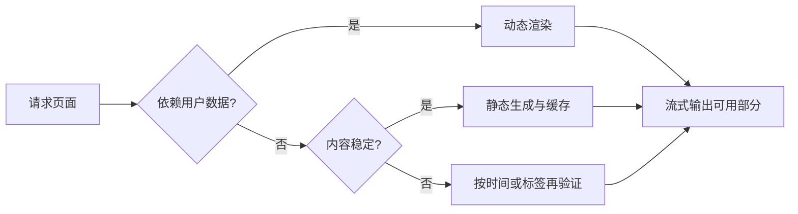

# Next.js 渲染、缓存与失效

Next.js 渲染是框架把 React 组件转换成 HTML、流式响应和客户端交互代码的过程；缓存则复用已经取得的数据或生成结果，减少重复请求和计算。两者位于页面组件与最终 HTTP 响应之间，用来平衡内容新鲜度、首屏速度和服务端成本。缓存不是一种单独模式，它可能作用于请求、数据、路由片段或完整页面。

产品介绍页一天更新一次，登录后的订单页则每次请求都不同。若两页使用同一缓存策略，前者浪费服务端计算，后者可能把旧数据甚至别人的数据返回给用户。

渲染和缓存策略由页面新鲜度与用户范围决定。Next.js 缓存行为随大版本和 Router 演进，实际项目要以当前版本文档和构建输出为准。

## 渲染与缓存的四项决策

1. 页面是否包含用户私有数据？
2. 数据多久变化，允许多旧？
3. 更新由请求触发、定时触发还是发布触发？
4. 页面失败时能否展示旧版本或局部 fallback？


## 静态渲染与动态渲染的选择

静态生成在构建或再验证时生成 HTML，适合公开、变化较慢的内容。动态渲染在请求时计算，适合 Cookie、认证和实时数据。流式渲染让不依赖慢数据的部分先发送，Suspense 边界显示局部 fallback。

不要把“SSR 更利于 SEO”当统一答案。公开主要内容能稳定出现在初始 HTML、状态码正确、链接可发现才是目标；静态与服务端渲染都可以做到。
## 数据、页面与请求缓存

浏览器缓存、CDN/全路由输出、服务端数据请求和客户端 Router Cache 不是同一层。命中一层不代表其他层也新鲜。用户私有响应需要正确的缓存范围，不能进入公共共享缓存。

在 App Router 中，数据获取和缓存 API 会随版本变化。使用 `fetch` 选项、revalidate、标签或框架提供的缓存函数时，记录当前 Next.js 版本，并用构建日志和实际请求头验证，不从旧教程推断默认值。
## 基于业务事件的缓存失效

内容系统发布文章后，可以按路径或内容标签失效相关页面。标签适合一份数据被多个页面消费；路径适合明确页面。失效只表示缓存需要重新生成，不保证下一个请求一定成功，因此要定义旧内容可否继续服务和失败观测。

缓存键包含影响结果的语言、地区、权限或查询参数。把 Cookie 私有内容放入缺少用户维度的自定义缓存，会造成跨用户泄露。

下面是概念性的 Server Component 示例。输入是公开文章 ID，预期数据可按文章标签失效。具体 API 选项应根据项目锁定的 Next.js 版本核对。

```tsx
export default async function ArticlePage({ params }: PageProps) {
  const article = await fetch(`${contentOrigin}/articles/${params.id}`, {
    next: { revalidate: 3600, tags: [`article:${params.id}`] }
  }).then(response => {
    if (!response.ok) throw new Error('ARTICLE_LOAD_FAILED')
    return response.json() as Promise<Article>
  })

  return <ArticleView article={article} />
}
```

代码先检查 HTTP 状态，再解析公开数据；缓存一小时并允许发布动作按标签失效。执行顺序是 `params.id` 组成请求地址，`fetch` 取得响应，`response.ok` 把 4xx/5xx 转成明确异常，`response.json()` 产生 `Article`，最后 `ArticleView` 负责渲染。输入是公开文章 ID，输出是页面组件；

数据源 404 时会进入错误边界，标签失效只会让下一次请求重新取数，并不替代数据库事务。它不适合带用户 Cookie 的私有订单，也没有包含实际鉴权和错误页面。## 请求记忆与客户端导航

同一次服务端渲染中的重复读取可能被框架或 React 去重，但这与跨请求持久缓存不同。客户端导航还可能复用之前获取的路由结果。调试“为什么还是旧数据”时，要逐层检查数据源、服务端缓存、CDN、浏览器和 Router。

Server Action 或 Route Handler 修改数据后，明确更新数据库、失效相关缓存并返回结果。缓存失效不是事务；数据库提交成功而失效失败时，需要可重试事件或短 TTL 限制陈旧窗口。
## 正常结果和失败结果

公开文章在缓存期内复用，发布后相关标签失效；用户订单每次按可信身份查询，不进入公共缓存；慢推荐模块可以在 Suspense 边界内晚到。数据源 404 应成为真实 Not Found，不把错误页缓存成正常文章。

验证至少包含首次请求、第二次命中、失效后请求、两个不同用户、数据源失败和客户端导航。观察最终 HTML、响应头、构建输出和服务端日志，避免只看页面肉眼变化。
## 为四类页面填写渲染决策表

选择公开首页、帮助文章、商品库存和用户订单四类页面，分别填写是否含私有数据、允许陈旧多久、更新事件、失败时能否用旧内容。不要先写“全部 SSR”或“全部静态”，页面的数据性质才决定策略。

| 页面 | 合理起点 | 失效/新鲜度 |
| --- | --- | --- |
| 公开首页 | 静态或可再验证输出 | 发布事件或短周期 |
| 帮助文章 | 静态缓存 | 内容版本发布时按标签失效 |
| 库存展示 | 动态或短缓存 | 库存事件与保护性 TTL |
| 用户订单 | 按请求、按可信身份 | 不进入公共共享缓存 |

随后在开发和生产构建各请求两次，记录服务端日志、响应头和 HTML，确认真实命中行为。发布一条文章更新，触发标签失效，再观察下一个请求是否重建。用两个身份访问订单页，确保任何 CDN、框架缓存和自定义缓存都没有共享私有结果。

排查旧数据时从数据源向外走：数据库是否已更新、服务端数据缓存是否命中、全路由输出是否重建、CDN 是否仍缓存、浏览器和 Router 是否复用。Next.js 默认行为随版本变化，升级时把这组实验当回归，而不是沿用旧博客中的结论。
