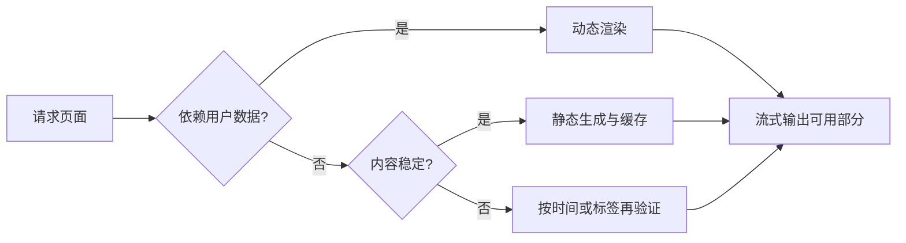

# Next.js 渲染与缓存

产品介绍页一天更新一次，登录后的订单页则每次请求都不同。若两页使用同一缓存策略，前者浪费服务端计算，后者可能把旧数据甚至别人的数据返回给用户。

本篇不背缓存名词，而是从页面新鲜度和用户范围选择渲染。Next.js 缓存行为随大版本和 Router 演进，实际项目要以当前版本文档和构建输出为准。

## 先回答四个问题

1. 页面是否包含用户私有数据？
2. 数据多久变化，允许多旧？
3. 更新由请求触发、定时触发还是发布触发？
4. 页面失败时能否展示旧版本或局部 fallback？



## 步骤一：静态和动态按数据决定

静态生成在构建或再验证时生成 HTML，适合公开、变化较慢的内容。动态渲染在请求时计算，适合 Cookie、认证和实时数据。流式渲染让不依赖慢数据的部分先发送，Suspense 边界显示局部 fallback。

不要把“SSR 更利于 SEO”当统一答案。公开主要内容能稳定出现在初始 HTML、状态码正确、链接可发现才是目标；静态与服务端渲染都可以做到。

## 步骤二：明确缓存对象

浏览器缓存、CDN/全路由输出、服务端数据请求和客户端 Router Cache 不是同一层。命中一层不代表其他层也新鲜。用户私有响应需要正确的缓存范围，不能进入公共共享缓存。

在 App Router 中，数据获取和缓存 API 会随版本变化。使用 `fetch` 选项、revalidate、标签或框架提供的缓存函数时，记录当前 Next.js 版本，并用构建日志和实际请求头验证，不从旧教程推断默认值。

## 步骤三：按事件失效

内容系统发布文章后，可以按路径或内容标签失效相关页面。标签适合一份数据被多个页面消费；路径适合明确页面。失效只表示缓存需要重新生成，不保证下一个请求一定成功，因此要定义旧内容可否继续服务和失败观测。

缓存键包含影响结果的语言、地区、权限或查询参数。把 Cookie 私有内容放入缺少用户维度的自定义缓存，会造成跨用户泄露。

下面是概念性的 Server Component 示例。输入是公开文章 ID，预期数据可按文章标签失效。具体 API 选项应根据项目锁定的 Next.js 版本核对。

```tsx
export default async function ArticlePage({ params }: PageProps) {
  const article = await fetch(`${contentOrigin}/articles/${params.id}`, {
    next: { revalidate: 3600, tags: [`article:${params.id}`] }
  }).then(response => {
    if (!response.ok) throw new Error('ARTICLE_LOAD_FAILED')
    return response.json() as Promise<Article>
  })

  return <ArticleView article={article} />
}
```

代码先检查 HTTP 状态，再解析公开数据；缓存一小时并允许发布动作按标签失效。它不适合带用户 Cookie 的私有订单，也没有包含实际鉴权和错误页面。

## 步骤四：处理请求记忆与客户端导航

同一次服务端渲染中的重复读取可能被框架或 React 去重，但这与跨请求持久缓存不同。客户端导航还可能复用之前获取的路由结果。调试“为什么还是旧数据”时，要逐层检查数据源、服务端缓存、CDN、浏览器和 Router。

Server Action 或 Route Handler 修改数据后，明确更新数据库、失效相关缓存并返回结果。缓存失效不是事务；数据库提交成功而失效失败时，需要可重试事件或短 TTL 限制陈旧窗口。

## 正常结果和失败结果

公开文章在缓存期内复用，发布后相关标签失效；用户订单每次按可信身份查询，不进入公共缓存；慢推荐模块可以在 Suspense 边界内晚到。数据源 404 应成为真实 Not Found，不把错误页缓存成正常文章。

验证至少包含首次请求、第二次命中、失效后请求、两个不同用户、数据源失败和客户端导航。观察最终 HTML、响应头、构建输出和服务端日志，避免只看页面肉眼变化。

## 参考资料

- [Next.js Caching](https://nextjs.org/docs/app/guides/caching)
- [Next.js Rendering](https://nextjs.org/docs/app/building-your-application/rendering)
- [Next.js revalidateTag](https://nextjs.org/docs/app/api-reference/functions/revalidateTag)
- [React Suspense](https://react.dev/reference/react/Suspense)
