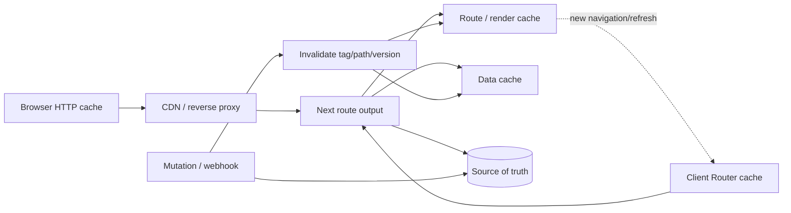
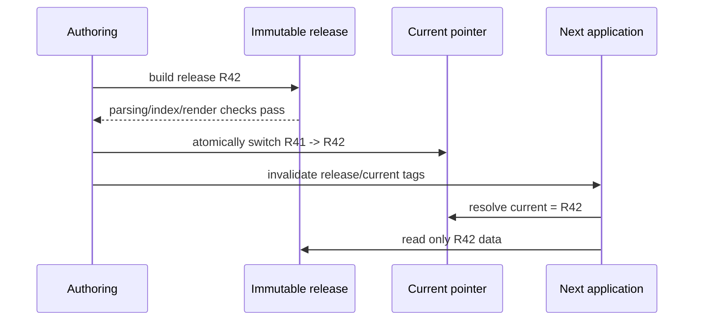

# Next.js 渲染与缓存

Next.js 缓存问题难，不是因为 API 名字多，而是同一次访问可能同时经过浏览器 HTTP 缓存、CDN、服务端路由输出、数据请求缓存、进程/平台缓存和客户端 Router 缓存。任何一层的缓存键、可见范围或失效时机不清楚，都可能出现“服务端已经更新，页面仍旧”“用户 A 看到用户 B 数据”或“调用了 revalidate 但当前标签页不变”。

本文以 App Router 的稳定概念为主。Next.js 的默认缓存行为和 API 会随大版本演进，实际工程必须用锁定版本官方文档和构建输出核对；不要把某篇旧教程中“fetch 默认永久缓存”或“所有页面默认动态”当作跨版本事实。

## 先画出所有状态副本



每一层都应回答四个问题：key 是什么、value 属于谁、多久算新鲜、谁能使它失效。

| 层 | 常见 key | 风险 | 验证方法 |
| --- | --- | --- | --- |
| Browser/CDN | URL、method、`Vary` 维度 | 私有响应被共享、旧 HTML 指向已删资产 | 响应头、Age、跨用户探针 |
| 路由输出 | pathname、params、渲染模式 | 动态用户状态被静态化 | 构建路由表、请求日志 |
| 数据缓存 | 请求与显式参数/标签 | 缓存键漏租户、权限或 locale | 数据访问 trace、变异测试 |
| React 请求级 memo | 一次 render 内函数参数 | 误以为跨请求持久 | 单请求调用计数 |
| Client Router | segment/RSC payload | 服务端失效后当前页面仍持有旧副本 | 导航、refresh、历史返回测试 |

缓存不是权限系统。即便缓存 key 包含用户 ID，读取源数据时仍要执行服务端授权；反之，如果缓存 key 不包含所有影响响应的安全维度，授权正确也可能把已授权用户 A 的结果复用给 B。

## 静态、动态与流式是不同决策轴

**静态渲染**表示输出可以在构建期或再验证时生成并复用，适合所有访问者共享且允许某种新鲜度窗口的内容。**动态渲染**表示每次请求需要根据 Cookie、Header、实时权限或明确动态数据计算。二者描述生成时机，不等同客户端是否有 JavaScript。

**Server Component / Client Component** 描述代码在哪个环境执行和交互边界。Server Component 可以参与静态或动态渲染；Client Component 仍可由服务器预渲染初始 HTML，随后 hydration。把 `'use client'` 理解成“只在浏览器渲染”会导致错误架构。

**Streaming** 描述响应是否按就绪边界逐步发送。它可以改善慢子树下的首屏与进度体验，但不会减少后端工作，也不能修复 waterfall。若父 Server Component 先等待所有数据再渲染，子 Suspense 根本没有机会提前流出。

```tsx
export default function Page({ params }: { params: Promise<{ id: string }> }) {
  return (
    <main>
      <RecordHeader params={params} />
      <Suspense fallback={<RelatedSkeleton />}>
        <RelatedRecords params={params} />
      </Suspense>
    </main>
  )
}
```

边界应对应可独立失败和就绪的 UI 区域。把每行都包 Suspense 会造成视觉跳动和大量边界成本；把整页包一个边界又失去渐进呈现。

## 数据读取先定义新鲜度

不要从 `cache: 'force-cache'` 或 `revalidate: 60` 开始。先按数据语义分类：

- 发布内容：按版本发布，可接受分钟级窗口，可由 tag 失效；
- 用户会话与权限：每请求验证，不进入共享缓存；
- 高频计数：可以短 TTL，但展示需标注时间，写入后不承诺强一致；
- 配置字典：版本化、长缓存，部署或配置发布时失效；
- 搜索结果：key 包含规范化查询、索引版本、租户和权限范围；
- 一次 render 重复读取：只需请求级去重，不代表跨请求缓存。

```ts
type CachePolicy =
  | { kind: 'request-only' }
  | { kind: 'shared'; ttlSeconds: number; tags: readonly string[] }
  | { kind: 'versioned'; version: string }

async function loadPublishedRecord(
  recordId: string,
  release: string
): Promise<PublishedRecord> {
  const response = await fetch(
    `${publicApiBase}/releases/${encodeURIComponent(release)}/records/${encodeURIComponent(recordId)}`,
    {
      next: {
        revalidate: 300,
        tags: [`release:${release}`, `record:${recordId}`]
      }
    }
  )
  if (!response.ok) throw new Error(`record fetch failed: ${response.status}`)
  return PublishedRecordSchema.parse(await response.json())
}
```

示例只适合所有读者共享的已发布数据。若记录可见性因用户或组织不同，就不能把它放进这个公共 URL/共享策略；改为每请求鉴权和范围过滤，或缓存经过严格分区的安全投影。Tag 不能含敏感值，也不能无限增长。

React 的请求级 memoization 主要避免同一次服务端 render 中相同数据函数重复执行，它的生命周期和持久 Data Cache 不同。不要因为一轮日志只出现一次 SQL，就宣称数据跨请求缓存。

## 缓存键必须覆盖所有响应变量

设响应函数为：

```text
response = f(path, locale, tenant, permissions, release, featureFlags, sourceVersion)
```

共享缓存 key 至少要覆盖所有会让响应不同且可安全分区的输入。遗漏 locale 会串语言；遗漏 Release 会把旧索引结果用于新发布；遗漏权限范围则是安全漏洞。并不是把所有 Cookie 拼入 key 就安全，那会造成高基数、泄露和缓存失效；更合理的是把私有响应标为不共享，或使用受控范围版本。

HTTP 层同样如此。`Vary: Accept-Encoding` 常见，按 Origin 返回 CORS 时还需要正确 `Vary: Origin`。带 Cookie 的个性化 HTML 不应由公共 CDN 缓存，除非平台提供经过验证的私有分区机制。

## 失效比写缓存更难

TTL 只保证“最多可能旧多久”，不保证写后立刻可见。对于内容发布，可采用版本指针：先构建不可变 Release，所有数据和页面引用该版本，完成验证后原子切换 current pointer。旧请求继续读旧 Release，新请求读新 Release，避免一半新一半旧。



按 path 失效适合页面语义，按 tag 失效适合同一实体影响多个页面。失效操作应在数据库写事务成功之后发生；若写回滚却先失效，只造成额外 miss，通常可恢复；若写成功但失效消息丢失，则会持续旧数据。可以用 Outbox 在同一事务记录 invalidation event，由可靠消费者执行并幂等重试。

失效不是删除权限的唯一手段。紧急撤权必须在每次受保护读取重新验证，不能等待 5 分钟 TTL。共享公开内容可延迟，安全边界不能。

## Server Action 与 Route Handler 的写入边界

服务端写操作需要验证身份、CSRF/Origin（取决于认证方式和框架机制）、输入 Schema、权限、幂等与审计。函数位于 Server 文件不等于天然安全；客户端能够触发的入口必须视为公开协议。

```ts
'use server'

export async function renameRecord(input: unknown): Promise<ActionResult> {
  const command = RenameRecordSchema.parse(input)
  const actor = await requireSession()

  await authorization.assertCanRename(actor, command.recordId)
  const result = await recordService.rename({
    actorId: actor.id,
    recordId: command.recordId,
    expectedVersion: command.expectedVersion,
    title: command.title,
    idempotencyKey: command.idempotencyKey
  })

  revalidateTag(`record:${command.recordId}`)
  return { ok: true, version: result.version }
}
```

更新应带 expected version 处理并发冲突，而不是“最后写入覆盖”。`revalidateTag` 只影响缓存，不替代数据库事务。成功返回前要明确缓存失效失败如何处理；关键链路可以走可靠事件而非把失效完全寄托在进程内调用。

## Client Router Cache 与当前页面

服务端缓存失效后，浏览器当前持有的 RSC Payload 或组件状态不会凭空消失。写操作完成后可能需要 `router.refresh()` 获取新的服务端结果，或使用 Server Action 与框架提供的刷新语义。refresh 也不是清空所有浏览器 HTTP 缓存，它触发当前路由的服务端重新获取并合并结果。

历史前进后退、prefetch 和长时间打开的标签页都要测试。用户在旧标签页提交基于旧版本的数据时，服务端用乐观锁返回 conflict，不能让客户端缓存掩盖并发。

预取可以减少导航延迟，但会消耗数据和服务资源。不要对超大列表所有链接无界预取；根据可见性、网络和意图限制，并确保预取响应不会产生副作用。

## Browser Cache 仍然遵循 HTTP 语义

Next.js 不能绕过浏览器缓存规则。带内容哈希的静态资产适合：

```http
Cache-Control: public, max-age=31536000, immutable
```

HTML/路由入口通常需要短缓存或协商验证，确保能指向当前制品。API 根据公开/私有语义选择 `public`、`private`、`no-cache` 或 `no-store`：

- `no-cache` 表示可存储但复用前必须验证，不等于“不缓存”；
- `no-store` 才是不应存储；
- `max-age` 控制浏览器新鲜度，`s-maxage` 可控制共享缓存；
- ETag/Last-Modified 提供验证器，但服务端必须正确比较资源版本；
- `stale-while-revalidate` 允许先用旧值后台刷新，不能用于要求立即一致的权限数据。

Service Worker 若拦截 Next 数据请求，还会再加一层状态副本。默认不要缓存 RSC/个性化响应；离线策略必须理解请求头、用户隔离和版本协议。

## 动态函数会影响渲染策略

读取 Cookie、Header、Search Params 或显式禁用缓存可能使路由/子树转为动态。具体传播规则随 Next 版本变化，应使用构建输出和官方 Route Segment 文档确认。工程上把动态读取集中在需要的边界，避免一个顶层 Layout 无意让大范围失去静态能力。

这不是为了追求“全静态”。认证后的工作台本来就应按请求生成；强行静态化再在客户端请求全部数据，会增加白屏、泄露风险与复杂状态。应以数据安全和用户路径为第一约束，再优化可共享部分。

## Partial Prerendering 与版本意识

Next.js 某些版本提供 Partial Prerendering 等能力，把静态外壳与动态区域组合。此类能力的稳定性、配置和缓存行为需要按锁定版本确认，不能把实验特性写成长期默认。即使框架能够拆分，动态区域的认证、缓存键和故障状态仍由应用负责。

选择新渲染特性时记录：采用版本、是否实验、回退路径、构建平台支持、监控维度和升级测试。博客或架构文档应明确版本上下文，而不是给一个永不过期的绝对规则。

## 可观测性要区分命中层次

“页面快了”不能证明缓存正确。为请求记录受控的 cache status、release、route、数据源版本和请求关联 ID：

```text
route=/records/[id]
render_mode=dynamic
data_cache=hit
release=R42
source_version=17
request_id=req_xxx
```

不要记录原始 Cookie、完整 URL 查询、用户正文或缓存内容。高基数实体 ID 可按采样或散列处理。CDN `Age`/命中头、应用 Data Cache 和数据库查询分别观测，避免把某层 hit 误认为全链路命中。

关键指标包括命中率、回源延迟、失效延迟、stale read 探针、跨范围泄漏探针、重验证错误和缓存对象基数。命中率越高不一定越好：把私有数据全部 no-store 会降低命中，但提高正确性。

## 验证

| 场景 | 操作 | 需要证明的结果 |
| --- | --- | --- |
| 公开内容更新 | 发布新版本并切指针 | 新导航看到同一 Release，旧请求不混版本 |
| 私有隔离 | 用户 A/B 请求同一路径 | 响应、RSC、CDN 均不串数据 |
| 写后读 | Server Action 成功后刷新 | 当前页面和新标签页看到新版本 |
| 失效消息丢失 | 暂停消费者后写入 | Outbox 重试后收敛，过程可告警 |
| CDN 缓存 | 检查 `Age/Vary/Cache-Control` | HTML、资产、API 按各自策略工作 |
| 长标签页 | 发布后从旧页面加载异步能力并写入 | 资产仍存在；旧版本写入触发冲突而非覆盖 |
| 动态边界 | 构建分析所有路由 | 静态/动态结果与设计表一致 |
| 故障降级 | 数据源超时、重验证失败 | 不泄露旧私有数据；公开内容按策略 stale/失败 |

测试要通过实际生产构建和 preview/目标平台执行，Dev Server 的缓存与渲染行为不能作为生产证据。对每个代表路由建立“数据类别、渲染模式、缓存层、TTL、失效事件、安全范围”清单，CI 比对构建结果，升级 Next 后重新跑。

## 常见误区

- **SSR 等于每次请求都无缓存**：动态生成和数据/代理缓存是不同层。
- **Server Component 一定静态**：它可以按请求动态执行；Client Component 也可预渲染初始 HTML。
- **调用 revalidate 后所有用户立即更新**：服务端条目、路由输出和客户端 Router 是不同副本。
- **缓存 key 加 userId 就安全**：权限可能还依赖租户、角色、状态和策略版本，且读取仍需授权。
- **`no-cache` 表示不存储**：它要求复用前验证；敏感内容通常评估 `private, no-store`。
- **Streaming 能消除后端 waterfall**：只有数据请求并行启动且 Suspense 边界合理才可能改善呈现。
- **框架默认永远不变**：Next 大版本会调整 fetch 与路由缓存默认，必须绑定版本验证。

## 源码与规范

- [Next.js Caching](https://nextjs.org/docs/app/getting-started/caching)：当前 App Router 的缓存与重验证入口。
- [Next.js Rendering](https://nextjs.org/docs/app/building-your-application/rendering)：Server/Client Components、Streaming 和渲染边界。
- [从 0-1 搭建 Next SSR SEO 项目](https://juejin.cn/post/7202541400059445303)：我的 Next SSR 实践；本文按当前 App Router 重新校订缓存和隔离语义。
- 个人实验材料已匿名化；本文只抽取通用机制，不建立项目映射。
