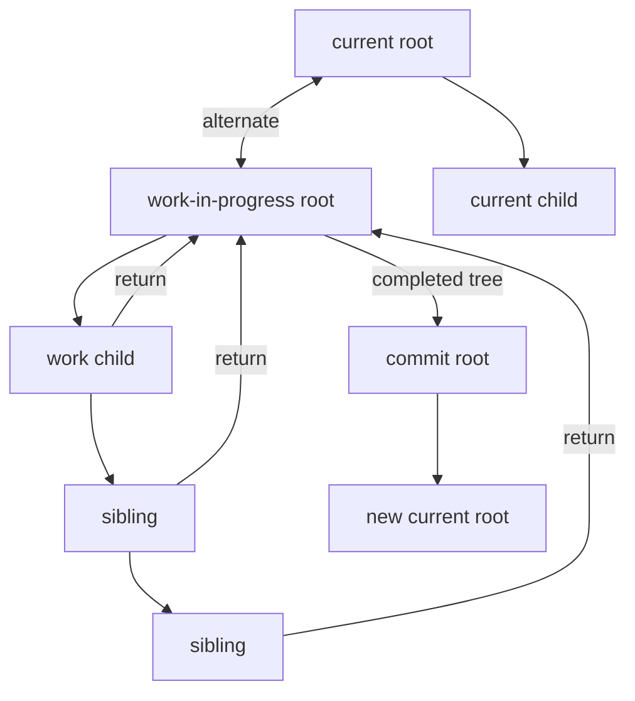
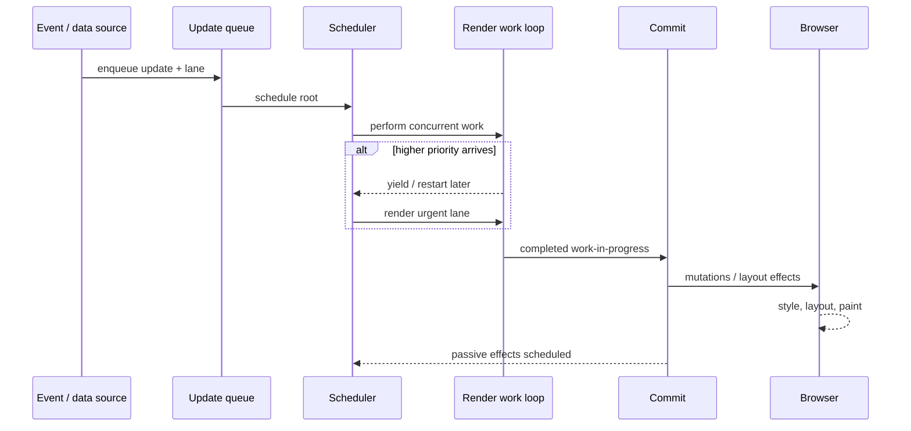

# React Fiber 与并发渲染

Fiber 不是“用链表实现虚拟 DOM”，并发渲染也不是 JavaScript 多线程执行。React 把一次更新表示为带优先级的工作，让可重复的 Render 阶段能够暂停、放弃或重新开始，最终在不可中断的 Commit 阶段把一致结果应用到宿主环境。理解这条边界，才能解释为什么 render 必须纯净、为什么 Transition 不会让重计算自动变快，以及为什么教学版 `requestIdleCallback` 循环不能代表 React Scheduler。

## Fiber 同时承担身份、工作和双缓冲

一个 Fiber 节点与某个组件或宿主节点的工作单元对应，典型关系包括 `return`、`child`、`sibling`。它还保存类型、key、待处理与已确认 Props/State、更新队列、优先级、Flags，以及通过 `alternate` 连接 current 和 work-in-progress 两棵树的对应节点。



链式结构让工作循环从一个节点下探 child，完成后转向 sibling，没有 sibling 就沿 return 回溯。可中断来自工作被拆成单元并由调度器决定何时继续，不是因为链表本身具有并发能力。

| Fiber 信息 | 作用 | 不能简单省略的原因 |
| --- | --- | --- |
| `key + elementType` | 确定子节点身份和复用 | 只按数组下标比较会导致状态错位 |
| `alternate` | current/WIP 对应关系 | 支持放弃未提交工作而保留当前 UI |
| update queue | 保存待处理状态更新 | 更新可能属于不同优先级与渲染批次 |
| lanes | 表达更新优先级集合 | 单个 priority 数不足以组合、跳过与重放 |
| flags/subtreeFlags | 标记 Commit 工作 | 不应遍历整树猜哪些节点有副作用 |
| dependencies | Context 等订阅 | 更新来源不只有 Props 和本地 State |

早期 React Fiber 资料常讲一条线性的 effect list。现代实现更多通过 flags 与 subtree flags 在 Commit 阶段遍历相关子树。阅读资料时必须绑定版本，不能把 React 16 教学字段当成当前稳定内部 API。

## 从更新到提交

一次更新大致经历以下阶段：

1. 事件、外部 store、异步回调或服务端数据产生更新；
2. React 为更新分配 Lane，将其加入 Fiber 的更新队列并向根传播待处理 Lane；
3. Scheduler 根据根的最高优先级安排回调；
4. Render 阶段从 current 构建/复用 work-in-progress，执行组件并协调子节点；
5. 若更紧急工作到来，可让出、放弃或稍后继续低优先级工作；
6. 完整树满足提交条件后，Commit 同步执行宿主变更和 Effect 生命周期；
7. work-in-progress 成为新的 current，用户才看到这次提交。



“Render 可中断”不等于某个组件函数会在任意机器指令中间暂停。React 在工作单元边界检查是否应让出，已执行的组件 render 可能被丢弃并重新执行。Commit 则不能向用户暴露半棵新树，所以宿主 mutation 与布局 Effect 需要同步完成。

## 为什么 Render 必须纯净

如果组件在 render 中发请求、写全局变量或向分析系统上报，Render 被重试就会重复副作用；未提交的低优先级树也可能执行了外部写入，形成“系统发生了变化但 UI 从未提交”的幽灵状态。

```tsx
// 错误：render 次数不等于用户可见提交次数。
function RecordView({ id }: { id: string }) {
  analytics.track('record_rendered', { id })
  document.title = id
  return <article>{id}</article>
}

// 更合理：渲染只计算 UI，外部同步进入 Effect 或事件。
function RecordView({ id }: { id: string }) {
  useEffect(() => {
    document.title = id
  }, [id])

  return <article>{id}</article>
}
```

Effect 也不是“所有逻辑的容器”。由 Props/State 可直接计算的值放在 render；用户点击产生的写操作放事件处理；Effect 用于让 React 状态与网络连接、DOM API、第三方实例等外部系统同步。把派生值先 setState 再由 Effect 维护，会制造额外提交和竞态。

开发环境 Strict Mode 可能额外调用组件、Effect setup/cleanup 等路径以暴露不纯和清理不对称。它不是生产环境“一定执行两次”的契约，也不应通过 `useRef` 标志绕过。正确修复是让 setup/cleanup 可重复且对称。

## Lane、批处理与优先级

Lane 是位掩码形式的优先级集合，允许多个相关更新被选择、合并、跳过并在后续重放。紧急输入更新和 Transition 更新可以同时存在：React 先保持输入响应，再在后台准备较慢的结果树。

```tsx
function SearchPanel() {
  const [query, setQuery] = useState('')
  const [filter, setFilter] = useState('')
  const [isPending, startTransition] = useTransition()

  function onChange(value: string) {
    setQuery(value) // 输入框需要立即响应。
    startTransition(() => {
      setFilter(value) // 结果列表允许被新输入中断。
    })
  }

  return (
    <>
      <input value={query} onChange={(event) => onChange(event.target.value)} />
      <ResultList query={filter} dimmed={isPending} />
    </>
  )
}
```

Transition 改变的是更新优先级与可中断性，不是把 `ResultList` 的昂贵计算移到另一个线程。如果一次组件执行或某个同步循环耗时 300ms，React 在它返回前也无法接管主线程。应先减少工作、建立索引、虚拟化、memoize 有稳定收益的纯计算，或把 CPU 密集任务移到 Web Worker。

现代 React 会在更多异步上下文自动批处理状态更新，减少重复提交。但批处理边界、闭包中读取到的状态快照和更新队列语义仍要理解。需要基于旧值时使用函数式更新：

```tsx
setCount((value) => value + 1)
setCount((value) => value + 1)
// 两个 updater 顺序应用；setCount(count + 1) 连写则可能都基于同一快照。
```

## Scheduler 不等于 requestIdleCallback

许多 Mini Fiber 用 `requestIdleCallback(workLoop)` 说明时间切片，这是有价值的教学模型，但不能据此说 React “基于浏览器空闲时间渲染”。`requestIdleCallback` 的跨浏览器支持、触发时机和 deadline 语义不足以承担 React 的优先级调度。React Scheduler 使用自己的任务队列、时间片和宿主回调策略，并随版本与环境演进。

一个教学调度器若只是：

```ts
requestIdleCallback((deadline) => {
  while (nextUnit && deadline.timeRemaining() > 1) {
    nextUnit = performUnit(nextUnit)
  }
})
```

它省略了任务过期、优先级队列、取消、连续输入、不同根、错误恢复、微任务/宏任务宿主策略，以及“完成 Render 后如何保证一次正确 Commit”。它证明时间切片的直觉，不证明 React 实现细节。

## Reconciliation：Key 是身份，不是性能提示

协调要回答旧子节点能否代表新子节点。类型与 key 匹配时通常可以复用 Fiber/宿主实例；类型或 key 改变会重建相应子树。没有 key 或使用会变化的数组索引，列表插入和重排可能让组件状态跟随位置而不是业务实体。

```tsx
// 重排后，行内编辑状态可能落到另一条记录。
records.map((record, index) => <EditableRow key={index} record={record} />)

// 稳定业务身份使状态跟随记录。
records.map((record) => <EditableRow key={record.id} record={record} />)
```

React 的 diff 使用可预测的启发式，不是在任意树之间求理论最小编辑距离。列表协调会先利用顺序快速路径，再用 key 映射处理剩余节点和移动。不同版本内部算法会变，但外部契约稳定：相同位置/类型/key 倾向保留状态，身份变化会重置状态。

Vue 和 React 的 diff 不能简单排名。Vue 编译器能标注动态节点和 patch flags，React 的 JSX 通常保留更动态的运行时协调；两者还有不同的响应式、编译和调度设计。应以具体版本、输入结构与性能剖析比较，而不是背“双端比较一定更快”之类结论。

## Hooks 依赖 Fiber 调用顺序

函数组件的 Hook 状态与当前 Fiber 上的一条 Hook 链关联，按调用顺序配对。因此 Hook 不能放在条件分支或普通循环中。一个只用全局数组与索引实现的 `useState` Demo 能解释顺序规则，却省略了每个 Fiber 独立链、更新队列、Lane、render-phase update 和并发重放。

闭包捕获的是某次 render 的状态快照。异步回调读取旧值不代表 React 状态没有更新，而是回调属于旧 render。解决方式取决于意图：基于旧值更新用函数 updater；需要最新但不驱动 UI 的可变值用 ref；外部订阅使用 `useSyncExternalStore` 契约；不要通过随处读取全局变量破坏一致快照。

```tsx
function useRecord(recordId: string) {
  const [state, setState] = useState<LoadState>({ status: 'loading' })

  useEffect(() => {
    const controller = new AbortController()
    setState({ status: 'loading' })

    void loadRecord(recordId, controller.signal).then(
      (record) => {
        if (!controller.signal.aborted) setState({ status: 'ready', record })
      },
      (error: unknown) => {
        if (!controller.signal.aborted) setState({ status: 'failed', error })
      }
    )

    return () => controller.abort()
  }, [recordId])

  return state
}
```

cleanup 处理组件卸载和依赖改变；AbortSignal 控制真正的请求生命周期。只加一个 `isMounted` 布尔值虽然能阻止 setState，却不会取消网络、流读取或服务端工作。

## Commit 的细分与 Effect 时机

Commit 不是单一步骤。内部大致包括 mutation 前处理、宿主 mutation、layout effect，以及提交后安排 passive effect。`useLayoutEffect` 在 DOM 变更后、浏览器绘制前同步运行，适合必须测量并立即修正布局的少数场景；它会阻塞绘制。普通外部同步优先 `useEffect`，不要为了“更早”全面替换。

Effect cleanup 与下一次 setup 的顺序是资源正确性的核心：事件监听必须用同一引用移除，连接要关闭，订阅要退订，Timer 要清理。多个 Effect 按关注点拆分，使每一对 setup/cleanup 对称。

服务端渲染期间 Effect 不执行，组件也不能在 render 读取仅浏览器存在的全局而不做环境边界。Hydration 要求首个客户端输出与服务端标记可匹配；使用当前时间、随机数、客户端存储直接影响首屏会造成 mismatch。

## Suspense 与流式渲染

Suspense 是“子树目前无法完成”的 UI 边界。它可与框架数据加载、代码分割和流式服务端渲染配合，让外层先提交 fallback 或已就绪内容。它不是任意 Promise 的全局 try/catch，也不自动定义缓存、错误处理和请求去重。

错误边界处理渲染阶段错误，Suspense 处理约定的挂起信号，两者职责不同。数据框架需要保证同一资源的读取稳定、请求可缓存/去重，并处理导航取消。直接在 render 中创建新 Promise 会让每次重试得到新对象，可能永久挂起。

## 外部 Store 与 tearing

并发 Render 可能在不同时间读取外部可变数据。如果读取接口没有一致快照，同一次 UI 提交可能混入两个版本，这类问题称为 tearing。`useSyncExternalStore` 要求提供 subscribe 与同步 getSnapshot；快照在数据未变化时应保持引用稳定，服务端渲染还需要 server snapshot。

不要把任意全局对象塞进 Context 后原地修改。Context 更新依赖 Provider value 身份，巨大 value 每次新建又会让所有消费者更新。按变化频率拆上下文、稳定 value、或采用满足并发快照契约的 Store，比盲目 `useMemo` 更重要。

## 性能分析从提交证据开始

React DevTools Profiler 能展示哪些组件参与某次 Commit、Render 耗时及触发关系。浏览器 Performance 面板则显示主线程、样式布局和绘制。两者结合才能区分：组件计算慢、组件数量过多、Commit DOM 工作大、布局抖动或第三方脚本阻塞。

`memo`、`useMemo`、`useCallback` 都有比较、保留对象和认知成本。它们不提供语义保证，React 也可能丢弃缓存。优化前先确认：

- 组件确实频繁以相同 Props 重渲染；
- 计算成本显著而依赖稳定；
- 传入对象/函数身份确实让下游昂贵工作重复；
- 加缓存后 Commit、内存与交互指标实际改善。

状态应放在最接近使用处。把输入框每个字符都提升到页面根，再用 memo 修补整棵树，通常不如重新设计状态所有权。

## 验证与故障演练

| 场景 | 注入方式 | 需要验证的事实 |
| --- | --- | --- |
| Render 重试 | Strict Mode 与可挂起子树 | render 中没有重复外部写入 |
| Transition 抢占 | 慢列表更新时连续输入 | 输入保持响应，旧低优先级结果不提交 |
| 状态身份 | 列表头部插入、排序 | 稳定 key 的行状态跟随实体 |
| Effect 竞态 | A 请求慢、B 请求快 | A 被取消或结果不能覆盖 B |
| 卸载清理 | 快速切换路由 | 连接、监听、Timer 和请求均释放 |
| Hydration | 服务端/客户端固定输入 | 无 mismatch，交互后状态正确 |
| 外部 Store | 更新与并发渲染交错 | 一次提交读取同一版本快照 |
| 性能优化 | Profiler 基线与优化后对比 | 用户路径指标改善而非只少一次 console |

测试并发 UI 不要只断言某个中间 render 次数，因为调度细节不是稳定公共契约。应断言用户可观察结果、旧结果没有提交、焦点未丢失、资源已清理。对组件库还应覆盖不同 React 严格模式与服务端渲染消费场景。

可以故意在 render 中增加计数副作用，确认 Strict Mode 测试暴露问题；删除 Effect cleanup，确认连接测试检测泄漏；将稳定 key 改成 index，确认重排测试发现状态错位。能抓到故障的测试才是证据。

## 常见误区

- **Fiber 就是一棵链表**：关系字段只是遍历形式；节点还承载身份、状态、更新、优先级、Flags 和双缓冲。
- **并发模式会并行执行组件**：浏览器主线程上的 React render 仍是 JavaScript 执行；并发主要表示可调度、可中断、可重启。
- **React 使用 `requestIdleCallback`**：教学实现常这样做，React Scheduler 有自己的宿主调度与优先级系统。
- **Transition 能解决所有卡顿**：它不能打断正在运行的长同步函数，也不降低计算总量。
- **Virtual DOM Diff 会求最小操作**：React 使用基于类型和 key 的启发式，目标是在约束下获得可预测的线性级处理。
- **Effect 等同生命周期方法**：Effect 描述与外部系统的同步过程，应按依赖和 cleanup 推理，而不是硬套 mount/update/unmount 三个槽。
- **多一次 render 就是多一次 DOM 更新**：Render 可以被放弃或合并，只有 Commit 改变宿主环境。

## 源码与规范

- [React Reconciler source](https://github.com/facebook/react/tree/main/packages/react-reconciler)：Fiber、Lane、Work Loop 与 Commit 的当前源码入口。
- [React Render and Commit](https://react.dev/learn/render-and-commit)：公开渲染/提交模型与纯渲染约束。
- 个人实验材料已匿名化；本文只抽取通用机制，不建立项目映射。
- 个人实验材料已匿名化；本文只抽取通用机制，不建立项目映射。
