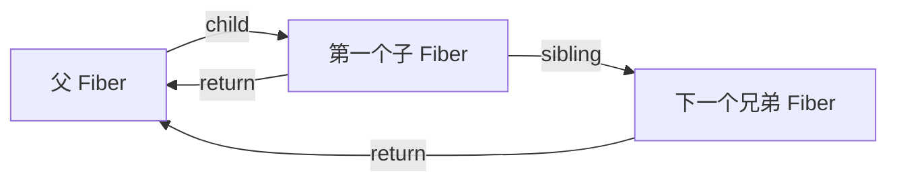

# React Fiber：节点、工作单元与双缓冲

Fiber 是 React Reconciler 内部表示组件工作和树关系的数据结构。每个 Fiber 保存组件身份、输入、状态、父子链接、优先级和待提交标记。它位于 React Element 描述与 DOM 提交之间，让 Render 阶段可以把整棵组件树拆成一个个工作单元；Fiber 本身不是线程，也不会让 JavaScript 同时在多个 CPU 核心执行。

一棵包含数千个组件的树发生更新时，如果协调过程用普通递归从根一路执行到底，JavaScript 调用栈在返回前不能保存为可调度的中间任务。主线程长时间没有机会处理输入，用户会先感到按键和滚动卡顿。Fiber 要解决的是怎样保存渲染进度，让未提交的工作可以暂停、恢复或丢弃，而不是单纯让 DOM 比较更快。

Fiber 是 React 内部数据结构，不是公开 API，字段会随版本调整。可靠的理解应来自当前公开源码中的稳定职责，而不是把某一版本的字段表当成契约。节点、遍历和双缓冲解释工作如何保存，调度优先级、提交阶段和并发 API 则建立在这些机制上。

## 递归树为什么不适合作为调度状态

传统递归协调把“下一步做什么”保存在 JavaScript 调用栈中。执行到深层节点时，父节点的局部变量和返回位置由引擎管理；应用无法把这一叠栈帧序列化成一个普通对象，交还主线程后再从准确位置继续。

Fiber 把隐含在调用栈里的控制信息显式放进节点链接。每处理一个节点，函数返回下一个 Fiber，而不是递归完成整个子树。调度器因此可以在工作单元之间检查是否应该让出主线程。



`child` 指向第一个子节点，`sibling` 串起同层兄弟，`return` 指回父节点。这里的 `return` 是字段名，不是 JavaScript 的 `return` 语句。三条链接把多叉树转换成可以用指针逐步行走的结构；正常路径向下处理子节点，没有子节点时向右找兄弟，再没有就沿 `return` 向上完成父节点。

## React Element、Fiber 与 DOM 不是一回事

JSX 产生 React Element。Element 是对“想要什么界面”的不可变描述，包含 `type、key、props` 等信息。Fiber 是 React 为某次组件工作维护的可变记录，承载树链接、状态、更新队列、优先级和待提交标记。宿主 Fiber 的 `stateNode` 才可能指向真实 DOM，函数组件 Fiber 没有对应 DOM 节点。

| 对象 | 生命周期 | 主要职责 | 是否公开概念 |
| --- | --- | --- | --- |
| React Element | 每次描述界面时创建 | 表达 type、key、props | 是 |
| FiberNode | 跨更新复用或克隆 | 保存工作、状态和树关系 | 否 |
| DOM Node | 提交后存在于页面 | 浏览器实际渲染与交互 | Web API |

把 Element 称为“虚拟 DOM 节点”可以帮助入门，但不能据此认为 Element 保存 Hook 状态或调度优先级。那些状态属于 Fiber 及其关联队列。

## FiberNode 的职责分区

源码字段很多，可以按职责理解而不是逐项背诵。

| 职责 | 常见字段 | 回答的问题 |
| --- | --- | --- |
| 身份 | `tag、key、elementType、type` | 这是什么工作，能否与旧节点复用 |
| 宿主实例 | `stateNode` | 对应 DOM、类实例或根容器是什么 |
| 树结构 | `return、child、sibling、index` | 下一个工作单元和父子关系在哪里 |
| 输入与状态 | `pendingProps、memoizedProps、memoizedState、updateQueue` | 新输入、已提交输入和更新记录是什么 |
| 双缓冲 | `alternate` | 当前节点与工作中节点如何互指 |
| 调度 | `lanes、childLanes` | 自身或子树有哪些优先级工作 |
| 提交标记 | `flags、subtreeFlags、deletions` | 哪些宿主变化和 Effect 需要提交 |

旧教程常使用 `effectTag、firstEffect、lastEffect、nextEffect` 描述一条副作用链。现代实现主要通过 `flags` 与 `subtreeFlags` 跳过没有提交工作的子树，具体遍历策略已经变化。理解“渲染阶段记录待提交工作”是稳定模型，把旧字段名称当成现状则会误导排查。

## 一个工作单元怎样向前推进

简化后的深度优先工作循环包含 `beginWork` 和 `completeWork` 两种方向。`beginWork` 根据当前 Fiber 和新输入决定子节点，建立或复用 child Fiber；若得到 child，下一步向下。没有 child 时进入完成过程，处理当前节点的输出并寻找 sibling；一路没有 sibling 就沿 return 完成祖先。

```ts
type TeachingFiber = {
  name: string
  child: TeachingFiber | null
  sibling: TeachingFiber | null
  return: TeachingFiber | null
}

function performUnitOfWork(unit: TeachingFiber): TeachingFiber | null {
  beginWork(unit)
  if (unit.child) return unit.child

  let completed: TeachingFiber | null = unit
  while (completed) {
    completeWork(completed)
    if (completed.sibling) return completed.sibling
    completed = completed.return
  }
  return null
}
```

输入是一棵已连接的教学 Fiber 树，输出是下一个工作单元。真实 React 的 `beginWork` 会按 tag 进入函数组件、宿主组件、Suspense 等不同路径，`completeWork` 会创建或更新宿主实例并向父级汇总 flags。示例只保留控制流，不声称复刻完整实现。

假设树为 `App -> Header -> Logo`，Header 的 sibling 是 Main。执行顺序是 begin App、begin Header、begin Logo、complete Logo、complete Header、begin Main，随后完成 Main 和 App。这是“向下 begin、向上 complete”的深度优先遍历，不是简单的前序或后序单选。

## current 与 workInProgress 为什么要两棵树

页面正在显示的已提交树称为 current。更新开始后，React 不能在 current 上边算边改：渲染可能被打断或发现更高优先级工作，如果 current 已经写了一半，事件和页面会观察到不一致状态。

React 为更新建立 workInProgress 树。对应节点通过 `alternate` 双向关联：首次更新时会创建另一侧节点，后续更新尽量复用这两组对象并覆盖工作字段，避免每次都为整棵树分配全新节点。

```text
提交前：root.current -> current tree
                    A.current <-> A.workInProgress
                    B.current <-> B.workInProgress

渲染中：只在 workInProgress 一侧计算新 props、state、child 和 flags

提交后：root.current 指向完成的 workInProgress
        原 current 成为下一次更新可复用的另一侧
```

“双缓冲”借用了图形学中前后缓冲区的思想，但 React 不是把两份 DOM 互换。交换的是根对象指向的 Fiber 树；DOM 变化仍在 Commit 中按标记执行。若 Render 被放弃，workInProgress 可以丢弃，current 和已显示 DOM 仍保持上一次提交状态。

## 节点复用与身份

协调子节点时，`type` 和 `key` 共同参与身份判断。同位置、相同类型且 key 兼容时，可以复用旧 Fiber 对应的状态；类型或 key 改变通常意味着旧子树删除、新子树挂载。列表移动和状态错位的完整过程见 Reconciliation 专题。

复用不是“跳过渲染”。它表示可以沿用 Fiber、宿主实例或组件状态，是否能跳过某些工作还取决于 props、context、lanes 和 memo 等条件。把 key 当作消除所有重渲染的性能开关，是常见误解。

## 教学 Fiber 与真实 Scheduler 的边界

许多 mini Fiber 使用 `requestIdleCallback`：每次取一个节点，检查 `deadline.timeRemaining()`，没时间就等待下一次空闲。这适合观察“工作单元之间让出控制权”，但不是现代 React Scheduler 的准确实现。

当前 React Scheduler 在 Web 环境通常借助任务调度机制建立自己的时间片和优先级判断；Lane 又在 Reconciler 内表达更新优先级。浏览器是否“空闲”不等同于 React 更新是否到期，`requestIdleCallback` 也无法表达 React 的完整优先级、过期和连续任务语义。公开文章中的教学代码必须把这层差异写出来。

## 用最小实验验证树与双缓冲

准备一个父组件、两个带本地状态的子组件和一个可重排列表。第一次渲染后，在 React DevTools 中记录组件树；更新父状态，使用 Profiler 记录 Render 与 Commit。然后给其中一个子组件切换 key，观察其本地状态重置和 Effect cleanup/setup。

再在教学实现中为每个节点打印 `begin、complete、alternate 是否存在、flags`。验证结果应满足：工作顺序按 child/sibling/return 推进；首次挂载没有旧 alternate 或旧状态；更新时两侧互指；Render 日志可以出现多次，但 DOM 只在 Commit 路径改变。

若观察到 Render 中直接 `appendChild`，说明教学实现把两阶段混在了一起，无法安全丢弃中间工作。若节点重排后状态跟错对象，先检查 type/key 身份，而不是先怀疑 Lane。

## 业务代码能从 Fiber 理解什么

业务开发不应读取 Fiber 私有字段或依赖字段名称。理解 Fiber 的价值在于解释组件为何要纯、状态为何与树位置绑定、并发更新为何可以放弃 Render，以及 Profiler 中 Render/Commit 为什么是不同阶段。

排查渲染问题时，可以沿着显式工作单元、三条树链接、begin/complete 遍历、current/workInProgress 隔离和 alternate 复用逐层判断。Scheduler、Lane 和 Effect 建立在 Fiber 之上，却不等同于 Fiber；业务代码也不应读取 Fiber 私有字段来实现功能。

## 源码定位与版本边界

验证 Fiber 不需要记住所有私有字段。先从 React 仓库的 `ReactFiber.js` 看节点构造与 `createWorkInProgress`，再到 `ReactFiberWorkLoop.js` 找工作循环，到 `ReactFiberBeginWork.js` / `ReactFiberCompleteWork.js` 对照向下与向上阶段。字段、文件拆分和特性开关会变化，文章只依赖“显式节点、双树、两阶段、提交标记”这些稳定职责。

- [React: Render and Commit](https://react.dev/learn/render-and-commit)
- [React source: ReactFiber.js](https://github.com/facebook/react/blob/main/packages/react-reconciler/src/ReactFiber.js)
- [React source: ReactFiberWorkLoop.js](https://github.com/facebook/react/blob/main/packages/react-reconciler/src/ReactFiberWorkLoop.js)

教学实现如果使用 `requestIdleCallback`、单一 `effectTag` 或一次性重建所有节点，必须标注它只演示哪条控制流。判断它是否忠于真实原理的标准不是字段相同，而是能否解释：中断时状态存在哪里、恢复从哪开始、未提交工作为何不可见、current 为什么仍然一致。
