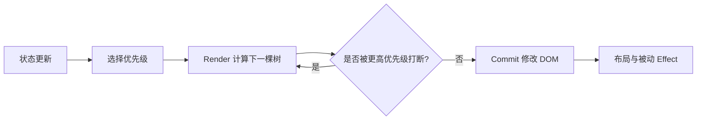

# React Fiber 与并发渲染

用户在搜索框输入时，页面还要过滤一份很大的列表。若每次按键都同步完成整棵渲染，输入会卡顿。React 的并发特性允许把一部分更新标为较低优先级，让更紧急的输入先得到响应。

本篇先区分 Render 和 Commit，再解释 Fiber 为什么能保存工作进度。并发渲染不是多线程 DOM，也不意味着所有函数随时会被暂停。

## 一次更新的两阶段



Render 阶段计算变化，可以暂停、放弃并重做，因此组件渲染应保持纯函数。Commit 阶段把确认结果写入 DOM，保持同步且不可随意中断，避免用户看到半棵界面。

## 步骤一：Fiber 保存一个工作单元

Fiber 是 React 内部表示组件工作的节点，连接父、子和兄弟，并保存当前树与工作中树的关系。这样渲染可以按小工作单元推进，而不必用一次递归调用完成整棵树。

Fiber 还承载更新优先级和副作用标记。具体字段属于内部实现，会变化；理解重点是“可恢复工作单元 + 双树 + 优先级”，不要把某个版本的字段表当公共契约。

## 步骤二：把非紧急更新标出来

`startTransition` 告诉 React 某组更新可以让位给紧急交互。输入框本身仍立即更新，过滤结果作为 transition。`useDeferredValue` 则让消费方暂时使用旧值，等待低优先级渲染完成。

下面是公开 API 的最小示例。输入是用户文本，预期是输入保持响应，列表结果可能稍晚更新。它不会让昂贵 JavaScript 计算自动变快；计算量过大仍需优化数据、缓存或移出主线程。

```tsx
function Search({ items }: { items: string[] }) {
  const [text, setText] = useState('')
  const [query, setQuery] = useState('')
  const [isPending, startTransition] = useTransition()

  function onChange(value: string) {
    setText(value)
    startTransition(() => setQuery(value))
  }

  const visible = useMemo(
    () => items.filter(item => item.includes(query)),
    [items, query]
  )

  return <>
    <input value={text} onChange={e => onChange(e.target.value)} />
    <p aria-live="polite">{isPending ? '更新中' : `${visible.length} 条`}</p>
    <ResultList items={visible} />
  </>
}
```

输入状态和查询状态分开，所以新按键可以覆盖仍在计算的旧 transition。`isPending` 表示 transition 尚未提交，不应用来假装精确进度。`visible` 仍在浏览器主线程计算；若一次过滤本身形成长任务，应先减少计算、建立索引或移到 Worker，并发渲染不会把同步函数自动拆成多线程。

## 步骤三：理解副作用时机

组件函数可能运行多次，因此不能在 Render 中发不可撤销请求或修改 DOM。DOM 测量与同步布局调整使用 `useLayoutEffect`，普通外部同步使用 `useEffect`。Effect 要提供 cleanup，处理依赖变化、卸载和开发模式下的额外检查。

事件处理器由用户动作触发，适合提交业务命令；Effect 用于组件已经显示后与外部系统保持同步。把所有逻辑放 Effect，容易产生重复请求和依赖循环。

## Suspense 和并发是什么关系

Suspense 让树在数据或代码尚未就绪时显示 fallback，并与流式服务端渲染、选择性 hydration 配合。数据源是否支持 Suspense 取决于框架和 API，不能靠在普通 Effect 中 fetch 就自动获得完整并发数据语义。

## 正常结果和失败结果

| 场景 | 预期 |
| --- | --- |
| 输入触发低优先级列表更新 | 输入优先响应，旧渲染可放弃 |
| Render 被重做 | 纯组件不产生重复副作用 |
| Commit 开始 | DOM 一次性应用确认结果 |
| transition 内包含受控输入更新 | 设计不当，输入可能不符合预期 |
| 计算本身长期阻塞线程 | 并发 API 也无法抢占同步长任务 |

使用 React Profiler 观察 Render 与 Commit，并在性能测试中区分交互延迟和总完成时间。不要用 `requestIdleCallback` 解释 React 当前调度器；公开概念以 React 文档为准，内部 Scheduler 实现通过源码测试核对版本。

## 用 Profiler 分清“响应快”和“完成快”

准备一万条模拟数据，先让输入与列表使用同一状态，记录按键到输入框更新、列表 Commit 完成和单次 Render 耗时。再加入 transition，保持数据和设备条件不变。预期是输入更快响应，但列表总计算量不一定减少。

| 指标 | 回答的问题 |
| --- | --- |
| 输入事件到 Commit | 用户何时看到自己输入 |
| transition pending 时长 | 低优先级结果等待多久 |
| Render 耗时 | 组件计算是否过重 |
| Commit 耗时 | DOM 写入与布局副作用是否过重 |
| Long Task | 同步 JavaScript 是否阻塞调度机会 |

接着在组件 Render 中故意加入一次计数副作用，开发环境下观察它可能被多次执行。把副作用移到用户事件或带 cleanup 的 Effect 后，重复 Render 不再改变外部世界。这个练习解释了“Render 可放弃”为什么要求组件纯净。

选择 API 时先判断更新优先级：输入、焦点和点击反馈通常紧急；大型结果列表、非关键图表可以 transition；数据尚未就绪可通过框架支持的 Suspense 边界展示 fallback。若业务要求每次输入立即得到完整结果，应该优化算法和数据量，而不是把一切标成低优先级。

## 参考资料

- [React: Render and Commit](https://react.dev/learn/render-and-commit)
- [React useTransition](https://react.dev/reference/react/useTransition)
- [React Keeping Components Pure](https://react.dev/learn/keeping-components-pure)
- [React Source](https://github.com/facebook/react)
