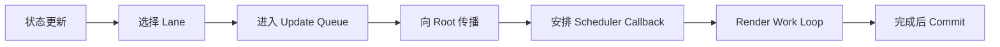

# React Work Loop、Scheduler 与 Lanes

搜索框输入和结果列表更新同时发生时，React 可以先提交输入，再继续计算低优先级列表。这里有两套容易混淆的优先级：Scheduler 决定 JavaScript 回调何时获得执行机会，Lane 在 Reconciler 中描述哪些 React 更新属于同一批工作、哪些可以跳过或稍后重做。

## 从 setState 到 Root 调度

状态更新先创建 Update，选择 lane，进入组件对应的更新队列，再把 lane 沿 `return` 路径合并到祖先的 `childLanes` 并标记 Root。Root 根据 pending lanes 选择下一批工作，并确保存在匹配优先级的调度回调。



Lane 常用位掩码表达，一组 lane 可以合并、删除和比较。把它理解成单个连续数字优先级会遗漏“多条更新共同参与一次 Render”的能力。具体位分配是内部实现，稳定概念是 pending、suspended、pinged、expired 等集合共同决定下一批工作。

## Scheduler 优先级与 Lane 的边界

Scheduler 接收回调、优先级和过期时间，维护任务队列，并在时间片结束或有更紧急工作时让出控制。它不知道组件树、Hook 或 DOM。Lane 属于 React Reconciler，知道更新与 Fiber Root 的关系，但不直接提供浏览器任务队列。

React 会把选中的 lanes 映射到合适的 Scheduler 优先级。二者相关却不相同：多个 lanes 可以映射到同一调度优先级，lane 还要表达依赖、挂起和 entanglement。

## 并发 Work Loop 如何让出

同步工作循环持续处理 Fiber，直到整棵目标树完成。并发工作循环在工作单元之间检查 `shouldYield`。让出时，`workInProgress` 指针和已建 Fiber 保留，稍后可以继续；若更高优先级更新到来，React 也可能从 Root 重新准备工作，先前结果被复用或丢弃。

```ts
function teachingConcurrentLoop(shouldYield: () => boolean): void {
  while (workInProgress !== null && !shouldYield()) {
    workInProgress = performUnitOfWork(workInProgress)
  }
}
```

这段教学代码只表达让出位置。真实 Scheduler 的宿主回调、时间片、连续任务和浏览器集成会随平台和版本变化，不应替换成“React 使用 requestIdleCallback”一句话。React 也只能在自己控制的工作单元边界让出；组件函数内部的一次巨大同步循环仍会阻塞主线程。

## 中断、恢复与丢弃

低优先级 Render 被中断后有三种结果：同一批工作稍后从保存位置继续；收到相关更新后重新计算部分路径；更高优先级提交改变 current 后，旧 workInProgress 基于过期树，需要重新开始。无论哪种，未提交 Render 都不能被用户当作完成结果。

这也是组件纯度的工程原因。若 Render 中发请求、写全局对象或记录不可重复业务事件，被丢弃的工作仍留下外部副作用，UI 与外部世界会失配。

## 饥饿、过期与 Lane 纠缠

持续输入可能不断产生紧急更新，低优先级任务不能永远等待。React 会跟踪等待时间并把到期工作视为必须推进，避免饥饿。Suspense 挂起的 lane 在数据 promise 解决后被标记为 pinged，重新具备尝试条件。

某些 transition 更新需要保持一致结果，会发生 lane entanglement：选择其中一条时必须一起处理关联 lanes。它解决的是跨更新一致性，不是让任务并行运行。

## 可观察实验

构造受控输入和计算较重的列表。版本一让输入与查询共享同步状态；版本二把列表查询放进 `startTransition`。使用 React Profiler 和浏览器 Performance 同时记录输入 Commit、列表 Commit、长任务与总完成时间。

预期是版本二允许输入先提交，低优先级 Render 可能多次开始；总计算量未必减少。如果组件内部单次计算超过整个时间片，仍要优化算法、分块或使用 Worker。调度只能重新安排可切分工作，不能让同步 JavaScript 抢占自身。

排查“transition 没效果”时，依次确认更新是否真的包在 transition、紧急与非紧急状态是否分离、是否有同步长任务、列表是否被外部 store 同步更新，以及 Suspense 是否不断用新 promise 挂起。

面试追问 Lane 时，不需要背二进制常量。应解释它为何比单值 expiration time 更适合表示多批工作，以及 Scheduler 与 Reconciler 各自拥有哪部分状态。

## Root 上有哪些状态集合

更新传播到 Root 后，不是只有一个“当前优先级”。`pendingLanes` 表示尚未完成工作，`suspendedLanes` 表示因等待资源暂不能推进，`pingedLanes` 表示等待条件已解决，过期信息帮助避免长期饥饿。`getNextLanes` 结合这些集合和正在渲染的 lanes，选择下一批一致工作。

```text
输入事件 -> Sync/离散更新 lane ----+
                                      +-> pendingLanes -> getNextLanes
startTransition -> Transition lane --+
Suspense 抛出 thenable -> suspendedLanes
thenable resolve       -> pingedLanes -> 重新调度 Root
```

Lane 是位集合，因此能同时表达多条更新、包含关系和批量删除；Scheduler 的 task priority/expiration 则决定宿主回调何时运行。React 会做映射，但 Scheduler 不理解“这条任务属于哪个 Fiber 子树”，Lane 也不会直接创建浏览器宏任务。

## beginWork、completeWork 与 bailout

工作循环取一个 Fiber 调用 `beginWork(current, workInProgress, renderLanes)`。它处理组件更新队列、Context 和子节点协调；若 props、依赖和相关 lanes 都没有工作，可以 bailout，但仍要根据 `childLanes` 判断是否进入子树。向上时 `completeWork` 创建/准备宿主实例并汇总 `subtreeFlags`。

中断后 `workInProgress` 保存下一节点。如果更高优先级更新使已完成部分不再适用，React 可以重新调用 `prepareFreshStack`，丢弃未提交结果。所谓“恢复”不保证逐指令继续，也不保证所有已算结果复用；稳定保证是 current/DOM 在 Commit 前不变。

## 源码核对

- [React source: ReactFiberLane.js](https://github.com/facebook/react/blob/main/packages/react-reconciler/src/ReactFiberLane.js)
- [React source: ReactFiberWorkLoop.js](https://github.com/facebook/react/blob/main/packages/react-reconciler/src/ReactFiberWorkLoop.js)
- [React source: Scheduler.js](https://github.com/facebook/react/blob/main/packages/scheduler/src/forks/Scheduler.js)

源码函数和 lane 常量会随版本调整。面试与排障应依赖职责和状态转换，只有在调试特定 React 版本时才锁定 commit 查字段。
