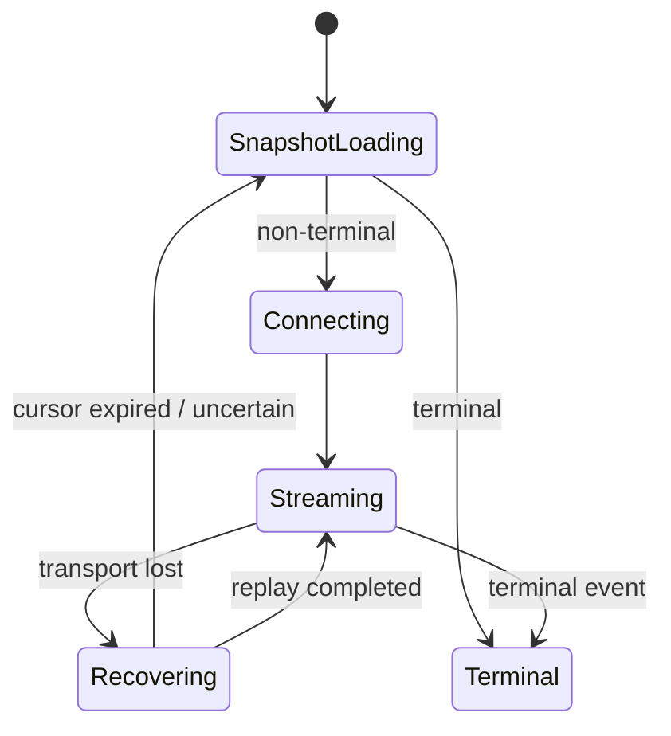
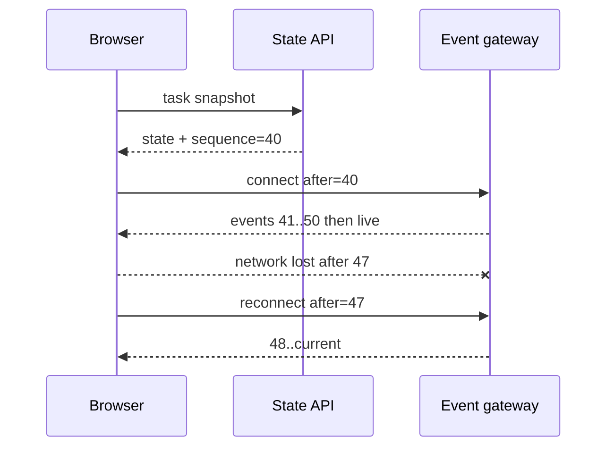

# SSE 与 WebSocket 实时通信

浏览器“连上服务器”只证明传输通道建立，不证明业务开始、消息完整或任务成功。网络切换、标签页休眠、代理超时、服务发布和实例迁移都会断开连接。前端需要把连接状态、事件游标和业务状态分开，使用快照与重放恢复，而不是把某个 socket 布尔值当事实。

## 按消息语义选择通道

| 维度 | SSE/EventSource | WebSocket | HTTP 状态查询 |
| --- | --- | --- | --- |
| 方向 | 服务端 -> 浏览器 | 全双工 | 客户端发起 |
| 数据 | UTF-8 文本事件 | 文本/二进制帧 | 普通响应 |
| 原生重连 | EventSource 有 | 应用实现 | 定时/条件请求 |
| 认证头 | 原生 EventSource 受限 | 握手可由库/票据设计 | 常规 Header |
| 常见用途 | 任务进度、生成流、通知 | 协作、低延迟双向控制 | 快照、低频兜底 |

任务进度和模型流通常 SSE 足够；客户端持续高频发送/二进制才倾向 WebSocket。方向性、网络代理和恢复需求比“哪个高级”更重要。

## 事件协议独立于传输

```ts
type RealtimeEvent<TType extends string, TPayload> = Readonly<{
  streamId: string
  sequence: number
  eventId: string
  type: TType
  schemaVersion: 1
  occurredAt: string
  payload: TPayload
}>
```

sequence 在 stream 内单调递增，用于检测缺口；eventId 去重；type 表达业务事件；schemaVersion 支持新旧客户端共存。时间戳不能替代顺序。终态显式为 completed/failed/cancelled/rejected，连接 close/error 不是业务终态。

## 前端状态机：连接与任务分开

```ts
type ConnectionState = 'idle' | 'connecting' | 'open' | 'backing-off' | 'closed'
type TaskState = 'queued' | 'running' | 'cancelling' | 'succeeded' | 'failed' | 'cancelled'

type RealtimeViewState = {
  connection: ConnectionState
  task: TaskState
  lastAppliedSequence: number
  latestError: { code: string; retryable: boolean } | null
}
```

断线时 connection 变 backing-off，task 保持最后服务器快照，不立即标 failed。重新进入页面先 GET Task snapshot，再从 snapshot sequence 订阅事件。若任务已终态，不必重开长连接。



## SSE 客户端：认证、重连和游标

原生 EventSource 会重连并发送 Last-Event-ID，但无法方便设置任意 Authorization Header。优先同站 HttpOnly Cookie + Origin/CSRF 边界，或从受保护 API 换短期、单 stream 连接票据；长期 Token 不放查询字符串。

需要 Abort/自定义 Header/精细错误处理时可用 fetch 流解析 SSE。解析必须处理分块：一条 event 可能跨多个 chunk，一个 chunk 也可能包含多条 event，不能按每次 `reader.read()` 当完整 JSON。

```ts
async function consumeSse(url: string, cursor: number, signal: AbortSignal) {
  const response = await fetch(url, {
    headers: { Accept: 'text/event-stream', 'Last-Event-ID': String(cursor) },
    credentials: 'same-origin',
    signal
  })
  if (!response.ok || !response.body) throw await toProtocolError(response)

  const decoder = new TextDecoderStream()
  const reader = response.body.pipeThrough(decoder).getReader()
  const parser = createSseParser(event => applyValidatedEvent(event))
  try {
    while (true) {
      const { value, done } = await reader.read()
      if (done) break
      parser.feed(value)
    }
  } finally {
    reader.releaseLock()
  }
}
```

生产使用成熟 SSE parser 或完整实现字段/多行 data/CRLF/UTF-8 边界。事件经 Schema 校验，streamId 匹配当前任务，sequence 只在成功应用后推进。

## WebSocket 应用层协议

WebSocket 帧不提供业务 ACK、重放或幂等。客户端消息包含 messageId、type、schemaVersion 和 client sequence；写命令服务端按幂等键处理。服务消息仍使用 stream sequence。

```ts
type ClientCommand = {
  messageId: string
  type: 'cursor.update' | 'operation.submit'
  schemaVersion: 1
  payload: unknown
}
```

握手成功后先认证/授权 stream，再交换 server snapshot/hello（当前 sequence、心跳间隔、协议版本）。未知未来消息版本明确拒绝或请求刷新客户端，不静默按旧格式解释。

## 快照加增量恢复



检测 sequence <= last 视为重复并忽略；sequence > last + 1 说明缺口，停止应用、请求 replay/snapshot。游标早于服务端保留窗口时返回 `CURSOR_EXPIRED`，客户端重取快照，不能直接跳最新。

## 退避与重连风暴

```ts
function reconnectDelay(attempt: number): number {
  const cap = Math.min(30_000, 500 * 2 ** attempt)
  return Math.floor(Math.random() * cap)
}
```

只有网络/503 等暂时故障重连；401 刷新/重新登录，403 不反复尝试，协议/Schema 错误要求客户端升级。页面 offline 时等待 online 事件但仍加退避；visibility 恢复先获取 snapshot，避免后台节流导致游标长期旧。

服务发布会让大量连接同时断开，full jitter 避免惊群。服务端可通过 SSE retry/WebSocket close reason 给建议，但客户端限制最大值与总恢复窗口。

## 浏览器端背压与渲染节流

WebSocket API 接收侧缺少真正背压；事件回调若处理慢会占主线程/内存。建立有界队列，按业务合并可覆盖事件（最新进度），不可丢的状态事件超限时停止并 resync。

模型 token 不要每个字符触发框架渲染。将 delta 累积，在 `requestAnimationFrame` 或固定短批次合并；页面隐藏时降低 UI 刷新，但仍更新可恢复游标/数据结构。大 JSON 解析可移 Worker，但消息复制和顺序仍需预算。

发送侧检查 `socket.bufferedAmount`，超过高水位暂停业务发送/拒绝操作；不能无限把消息 push 内存数组。高频协作需要专门协议/CRDT/OT库，不手写简单广播宣称一致。

## 组件生命周期与多标签页

组件卸载、任务切换、用户退出时 Abort/close，移除 timer/listener。旧连接事件必须检查 generation/streamId，不能覆盖新任务。

多标签可各自连接，或用 SharedWorker/BroadcastChannel 共享，但共享增加 leader election、权限和浏览器兼容。先评估连接成本。无论如何，服务端状态是事实；本地 leader 退出后可恢复。

```ts
let generation = 0
async function subscribe(taskId: string) {
  const current = ++generation
  for await (const event of connect(taskId)) {
    if (current !== generation) return
    apply(event)
  }
}
```

## 代理与缓存边界

SSE 响应 `text/event-stream`、禁止缓存，代理关闭 buffering/compression accumulation，read timeout 大于心跳间隔。WebSocket 正确 Upgrade。前端测试必须经过实际代理/CDN，localhost 直连通过不代表生产流式。

Service Worker 通常不缓存实时流；Fetch handler 对 event-stream/WebSocket 相关请求 bypass。页面级 HTTP 缓存也不能把状态快照缓存跨用户。

## 安全

- 每次连接/重连认证和资源授权，streamId 不可猜也不是授权；
- Cookie 连接验证 Origin，防跨站 WebSocket/SSE 滥用；
- 限制连接数、消息速率、消息/解压后大小；
- 客户端渲染 payload 使用文本/安全 Markdown，不插入原始 HTML；
- 日志不记录 Token、Cookie、完整用户消息/模型正文；
- 权限在长连接期间撤销，客户端收到拒绝/关闭并清本地受限数据；
- WebSocket 写命令与 HTTP 一样经过认证、ACL、幂等和审计。

## 验证矩阵

| 场景 | 预期 |
| --- | --- |
| 事件被拆成任意网络 chunk | parser 仍正确 |
| 重复/乱序事件 | 去重或检测缺口，不错误应用 |
| 网络中断 | last sequence 后补齐 |
| 游标过期 | snapshot 恢复 |
| 后台标签页后返回 | UI/状态同步且不重复 |
| 慢渲染/大量 token | 队列与内存有界 |
| 401/403/未知 Schema | 不无限重连 |
| 代理发布切流 | 抖动重连、终态不丢 |
| 组件切换任务 | 旧事件不覆盖新状态 |
| 权限中途撤销 | 停止接收并清理 |

```ts
it('resyncs instead of applying an event with a sequence gap', () => {
  const state = createState({ lastAppliedSequence: 10 })
  const result = reduceRealtimeEvent(state, event({ sequence: 12 }))
  expect(result.connection).toBe('backing-off')
  expect(result.needsSnapshot).toBe(true)
  expect(result.lastAppliedSequence).toBe(10)
})
```

Playwright 模拟断网/恢复、页面 reload、代理流式首事件；服务 Fixture 故意重复、乱序和延迟。内存/Listener 通过多次 mount/unmount 观察稳定。

## 常见误区

- socket open 被当作任务 running/succeeded。
- 每个网络 chunk 按完整 SSE/JSON 解析。
- WebSocket 重连后不取快照/事件游标。
- 断线立即标业务失败。
- 所有错误无限重连，无分类/总预算。
- 每 token 触发 UI 渲染，队列无限增长。
- Token 放 URL，或 streamId 作为唯一授权。
- 只在 localhost 测试，不经过代理缓冲/超时。
- 组件卸载不关闭连接，旧事件覆盖新状态。

## 源码与规范

- [WHATWG Server-sent events](https://html.spec.whatwg.org/multipage/server-sent-events.html)：EventSource、事件 ID 与重连语义。
- [WebSocket RFC 6455](https://www.rfc-editor.org/rfc/rfc6455.html)：握手、Frame、Ping/Pong 与关闭。
- [WebSocket API](https://websockets.spec.whatwg.org/)：浏览器 `WebSocket` 和 `bufferedAmount` 的接口语义。
- 个人实验材料已匿名化；本文只抽取通用机制，不建立项目映射。
- 个人实验材料已匿名化；本文只抽取通用机制，不建立项目映射。
