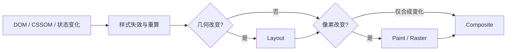

# 浏览器样式与布局过程

给文章添加一个只改变颜色的 class，浏览器需要重新计算样式并绘制；再添加一个满足 `:has()` 的子节点，祖先样式也可能失效；如果规则改变宽度，还会进入布局。DOM 变化不等于每次完整重跑全部渲染阶段。

## 先建立渲染阶段地图



这是排障模型，不是所有浏览器固定实现。引擎会缓存、并行、合并更新；具体阶段以目标浏览器的 Performance trace 为证据。

## 步骤一：选择器变化怎样让样式失效

浏览器不需要每次从文档根重新匹配所有规则。它根据 class、属性、状态和结构变化标记可能受影响的元素，再计算层叠结果。后代选择器、兄弟选择器和 `:has()` 会扩大需要考虑的关系范围，但不能只按“选择器从右向左”口号推导实际成本。

期望实验是先切换只改 color 的 class，再插入会让 `article:has(> img)` 命中的图片。Performance 中记录 Recalculate Style 的范围，并确认是否发生 Layout。下面的样式只提供可观察差异。

```css
.article.is-muted { color: #667085; }
.article:has(> img) { padding-block-start: 0; }
.article > img { inline-size: 100%; aspect-ratio: 16 / 9; }
```

输入是 class 和子树两类变化；关键逻辑是第一条影响继承颜色，后两条让祖先匹配和图片几何改变；输出通常分别触发绘制或额外布局。实际 trace 还受页面其余样式影响，应在最小页面和代表页面各测一次。

## 步骤二：样式计算做了什么

匹配规则后，浏览器按来源、important、layer、specificity 和顺序层叠，再处理继承、自定义属性与计算值。伪类由链接、焦点、表单、树关系等状态驱动；伪元素产生额外可绘制对象，但不一定对应普通 DOM 节点。

Shadow DOM 改变样式作用域，`:host`、`::slotted` 和 part 有专门规则。全局选择器无法穿透封装边界，CSS 自定义属性则可以按继承协议进入组件。

## 步骤三：什么时候需要布局

布局根据格式化上下文、包含块、字体、内容和可用空间计算盒几何。改 width、display、字体指标、DOM 内容等可能让当前元素、祖先或后续元素重新布局。containment 能限制部分影响范围，但会引入尺寸和溢出语义，需按组件边界采用。

读取几何 API 可能迫使浏览器先刷新样式和布局。把 DOM 写入集中，再批量读取/写入，能减少 layout thrashing；是否改善应由 Layout 次数和主线程时间验证。

## 步骤四：绘制与合成不是性能魔法

颜色、阴影和背景改变通常需要绘制。transform 与 opacity 在元素已有合成层且内容可复用时，可能只更新合成属性；浏览器是否分层由自身启发式决定。

`will-change` 只是提前提示，长期给大量元素设置会增加图层、栅格和显存成本。动画是否顺滑还取决于主线程输入、图片解码和 GPU 资源，不应只检查属性名。

## 故意制造一次失败

循环中为每个列表项写 class，立即读取 offsetHeight，再写下一个。Trace 若出现反复 Style/Layout，就是同步读写交错。改成先写完、统一读取或减少测量后，再比较任务时间。

另一个失败是给所有卡片加 `will-change: transform`。Layers 面板可能出现大量纹理，滚动内存和栅格成本上升。删除长期提示，让浏览器按实际动画管理，并只在短暂交互前后设置必要范围。

## 参考资料

- [CSS Cascading and Inheritance](https://www.w3.org/TR/css-cascade-5/)
- [CSS Display Module](https://www.w3.org/TR/css-display-3/)
- [Chrome DevTools：Performance](https://developer.chrome.com/docs/devtools/performance/)
- [web.dev：Rendering performance](https://web.dev/articles/rendering-performance)
