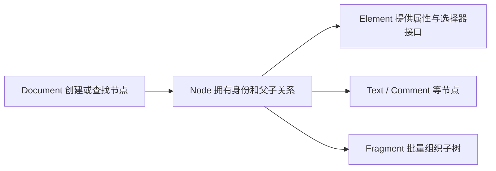

# DOM API 与节点操作

把一个按钮从容器 A 移到 B，它的事件监听器还在；用 `cloneNode(true)` 复制按钮，监听器却不在。DOM 操作处理的是具有身份、所有者文档和连接状态的节点，不是把 HTML 字符串从一处复制到另一处。

## 先认识 DOM 的主要对象

Document 表示文档入口，Node 定义树的通用能力，Element 表示元素节点，Text 表示文本，DocumentFragment 是临时轻量容器。Attr 由元素属性接口管理，不应当作普通子节点理解。



`ownerDocument` 表示节点所属文档，`isConnected` 表示是否连接到文档树。Shadow tree、template content 与普通 document tree 还会形成不同根。

## 步骤一：比较移动和克隆

预期结果是移动后的原按钮点击仍增加计数，克隆按钮只复制 id、属性与子节点，不复制通过 `addEventListener` 注册的监听器。插入已存在节点会先把它从旧父节点移走。

```js
const source = document.querySelector('#source')
const target = document.querySelector('#target')
const button = source.querySelector('button')
let count = 0

button.addEventListener('click', () => { count += 1 })
target.append(button)

const clone = button.cloneNode(true)
clone.removeAttribute('id')
target.append(clone)

console.log(button.isConnected, clone.isConnected, count)
```

输入是一个已有监听器的节点。append 保留原节点身份，cloneNode 创建新身份；输出显示两者都连接，但只有原节点拥有注册监听。复制表单、canvas、自定义元素时还有额外状态差异，不能从属性相同推导运行时状态相同。

## 步骤二：选择与遍历使用哪套接口

`querySelector(All)` 使用 CSS 选择器，返回首个元素或静态 NodeList；`getElementsBy*` 的部分集合是 live collection，会随 DOM 变化。迭代中修改 live collection 容易跳项，应先快照或选择静态接口。

`children` 只含 Element，`childNodes` 还含 Text/Comment。`parentElement` 在父节点不是 Element 时为 null，`parentNode` 更通用。TreeWalker 和 NodeIterator 适合按节点类型过滤大树，避免手写递归遗漏 Shadow DOM 或 template 边界；是否进入这些边界要由任务明确决定。

## 步骤三：批量创建与安全插入

创建文本使用 `textContent` 或 `createTextNode`，不会把 `<script>` 当元素解析。`insertAdjacentHTML` 和 innerHTML 会解析字符串，适合可信模板或经过清洗的富文本。DocumentFragment 可在插入前组织多节点，插入后 fragment 本身变空，子节点进入目标树。

批量 fragment 不保证“只触发一次布局”，浏览器布局由读取时机和渲染调度决定。它的主要价值是清楚地组织子树和减少反复连接过程，性能仍要测量。

## 步骤四：Range 表达一个文档范围

Range 由起点容器/偏移和终点容器/偏移组成，可以跨 Text 与 Element 边界。它支持提取、克隆、删除内容与获取边界矩形，是选区、编辑器和高亮的基础。

DOM 改变时 Range 会按规范调整边界，但应用保存到数据库的路径不会自动稳定。持久标注需要文本引用、结构路径、上下文摘要和重新定位策略，并处理原文已修改的失败结果。

## 步骤五：MutationObserver 观察的是批次

MutationObserver 异步收到 childList、attributes、characterData 等变更记录，回调在微任务检查点交付。它不观察 JavaScript 变量，也不替代业务状态管理。配置 subtree 或 attributeOldValue 会增加成本。

观察器回调若继续修改同一区域，可能产生后续记录和反馈循环。拥有者应限制处理量、过滤目标，并在销毁时 disconnect；测试要等待对应微任务时机，而不是同步断言回调已执行。

## 命名空间与多文档

HTML 文档中的 SVG/MathML 元素有不同 namespace，可用 `createElementNS()` 明确创建。把节点送入另一个 Document 时，`importNode()` 克隆到目标文档，`adoptNode()` 转移所有权；自定义元素与 iframe Realm 还需验证生命周期和构造器身份。

## 失败与验证

克隆带 id 的表单区域会产生重复 id，label、ARIA 引用和选择器可能指向错误目标。克隆后应重新生成标识并重建需要的监听/状态，或通过事件委托让新节点自然接入。

用 DevTools DOM breakpoints 和 MutationObserver 记录查找意外修改者；对编辑器测试 Range 在拆分文本、插入节点和撤销后的边界。性能问题用 trace 观察样式/布局，不以 DOM API 调用次数直接推导耗时。

## 参考资料

- [WHATWG DOM Standard](https://dom.spec.whatwg.org/)
- [DOM Standard：Ranges](https://dom.spec.whatwg.org/#ranges)
- [DOM Standard：Mutation observers](https://dom.spec.whatwg.org/#mutation-observers)
- [MDN：Document Object Model](https://developer.mozilla.org/docs/Web/API/Document_Object_Model)
