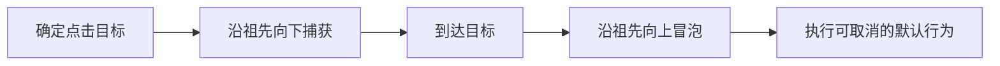

# DOM 事件系统

页面里有一个列表，按钮由接口动态添加。你给每个按钮绑定点击事件，后来发现新按钮没有反应；为了修复，又在外层监听一次，结果一次点击执行了两遍。

要解决这类问题，先要知道浏览器点击元素后发生了什么。本篇用一个嵌套按钮观察事件目标、捕获和冒泡，再用同一套机制实现事件委托。最后区分“阻止传播”和“阻止默认行为”。

## 先认识事件里的三个对象

**事件**是浏览器对一次交互的描述，例如 `click`、`input` 或 `keydown`。**事件目标** `target` 是交互最初指向的节点。**当前节点** `currentTarget` 是正在执行监听器的节点。

假设按钮在一个面板里：点击按钮时，`target` 通常是按钮；当面板的监听器正在执行时，`currentTarget` 是面板。事件委托正是利用了这两个对象的差别。

## 点击后经历哪些阶段



浏览器先通过命中测试确定目标，再构造传播路径。捕获阶段从外层向目标前进，目标阶段执行目标上的监听器，能够冒泡的事件再从目标向外层返回。

并非所有事件都会冒泡，默认行为也不是传播的一部分。例如点击链接通常会触发导航，这是浏览器在事件分发后执行的默认行为。

## 第一步：亲手观察捕获和冒泡

下面页面只包含一个面板和一个按钮。四个监听器会把执行顺序、`target` 和 `currentTarget` 打印出来。

```html
<div id="panel">
  <button id="save" type="button">保存</button>
</div>

<script type="module">
  const panel = document.querySelector('#panel')
  const save = document.querySelector('#save')

  const log = label => event => console.log(label, {
    phase: event.eventPhase,
    target: event.target.id,
    currentTarget: event.currentTarget.id,
  })

  panel.addEventListener('click', log('panel capture'), { capture: true })
  save.addEventListener('click', log('button capture'), { capture: true })
  save.addEventListener('click', log('button bubble'))
  panel.addEventListener('click', log('panel bubble'))
</script>
```

输入是一次按钮点击。输出顺序是外层捕获、按钮上的两个监听器、外层冒泡。按钮上的监听器都处于目标阶段；`target` 一直是 `save`，只有 `currentTarget` 会随着当前监听节点变化。

`addEventListener` 的第三个参数还支持 `once`、`passive` 和 `signal`。`once` 在执行后自动移除；`signal` 适合组件销毁时成组清理；`passive` 表示监听器不会取消默认行为，常用于浏览器需要尽快处理的滚动输入。

## 第二步：用冒泡实现事件委托

事件委托是把监听器放在稳定父元素上，再根据 `target` 判断用户点击了哪个子元素。这样动态添加的按钮也能工作。

```js
const list = document.querySelector('#article-list')

list.addEventListener('click', event => {
  if (!(event.target instanceof Element)) return

  const button = event.target.closest('button[data-article-id]')
  if (!button || !list.contains(button)) return

  const articleId = button.dataset.articleId
  console.log('open article', articleId)
})
```

输入是列表子树中的任意点击。代码先确认目标是元素，再向上寻找带文章 ID 的按钮，并用 `contains` 保证按钮仍属于当前列表。输出是被点击文章的 ID；点击空白区域时什么也不做。

这里使用 `closest`，是因为用户可能点到按钮里的图标或文字，而不是按钮节点本身。若事件来自 Shadow DOM，还要结合 `composedPath()` 理解封装边界，不能假设普通祖先链总能看到内部节点。

## 第三步：区分三种“阻止”

| 方法 | 阻止什么 | 不会阻止什么 |
| --- | --- | --- |
| `preventDefault()` | 链接导航、表单提交等可取消默认行为 | 事件继续传播 |
| `stopPropagation()` | 继续经过后续祖先节点 | 当前节点其他监听器、已执行监听器 |
| `stopImmediatePropagation()` | 后续节点和当前节点后续监听器 | 已经执行的监听器 |

调用 `preventDefault()` 前可以查看 `event.cancelable`。在 passive 监听器里调用它不会按预期取消默认行为，浏览器通常还会给出警告。

全局使用 `stopPropagation()` 往往会让埋点、快捷键或外层组件收不到事件。组件冲突应先检查监听范围和职责，只有传播本身违反交互规则时才停止它。

## 正常结果和一次故意失败

正常场景：列表首次渲染两个按钮，之后又动态插入第三个按钮。父容器只有一个监听器，三个按钮都能输出各自 ID。

失败场景：监听器直接读取 `event.target.dataset.articleId`。用户点到按钮内的图标时，`target` 是图标，结果得到 `undefined`。修复不是给图标再绑一次事件，而是用 `closest` 找到承担操作语义的按钮。

## 什么时候不使用事件委托

子元素很少且生命周期明确时，直接监听更简单。高频事件若在巨大容器上做昂贵的 `closest` 查询，也要评估成本。对于不冒泡的事件，应确认是否有可替代事件或使用捕获阶段，不能直接套用点击委托。

下一篇浏览器内容会继续讨论 DOM API 与页面结构。先掌握事件路径，组件事件、快捷键和 Shadow DOM 的行为才不会变成“试出来的规则”。

## 参考资料

- [WHATWG DOM：Events](https://dom.spec.whatwg.org/#events)
- [MDN：EventTarget.addEventListener](https://developer.mozilla.org/docs/Web/API/EventTarget/addEventListener)
- [MDN：Event bubbling](https://developer.mozilla.org/docs/Learn_web_development/Core/Scripting/Event_bubbling)
