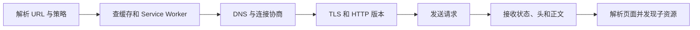

# 浏览器网络与 HTTP

在地址栏输入 URL 后，浏览器不是立刻“发送一个 HTTP 包”。它先解析地址、查缓存和策略，再建立或复用连接，发送请求并处理响应。页面随后还会发现 CSS、脚本、字体和图片，形成更多带优先级与依赖的请求。

## 先看一次导航的主流程

实际浏览器会并发、预连接、复用缓存，代理和 Service Worker 也可能介入。这张图只建立排障顺序，不能作为某个引擎的固定线程模型。

## 步骤一：读懂一组请求与响应

HTTP 消息由方法/目标或状态行、字段和可选正文组成。HTTP/2 和 HTTP/3 在线路上使用二进制帧，不再发送 HTTP/1.1 的文本格式，但开发者面对的方法、状态和字段语义仍大体延续。

方法表达请求意图：GET 获取表示，HEAD 只取响应元数据，POST 提交由资源处理的数据，PUT 通常替换目标状态，PATCH 做部分修改，DELETE 请求删除。安全方法与幂等性是协议语义，不是“是否需要鉴权”的结论。

GET 和 POST 没有天然安全等级差异。查询参数可能进入历史、日志和 Referer，POST 正文也能被客户端、代理和服务端读取；敏感传输依赖 HTTPS，权限依赖服务端认证授权，副作用还要处理 CSRF、重放和幂等。

## 步骤二：按状态码决定下一步

1xx 表示临时信息，2xx 表示请求得到成功处理，3xx 表示重定向或缓存相关结果，4xx 表示当前请求问题，5xx 表示服务端未完成请求。具体语义要看具体状态，而不是只看首位。

例如 200 与 204 都是成功，但后者没有响应内容；202 表示已接收处理，不表示后台任务最终成功；304 只用于条件请求，客户端复用已有表示；401 通常需要认证，403 表示服务器理解但拒绝授权；429 应配合限流策略，客户端重试还要考虑 `Retry-After` 与抖动。

重定向中，301/308 常表达永久目标，302/303/307 的方法保留语义不同。应用应使用明确状态，并验证浏览器、fetch 与代理对非 GET 方法的实际处理。

## 步骤三：理解浏览器缓存

新鲜缓存可以直接复用，不发条件请求；过期后，浏览器可带 `If-None-Match` 或 `If-Modified-Since` 验证，服务端返回 304 后继续使用本地正文。`Cache-Control` 决定新鲜度与共享边界，ETag 是表示验证器。

`no-cache` 表示复用前需要验证，不等于“不存储”；`no-store` 才要求不存储。带身份信息的响应要仔细设置 `private`、`Vary` 和共享 CDN 策略，避免不同用户表示互相污染。静态指纹资源适合长期 immutable 缓存，HTML 通常需要更快发现新版本。

## 步骤四：Cookie、CORS 与 CSP 各管什么

Cookie 由响应 `Set-Cookie` 创建，并按 Domain、Path、Secure、HttpOnly、SameSite 等规则附加到后续请求。前端无法设置或读取 HttpOnly Cookie；Secure 限制安全传输，SameSite 影响跨站发送，三者解决不同问题。

CORS 控制浏览器脚本是否可以读取跨源响应，不阻止服务器收到请求，也不是服务端权限系统。非简单请求可能先发 preflight；允许 credentials 时，`Access-Control-Allow-Origin` 不能使用通配符。

CSP 限制页面可以加载和执行哪些内容，用来降低 XSS 等风险；它不代替输出编码。CSRF 防护则关注浏览器自动携带凭证的跨站请求，可组合 SameSite、CSRF token、Origin 验证和重新认证。

## 步骤五：HTTPS、HTTP/2 和 HTTP/3 改了什么

HTTPS 是 HTTP over TLS，提供传输机密性、完整性和服务器身份验证。它不证明业务响应正确，也不阻止端点本身记录内容。证书、协议版本和 cipher 的选择由服务器、浏览器与平台安全基线共同决定。

HTTP/2 在一条连接上多路复用多个流，并使用 HPACK 压缩头部，减少 HTTP/1.1 多连接与应用层队头问题。TCP 丢包仍可能影响同一连接中的数据。历史上的 Server Push 已被主流浏览器移除或关闭，不应作为现代主要优化；资源发现优先检查 HTML、preload、103 Early Hints 和缓存。

HTTP/3 基于 QUIC，在独立流之间降低传输层队头影响，并改善连接迁移。它不自动让所有页面更快，握手、服务器支持、网络和资源依赖仍需用真实数据验证。

## 正常结果与失败演练

在 DevTools Network 中为同一 URL 连续加载：第一次可能 200，第二次显示 memory/disk cache，过期后可能通过 304 验证。保留 Disable cache 的状态说明，否则截图无法比较。

制造两个失败：让响应缺少正确 `Vary`，用不同 Accept-Encoding 或 Origin 访问，检查缓存是否混用；再让 CORS preflight 拒绝，观察请求失败位置。状态 200 但脚本读不到响应，说明传输成功、浏览器安全策略和应用可用性是三层事实。

Network 面板的 Protocol 列可以显示 h2、h3 等协商结果；也可查看安全信息和响应字段。不要用“Header 没有 view source”猜 HTTP 版本。

## 参考资料

- [HTTP Semantics：RFC 9110](https://www.rfc-editor.org/rfc/rfc9110)
- [HTTP Caching：RFC 9111](https://www.rfc-editor.org/rfc/rfc9111)
- [HTTP/2：RFC 9113](https://www.rfc-editor.org/rfc/rfc9113)
- [HTTP/3：RFC 9114](https://www.rfc-editor.org/rfc/rfc9114)
- [Fetch Standard](https://fetch.spec.whatwg.org/)
