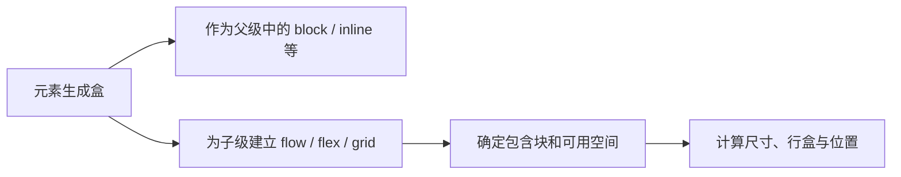

# 浏览器布局与格式化上下文

相同的三个子元素放进 block、flex 和 grid 容器，DOM 没变，尺寸和位置却不同。`display` 不只决定元素自己像块还是行内，还决定它为子元素建立哪种内部格式化上下文。

## 先拆开外部与内部 display

外部 display type 描述元素怎样参与父级布局，例如 block 或 inline；内部 display type 描述子元素怎样布局，例如 flow、flex、grid。`display: inline flex` 能明确表达两者，旧的 `inline-flex` 是兼容短写。



某些 display 值会让元素不生成普通盒或采用 table/ruby 等专门模型。`display: contents` 对布局和可访问树的历史兼容需要在目标浏览器测试。

## 步骤一：比较三种容器

预期结果是 block 子项沿块方向堆叠，flex 子项在主轴排列，grid 子项进入显式列。示例同时用 gap，避免 margin 折叠干扰比较。

三个容器应使用相同宽度和相同子节点，子节点包含短文本与一段不可断字符串。先在默认书写模式观察，再缩窄容器并切换 `writing-mode`；这样能区分布局算法、内容最小尺寸和书写方向造成的变化，而不是只对比一张宽屏截图。

```css
.block { display: block; }
.flex { display: flex; gap: 1rem; }
.grid { display: grid; grid-template-columns: repeat(2, minmax(0, 1fr)); gap: 1rem; }

.block > * + * { margin-block-start: 1rem; }
.flex > *, .grid > * { min-width: 0; }
```

输入是相同子树和三种内部布局，关键差异是普通流、主轴分配与二维轨道；输出可在 Layout 面板查看。`min-width: 0` 允许 Flex/Grid item 在长内容下收缩，仍需为 URL、代码或表格设计溢出策略。

## 步骤二：正常流怎样排文字和盒

块级盒沿 block axis 排列，inline 内容生成行盒并在可用 inline size 中换行。书写模式会改变轴方向，因此“水平/垂直”不总等于 inline/block。字体度量、line-height、替换元素和 bidi 都会影响行盒。

块间 margin 可能折叠，BFC、边框、padding、Flex/Grid 容器等条件会阻止折叠。遇到间距异常时先检查格式化上下文，不要通过随意负 margin 抵消。

## 步骤三：包含块决定定位参照

百分比尺寸和绝对定位偏移需要包含块。positioned ancestor、transform、contain 等都可能改变绝对/fixed 元素的参照。fixed 元素在移动端还要面对 layout viewport、visual viewport 和软键盘。

绝对定位脱离普通流，其他内容不会为它预留空间，适合局部覆盖；若内容高度未知或需要自然推开后续元素，应保留在流中。z-index 只在相应 stacking context 中比较，不能用无限增大数字跨越祖先上下文。

## 步骤四：浮动、Flex 与 Grid 的边界

float 让行内内容环绕浮动盒，适合文章插图；flow-root 可建立 BFC 包含浮动。现代应用主布局通常使用 Flex/Grid，因为它们直接表达空间分配和对齐。

Flex 的主轴与交叉轴由 flex-direction 和书写模式决定；flex-basis、grow、shrink 和 min-size 共同分配空间。Grid 使用显式/隐式轨道、fr、minmax 与自动放置。视觉重排不应改变逻辑 DOM，键盘和读屏顺序仍需验证。

## 故意制造一次失败

把 grid 轨道写成 `1fr 1fr`，插入一个不可断字符串。轨道可能受 min-content 撑大并产生页面横向滚动。改用 `minmax(0, 1fr)` 后，再决定内容换行或局部滚动。

再给弹层祖先加 transform，fixed 子元素可能改以该祖先为包含块，出现“固定元素跟着容器走”。DevTools 查看 containing block 和 stacking context，比继续调 top/left 更快定位原因。

## 参考资料

- [CSS Display Module Level 3](https://www.w3.org/TR/css-display-3/)
- [CSS 2.1 Visual Formatting Model](https://www.w3.org/TR/CSS21/visuren.html)
- [CSS Flexible Box Layout](https://www.w3.org/TR/css-flexbox-1/)
- [CSS Grid Layout](https://www.w3.org/TR/css-grid-2/)
