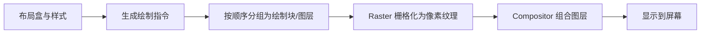

# 浏览器绘制与合成

两个方块视觉上都向右移动：一个动画 `left`，另一个动画 `transform`。前者通常改变布局位置并需要重绘，后者在满足条件时可以复用已有栅格内容，只更新合成。结果仍取决于图层、内容和设备，不能只靠属性名称下结论。

## 从布局盒到屏幕像素



不同引擎的内部对象命名和线程划分会变化。Web 平台承诺可观察渲染结果，开发者工具展示某版本实现；文章使用 display list、layer 等术语建立排障模型，不要求每个浏览器结构相同。

## 步骤一：比较 left 与 transform

预期结果是两者看起来移动相同距离，但 Performance trace 的 Layout、Paint 与 Composite 记录可能不同。测试前固定方块尺寸、动画时长和页面其余工作。

实验应在同一页面、同一录制区间运行，并先关闭其他动画和 DevTools CPU throttling。打开 paint flashing 与 Layers 后，分别录制静止、播放和中断三个阶段。我们关注 Layout、Paint、Raster 与合成层变化，不用一次肉眼帧率判断哪个属性“永远更快”。

```css
.by-left {
  position: relative;
  animation: move-left 800ms linear infinite alternate;
}

.by-transform {
  animation: move-transform 800ms linear infinite alternate;
}

@keyframes move-left { to { left: 8rem; } }
@keyframes move-transform { to { transform: translateX(8rem); } }
```

输入是两个只在动画属性不同的元素。left 改变相对定位几何，transform 作用于绘制后坐标；输出应通过 Performance、paint flashing 和 Layers 观察。transform 不保证独立图层，文字抗锯齿、纹理尺寸和内存也可能变化。

## 步骤二：理解绘制顺序与 stacking context

背景、边框、负 z-index、块内容、浮动、行内内容和定位元素按规范绘制顺序组合。opacity、transform、filter、isolation、position/z-index 等条件可能创建 stacking context；子元素的 z-index 只在所属上下文比较。

遇到弹层被盖住时，应画出 stacking context 树。把 z-index 从 9999 改成更大值，仍无法越过祖先上下文；解决方式可能是调整 DOM portal、祖先属性或明确层级 token。

## 步骤三：图层与栅格为何有成本

浏览器会根据动画、滚动、视频和重叠等因素选择合成层。图层可以让部分更新避免重绘其他内容，但每层需要纹理、栅格和上传，超大层还可能分 tile。滚动时浏览器只栅格需要区域，并尝试预栅格后续区域。

`will-change` 可在变化前提示浏览器准备，适合短暂、明确的热点。长期给大量节点设置会增加内存，甚至比原方案更慢。使用后应移除，并在低端设备检查峰值。

## 步骤四：哪些内容仍会触发 Paint

背景、颜色、阴影、边框和文字等像素变化通常需要重新绘制；滤镜可能在 GPU 处理，也可能产生昂贵中间表面。图片解码、字体加载与 Canvas 绘制也会进入帧成本。

合成动画仍可能被主线程长任务影响输入和提交，不能把“Compositor 动画”理解为页面永远 60fps。刷新率也不固定，评价应看掉帧、任务时长与目标设备，而不是写死每帧 16.67ms 作为所有屏幕标准。

## 故意制造一次失败

给整个长列表设置 transform 以“开启 GPU”。Layers 可能生成一张巨大纹理，滚动时栅格和显存上升。删掉无必要 transform，只提升正在动画的小元素，再比较内存和帧时间。

另一个失败是仅用截图验证绘制。截图相同无法说明动画中是否反复 Paint，也无法发现被遮挡层仍在消耗资源。需要保存 Performance trace 的环境、操作和时间段，并在动画中断、缩放、滚动时复测。

## 打印和截图为什么也要检查

打印使用分页媒体与不同 viewport，固定定位、背景和 overflow 可能得到不同结果。`@media print` 应隐藏纯交互控件、显示链接必要信息并避免截断正文；不要假设屏幕合成层会原样映射到打印。

Canvas 或跨源图片截图还涉及 tainted canvas，字体加载时机也会改变输出。自动视觉测试应等待明确页面就绪条件，而不是固定 sleep 后截图。

## 参考资料

- [CSS 2.1：Painting order](https://www.w3.org/TR/CSS22/zindex.html)
- [CSS Transforms Level 2](https://www.w3.org/TR/css-transforms-2/)
- [Chrome DevTools：Layers](https://developer.chrome.com/docs/devtools/layers/)
- [web.dev：Rendering performance](https://web.dev/articles/rendering-performance)
