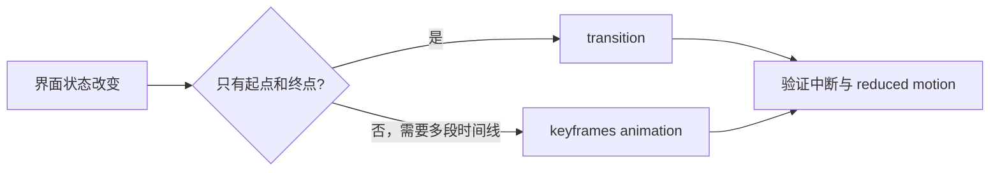

# CSS 动画与过渡

按钮悬停时从灰色变蓝，面板打开时从下方进入，这两种效果看起来相似，却适合不同工具。`transition` 连接两个已知状态，`animation` 描述一条可以重复和分段的时间线。选错工具通常不会报错，却会让中断、状态同步和无障碍变难。

## 先判断你要表达哪种变化



过渡需要属性的计算值发生改变才会触发，适合 hover、展开、选中等反馈。关键帧动画由 `@keyframes` 定义中间阶段，适合加载提示或需要多段动作的效果。两者都只负责视觉，不会自动改变业务状态或焦点。

## 步骤一：给面板增加短过渡

预期结果是：`data-open` 从 `false` 变为 `true` 时，面板在 160ms 内淡入并回到原位；用户要求减少动态效果时，内容仍立即可见。

```css
.panel {
  opacity: 0;
  transform: translateY(0.5rem);
  transition: opacity 160ms ease, transform 160ms ease;
}

.panel[data-open="true"] {
  opacity: 1;
  transform: translateY(0);
}

@media (prefers-reduced-motion: reduce) {
  .panel {
    transition-duration: 1ms;
  }
}
```

输入是 `data-open` 的状态变化，关键逻辑是只过渡 `opacity` 和 `transform`；输出是短暂视觉反馈，最终 DOM 状态仍由属性表达。明确列出属性比 `transition: all` 更容易审查，也避免以后新增尺寸样式时意外参与动画。

## 步骤二：理解动画的六个部分

`animation-name` 指向关键帧，`duration` 表示一轮时长，`timing-function` 控制插值，`delay` 控制开始等待，`iteration-count` 控制次数，`direction` 控制播放方向。`fill-mode` 还会影响开始前和结束后采用哪一帧样式。

一条动画可以在不同关键帧区间使用不同时间函数。它适合描述“进入、停顿、退出”等多阶段过程；如果只有两个状态，transition 通常更直观。

## 步骤三：把动画放回业务状态机

复杂组件可能处于 `closed`、`opening`、`open`、`closing`。动画只是状态之间的反馈。用户在播放中再次点击、按 Escape、切换路由或开启 reduced motion 时，状态机仍要得出确定结果。

监听 `animationend` 或 `transitionend` 时，要确认事件来自目标属性和目标元素，并在组件卸载时清理监听。不要用一个定时器假设所有设备都按同样时长完成；页面后台运行、样式变化和用户设置都会影响事件时机。

## 性能为什么不能只背 transform

改变 `width`、`height`、`top`、`left` 等几何属性，可能重复触发布局与绘制；`transform` 和 `opacity` 往往更容易在合成阶段处理。但创建过多合成层也会增加栅格化和内存成本，所以“只用 transform 就一定快”同样不准确。

使用 DevTools Performance 记录静止、播放和中断三段，观察长任务、布局、绘制、栅格化和图层数量。动画还应保持输入响应与焦点可见，不能只比较帧率。

## 故意制造一次失败

在面板打开动画中再次点击关闭。如果组件只等待第一次结束事件，视觉可能回到关闭，业务状态却仍写着 open。测试应断言最终属性、可见性和焦点三者一致。

再开启系统的“减少动态效果”。正常结果是核心内容和进度仍可理解；如果动画被移除后页面永远停在透明或位移状态，说明动画错误地承担了业务状态。

## 验收清单

1. 动画关闭时，功能仍完整可用。
2. 播放中再次操作会进入确定状态。
3. Escape、路由切换和卸载会清理监听器。
4. reduced motion 下保留必要状态反馈。
5. 动画结束后焦点与滚动位置没有丢失。

## 参考资料

- [CSS Transitions Level 2](https://www.w3.org/TR/css-transitions-2/)
- [CSS Animations Level 2](https://www.w3.org/TR/css-animations-2/)
- [MDN：Using CSS animations](https://developer.mozilla.org/docs/Web/CSS/CSS_animations/Using_CSS_animations)
- [web.dev：Animations](https://web.dev/learn/css/animations/)
