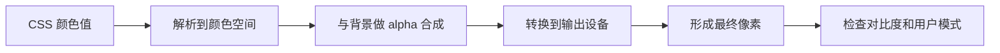

# Web 色彩系统

同一个半透明蓝色放在白底和黑底上，最终颜色并不相同。只比较十六进制值，也无法判断文字是否易读。网页色彩要同时考虑颜色空间、透明度合成、实际背景、用户设置与屏幕能力。

## 先把颜色从设计值变成显示结果



CSS 中的颜色值是输入，屏幕像素才是结果。半透明前景需要与背景合成；渐变每个位置都可能不同；浏览器还可能受色彩管理、HDR 和强制颜色模式影响。

## 步骤一：认识常用颜色表示

十六进制和 `rgb()` 都能表示 sRGB 颜色，alpha 表示不透明度。HSL 用色相、饱和度和亮度组织参数，便于人工理解，但数值上等距不代表视觉上等距。

现代 CSS 还支持 `lab()`、`lch()`、`oklab()` 和 `oklch()`。OKLCH 的明度与色度更接近人类感知，适合生成主题梯度；超出设备色域的值会被映射，仍需在目标浏览器和屏幕验证。CMYK 面向印刷，不是普通网页显示的工作空间。

## 步骤二：建立语义色，而不是散落色值

期望结果是浅色和深色主题共享“正文、背景、强调、危险”这些用途，组件不直接绑定某个蓝色编号。

```css
:root {
  color-scheme: light dark;
  --surface: #ffffff;
  --text: #17202a;
  --accent: oklch(58% 0.17 250);
  --danger: oklch(55% 0.2 25);
}

@media (prefers-color-scheme: dark) {
  :root {
    --surface: #15181d;
    --text: #f2f4f7;
    --accent: oklch(76% 0.12 245);
    --danger: oklch(72% 0.15 25);
  }
}
```

输入是四个按用途命名的 token，关键逻辑是深色模式重新选择每种用途的值；输出是组件只消费语义变量。`color-scheme` 还能提示浏览器调整原生控件，但不会自动替应用完成全部主题样式。

## 步骤三：正确理解透明度

带 alpha 的颜色只影响该颜色与背后的合成，`opacity` 会让整个元素及其子树一起透明。若只想弱化背景，应使用带 alpha 的 background color；给容器设置 `opacity` 可能连文字也变淡。

透明层叠在图片、渐变或其他半透明层上时，最终结果由完整背景链决定。对比度检查必须使用合成后的颜色，不能只拿前景变量与页面最底层背景计算。

## 步骤四：渐变和形状仍要服从内容

线性、径向和锥形渐变是生成图像，可以设置多个 color stop。不同颜色空间中的插值路径会影响中间颜色；品牌渐变需要跨浏览器截图核对，不应假设端点正确就代表中间都合适。

圆角、`clip-path`、遮罩和渐变可以形成图形，但它们通常只承担装饰。传达数据或状态的图形要提供文字、图例和非颜色线索；复杂可交互图形更适合使用有语义的 DOM 或 Canvas/SVG 配套替代内容。

## 正常结果和失败结果

正常主题在浅色、深色、半透明背景与系统高对比模式下仍能区分正文、链接、焦点和错误状态。颜色不是唯一信号，例如表单错误同时有文字与图标。

失败示例是把绿色与红色作为成功/失败的唯一差异，或在渐变最亮位置覆盖白色小字。视觉上“好看”不表示对比持续达标；应取最不利背景点测量，并在 200% 缩放和强制颜色模式中走完任务。

## 如何验证

1. 用浏览器对比度工具检查普通文字、图标与焦点轮廓。
2. 切换浅色、深色、`forced-colors` 和 `prefers-contrast` 支持环境。
3. 在 sRGB 与广色域设备上比较，给现代颜色准备合理回退。
4. 只看灰度或使用色觉模拟，确认状态不只依赖色相。
5. 对动态主题覆盖 hover、disabled、selected 和 error。

## 参考资料

- [CSS Color Module Level 4](https://www.w3.org/TR/css-color-4/)
- [CSS Color Module Level 5](https://www.w3.org/TR/css-color-5/)
- [WCAG：Contrast minimum](https://www.w3.org/WAI/WCAG22/Understanding/contrast-minimum.html)
- [MDN：CSS colors](https://developer.mozilla.org/docs/Web/CSS/CSS_colors)
