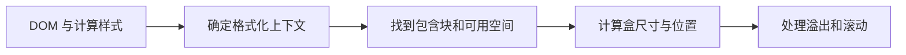

# CSS 布局与格式化上下文

侧栏固定宽度，正文填满剩余空间，看起来是一个简单两列布局。把正文换成长 URL、把页面缩窄或放大到 200%，旧式负 margin 方案就可能溢出。布局方案要由内容和几何约束选择，不由截图位置反推。

## 先理解浏览器从哪里开始排版

普通块级元素沿块方向排列，行内内容形成行盒。每个盒子的百分比、定位偏移和尺寸都要找到包含块；`display`、浮动、定位和 overflow 等属性又可能建立新的格式化上下文。



Flex 和 Grid 不是“代替全部正常流”。Flex 适合沿一个主要轴分配空间，Grid 适合同时控制行列；它们的子项仍受最小内容尺寸、书写模式和溢出规则约束。

## 步骤一：实现一个能收缩的两列布局

预期结果是宽屏显示侧栏与正文，窄屏自动堆叠；正文含长链接时只在自身内部换行或滚动，不把整个页面撑宽。

```css
.page {
  display: grid;
  grid-template-columns: minmax(12rem, 16rem) minmax(0, 1fr);
  gap: 1.5rem;
}

.content {
  min-width: 0;
  overflow-wrap: anywhere;
}

@media (max-width: 42rem) {
  .page {
    grid-template-columns: 1fr;
  }
}
```

输入是侧栏、正文和容器可用宽度。`minmax(0, 1fr)` 与 `min-width: 0` 允许正文轨道小于默认最小内容宽度；输出是长内容不会强迫页面横向溢出。媒体条件只改变布局，不改变 DOM 阅读顺序。

## 步骤二：区分 Flex 和 Grid

导航栏、按钮组等主要沿一条轴排列的内容适合 Flex。需要让标题、正文和操作跨多行对齐的卡片列表更适合 Grid。两者都支持 gap、对齐与顺序控制，但视觉 order 不应破坏键盘和阅读顺序。

Flex item 默认 `min-width: auto`，Grid track 的 `1fr` 也受最小内容影响。遇到“明明有剩余空间却溢出”，先检查 min-content 约束，再决定 `min-width: 0`、`minmax(0, 1fr)` 或内容换行策略。

## 步骤三：知道何时建立 BFC

块格式化上下文（BFC）会隔离一部分内部布局，例如包含浮动、避免外部浮动环绕，并改变 margin collapsing 条件。`display: flow-root` 是表达“建立新的块格式化上下文”的清楚方式。

历史上常用 `overflow: hidden` 清除浮动，但它同时裁剪溢出，可能截断焦点环和浮层。理解副作用后再选择触发方式，不要把 BFC 当作神秘修复开关。

## 步骤四：定位与浮动各有用途

`position: absolute` 让元素脱离普通流，并相对定位包含块放置，适合徽标、局部覆盖和明确锚点；它不适合靠固定坐标搭整页响应式布局。`fixed` 与 viewport 相关，移动端还要考虑视觉视口和软键盘。

float 最初用于让文字环绕内容，如今仍适合文章插图。应用主布局优先使用 Flex/Grid，避免 clearfix、负 margin 与浮动宽度相互依赖。

## 故意制造一次失败

把正文轨道改成 `1fr` 并移除 `min-width: 0`，再插入一段不可断长字符串。若页面出现横向滚动，说明最小内容约束仍在生效。修复后要同时验证代码块、表格和焦点轮廓，因为简单对所有内容使用 `overflow: hidden` 会隐藏真实问题。

另一个失败是用 CSS `order` 把操作按钮移到标题前。视觉顺序改变，Tab 和读屏顺序仍按 DOM，用户会感到焦点跳动。正确做法通常是让 DOM 反映逻辑顺序，再用布局完成对齐。

## 排障顺序

1. 在 DevTools 查看目标元素的 containing block 和 computed display。
2. 确认问题来自可用空间、最小内容、margin collapsing 还是定位。
3. 检查是哪一个元素真正产生 overflow。
4. 逐项关闭定位、固定尺寸与 transform，缩成最小页面。
5. 覆盖长内容、200% 缩放、RTL 与键盘顺序。

## 参考资料

- [CSS Display Module Level 3](https://www.w3.org/TR/css-display-3/)
- [CSS Flexible Box Layout](https://www.w3.org/TR/css-flexbox-1/)
- [CSS Grid Layout](https://www.w3.org/TR/css-grid-2/)
- [CSS Overflow Module Level 3](https://www.w3.org/TR/css-overflow-3/)
