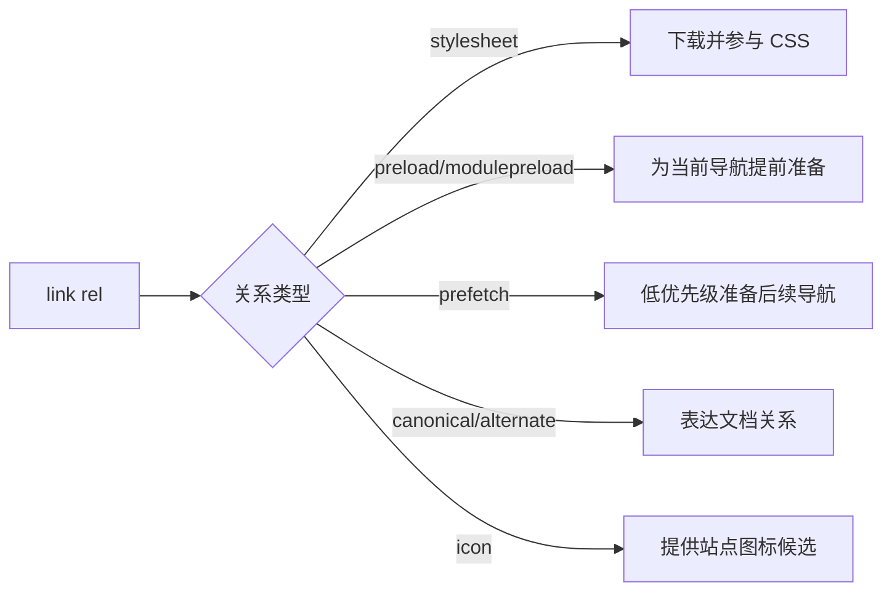

# CSS 与文档资源

`stylesheet`、`preload` 和 `prefetch` 都写在 `link` 中，却不做同一件事。前者把响应作为当前样式表，后两者只向浏览器表达资源意图。标签存在不代表请求一定发出，也不代表后续消费一定复用。

## 先分清导航关系和资源关系

`a` 与 `area` 通常创建用户可以激活的超链接；`link` 描述当前文档与另一个资源或文档的关系。浏览器根据元素、`rel`、`as`、媒体条件、CORS 和响应 MIME 决定是否抓取以及怎样处理。



资源提示是提示，不是下载承诺。省流、网络状态、缓存和浏览器策略都可能改变执行。

## 步骤一：加载并提前发现关键样式

目标结果是主样式表直接生效，打印样式只在打印媒体使用，模块依赖由 modulepreload 提前准备。下面的 preload 字体还要与实际 CSS 中的 URL、CORS 模式和类型完全匹配，才能复用。

```html
<link rel="stylesheet" href="/assets/site.css">
<link rel="stylesheet" href="/assets/print.css" media="print">
<link rel="modulepreload" href="/assets/editor.js">
<link
  rel="preload"
  href="/assets/text.woff2"
  as="font"
  type="font/woff2"
  crossorigin
>
```

输入是四种当前页面资源声明。关键逻辑是 relation 决定处理模型，`as` 和 `type` 帮助选择优先级与安全策略；输出应在 Network 中看到正确 initiator，字体后续消费不重复请求。把 `as="script"` 错写到字体上，通常会导致无法复用或控制台警告。

## 步骤二：理解文档关系

`canonical` 表达重复或相似 URL 的首选地址，不能代替服务端重定向和一致站内链接。`alternate` 可配合语言、媒体或不同表示使用，例如 hreflang 页面需要互相返回并使用可抓取绝对 URL。

`prev`、`next` 仍是通用链接关系，但 Google 已不再把它们作为分页索引信号。分页页面是否可发现，应依赖真实链接、独立 URL、正文与索引策略，而不是把历史 SEO 建议当现行保证。

icon 可以提供尺寸和类型候选；浏览器和平台还可能读取 Web App Manifest。`pingback` 等关系属于特定协议，只有系统确实实现对应能力时才有意义。

## 步骤三：正确使用 a 与 area

`a` 有 `href` 时才具有完整超链接能力，支持复制地址、在新标签页打开和浏览器历史。触发当前页面动作使用 button。链接文本应说明目的，避免一页出现大量无法区分的“点击这里”。

`area` 在 image map 中定义可点击区域，需要有替代文本和可理解的后备导航。响应式图片坐标、缩放和键盘可用性使它不适合大多数现代交互图；SVG 或普通链接列表通常更容易维护。

下载链接的 `download` 属性受同源、响应头和浏览器策略影响，不是强制保存开关。`target="_blank"` 要表达 opener 与 Referer 策略，并在新上下文打开后保持清楚的链接目的。

## 正常与失败验证

正常样式请求具有 `text/css` 响应、可接受的 CORS 和缓存字段，媒体条件改变时样式按预期启用。预加载资源被真正消费者以相同 URL 和请求模式复用。

故意把字体 preload 的 `crossorigin` 删除，或让服务器返回错误 MIME。若出现重复请求或资源拒绝，说明“Network 里看到 200”不足以证明关系有效。检查响应头、initiator、priority、from cache 和控制台，而不是继续添加更多 preload。

## 参考资料

- [WHATWG HTML：Link types](https://html.spec.whatwg.org/multipage/links.html)
- [WHATWG HTML：The link element](https://html.spec.whatwg.org/multipage/semantics.html#the-link-element)
- [MDN：Preloading content](https://developer.mozilla.org/docs/Web/HTML/Attributes/rel/preload)
- [Google Search Central：Pagination](https://developers.google.com/search/docs/specialty/ecommerce/pagination-and-incremental-page-loading)
