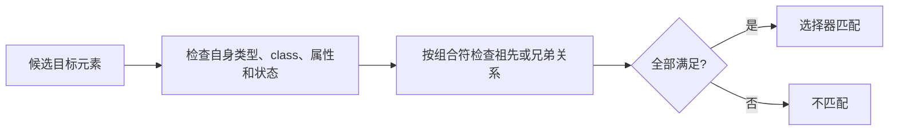

# CSS 选择器与伪元素

`article > img`、`article :is(img, video)` 和 `article:has(> img)` 都提到 article 与图片，真正被选中的元素却不同。读选择器要从右侧目标开始，再看左侧用什么关系限制它，不能只按自然语言从左往右念。

## 先认识选择器的组成

简单选择器可以按类型、class、id、属性或状态筛选。多个简单选择器连在一起形成 compound selector，例如 `button.primary:hover`；再用空格、`>`、`+`、`~` 等 combinator 连接，就得到 complex selector。



这是理解用的匹配模型，不代表浏览器逐元素采用同一算法。现代引擎会编译选择器、缓存结果，并在 DOM 或状态变化时做增量失效。

## 步骤一：比较目标选择和关系选择

预期结果是第一条选择直接属于 article 的 img，第二条选择 article 内任意层级的媒体元素，第三条选择“拥有直接图片子元素的 article 本身”。

```css
article > img { border-radius: 0.5rem; }
article :is(img, video) { max-width: 100%; }
article:has(> img) { padding-block-start: 0; }
article:where(.featured, .pinned) { border-color: currentColor; }
```

输入是 article 与不同层级媒体的 DOM。关键逻辑分别使用子代、后代、关系伪类和零优先级分组；输出目标依次是图片/视频或 article。`:has()` 会让祖先样式随后代变化，使用前检查目标浏览器支持和失效范围。

## 步骤二：理解常见伪类

结构伪类包括 `:first-child`、`:nth-child()`、`:empty` 等；交互状态包括 `:hover`、`:focus-visible`、`:checked`、`:disabled`；链接有 `:link` 与 `:visited`。浏览器会限制 `:visited` 可读取和可设置的属性，以降低历史泄露。

`:is()` 和 `:not()` 的 specificity 取参数中最高值，`:where()` 始终为零，适合写容易覆盖的基础规则。`:focus-visible` 能在适当输入方式下显示焦点，不应通过 `outline: none` 删除键盘反馈。

## 步骤三：不要只算三个数字

层叠先比较来源与重要性、layer 和作用域，再比较 specificity，最后才是源码顺序。id、class/属性/伪类、类型/伪元素常用于解释 specificity，但它不是十进制，也无法跨越更高层级的层叠规则。

大规模项目可以用 `@layer reset, base, components, utilities, overrides` 固定层级。组件状态优先用语义 class 或 data attribute，避免通过很长祖先链提高权重。`!important` 会进入另一条层叠顺序，适合明确控制的少数边界，不是日常覆盖工具。

## 步骤四：伪元素生成的不是普通 DOM

`::before`、`::after`、`::first-line`、`::first-letter` 等指向抽象的树外对象或排版片段，无法像普通 Element 一样遍历。生成内容适合装饰和少量辅助标记，不适合承载核心可访问文本或独立交互。

`::first-line` 的可用属性受限，结果会随容器宽度和字体变化；`::first-letter` 受语言和标点规则影响。选择器与排版关系要在真实内容和语言环境中验证。

## 故意制造一次失败

给组件写 `.page .main #app .card button`，再用另一个页面覆盖按钮颜色。覆盖方被迫复制或提高权重，组件脱离原页面也失去样式。改为低权重组件类、layer 和显式状态后，依赖范围更清楚。

另一个失败是把错误图标文字放在 `::before { content: '错误' }` 中，却没有真实错误说明。关闭 CSS 或辅助技术不暴露生成内容时，信息消失。核心状态应存在 DOM 文本和可访问关系中，伪元素只增强视觉。

## 参考资料

- [Selectors Level 4](https://www.w3.org/TR/selectors-4/)
- [CSS Cascading and Inheritance Level 5](https://www.w3.org/TR/css-cascade-5/)
- [CSS Pseudo-Elements Level 4](https://www.w3.org/TR/css-pseudo-4/)
- [MDN：CSS selectors](https://developer.mozilla.org/docs/Web/CSS/CSS_selectors)
