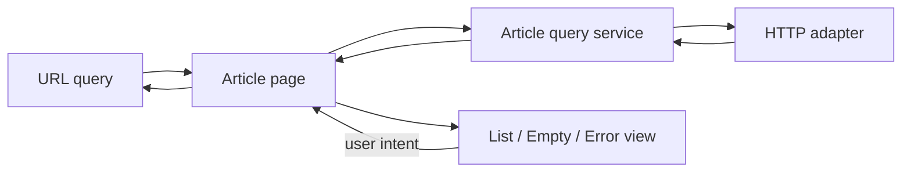

# 前端架构与组件化

从一个文章列表页开始：页面要读取查询条件、请求数据、展示空态，并把选中项同步到 URL。第一版把请求、路由和视图都写进 `ArticlePage`；随后需求增加收藏、分页和错误重试，任何改动都会碰同一个组件。

本篇不先争论框架。我们先找变化原因，再把页面拆为领域状态、数据访问和视图组件，最后用依赖测试和浏览器历史验证边界是否成立。

## 步骤一：画出数据流



图里只有页面编排层知道路由和具体数据服务。列表组件接收数据并发出用户意图，不自行读取 URL 或请求接口。这样它可以在搜索页、收藏页和组件测试中复用。

## 步骤二：先定义页面状态

多个布尔值很容易产生 `loading=true` 且 `error` 不为空的非法组合。我们希望状态成为互斥选项：请求开始时只能是 loading，成功后只能是 ready 或 empty，失败后只能是 failed。用可辨识联合能把这条约束交给 TypeScript 检查：

```ts
type ArticlePageState =
  | { status: 'idle' }
  | { status: 'loading'; requestId: string }
  | { status: 'ready'; items: ArticleSummary[]; total: number }
  | { status: 'empty' }
  | { status: 'failed'; message: string; retryable: boolean }
```

输入是页面可能出现的五个阶段，`status` 是区分分支的关键字段；输出是视图可以穷尽处理的状态协议。请求取消、旧响应覆盖与重试留在页面控制器或查询服务，展示组件只根据当前状态渲染，避免产生“加载中同时显示旧错误”的组合。

## 步骤三：按变化原因拆组件

一个组件进入公共层前，至少回答：

| 问题 | 放在页面内 | 提取为共享组件 |
| --- | --- | --- |
| 是否含文章业务词汇 | 可以 | 应尽量没有 |
| 是否有第二个真实消费者 | 不要求 | 需要 |
| 变化是否由同一需求驱动 | 是 | 否，且契约稳定 |
| 是否能用 Props/事件说明行为 | 可直接组合 | 必须 |

`ArticleCard` 可能仍属于文章领域；通用 `Button`、`Dialog` 才进入设计系统。把一个业务面板变成几十个 Props，不会消除耦合，只会把耦合藏进调用参数。

## 步骤四：让依赖方向可检查

```text
pages -> features -> domain -> shared
                 -> adapters
```

下层不导入上层，领域代码不依赖浏览器或框架对象。可以用 ESLint import 规则、workspace 边界或依赖图在 CI 中阻止反向引用。规则应允许明确的适配器入口，避免把合理依赖变成大量忽略注释。

跨模块只导出稳定入口：

```ts
// features/article-search/index.ts
export { ArticleSearchPanel } from './ui/ArticleSearchPanel'
export type { ArticleSearchInput } from './model/contracts'
```

输入是功能模块允许外部使用的组件和类型，关键做法是只从 `index.ts` 导出稳定契约；输出是消费者无需知道内部缓存和目录结构。消费者不应导入 `features/article-search/internal/requestCache`，这样内部实现调整时不会扩散到整个项目。

## 步骤五：路由也是状态契约

列表筛选、分页和详情选择如果影响分享、刷新或前进后退，应进入 URL。使用 History API 的 router 能通过 `pushState`/`replaceState` 与 `popstate` 恢复逻辑页面；Hash 路由也可工作，并不存在“无法判断前进后退所以没有方案”的限制。

路由验收至少包含：

1. 复制 URL 到新标签页可恢复同一可分享状态；
2. 前进后退不会重复写历史或丢失筛选；
3. 深链接刷新时服务器返回应用入口，而不是 404；
4. 页面切换后标题、焦点与滚动位置符合产品约定。

第四项经常被 SPA 忽略。URL 变化不会自动把屏幕阅读器焦点移动到新内容，也不会自动生成合适页面标题。

## 步骤六：适配内容，不按设备型号写分支

响应式布局首先使用正常流、Flex/Grid、容器可用空间和内容最小尺寸。DPR 主要影响图像资源与像素栅格化，PPI 不是日常 CSS 媒体查询的通用设计入口。

```css
.results {
  display: grid;
  grid-template-columns: repeat(auto-fit, minmax(min(18rem, 100%), 1fr));
  gap: 1rem;
}

.results > * { min-width: 0; }
```

测试 320px 到宽屏、200% 缩放、长标题、系统大字号、RTL 和键盘顺序。`vw` 适合由视口决定的尺寸，但不应替代所有 rem、容器查询与内容约束。

## 故意制造一次失败

让 `ArticleCard` 在挂载时自己请求收藏状态，再渲染 30 张卡片。Network 会出现 N+1 请求；服务端失败时每张卡各自显示不同错误，页面也无法统一重试。

修复时由页面查询层批量读取收藏状态，再以数据传入卡片。回归测试应断言页面只发出预期请求，并验证一项失败如何映射为页面级或条目级状态。

## 验收这次拆分

- 组件测试能在没有 router 和真实网络时渲染各状态；
- 浏览器测试覆盖深链接、刷新与前进后退；
- 依赖规则能让一次故意的反向 import 失败；
- 删除某个业务模块不会要求修改通用组件内部；
- Bundle 分析确认拆分没有把同一依赖复制到多个入口。

## 参考资料

- [MDN: History API](https://developer.mozilla.org/en-US/docs/Web/API/History_API)
- [WAI-ARIA APG](https://www.w3.org/WAI/ARIA/apg/)
- [web.dev: Responsive design](https://web.dev/learn/design/)
