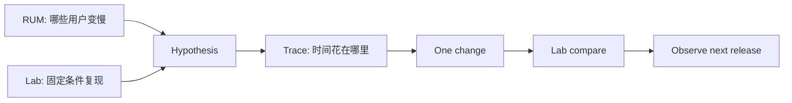

# 性能工程方法

选择一个真实用户任务：打开文章页，看到标题与正文，点击目录跳到对应章节。先固定设备、网络和缓存条件录制基线，再只改变首屏图片优先级，比较 LCP 与资源瀑布。没有基线，就无法知道优化是否来自这次改动。

本篇把性能工作拆成定义任务、定位人群、采集证据、执行实验和防止回归五步。公开阈值用于识别风险，项目预算还要结合页面类型和用户设备。

## 步骤一：从用户完成点选指标

| 用户问题 | 观测指标 | 需要的补充证据 |
| --- | --- | --- |
| 主要内容多久可见 | LCP、TTFB | LCP 元素与资源优先级 |
| 点击后多久有视觉反馈 | INP | Event Timing、Long Animation Frame |
| 内容是否意外跳动 | CLS | layout-shift 来源与会话窗口 |
| 功能何时可用 | 业务完成时间 | 数据、Hydration、错误状态 |
| 长会话是否退化 | 内存、长任务、帧率 | Heap、Performance trace |

平均值会掩盖长尾。Core Web Vitals 通常看 P75，但仍需按页面模板、设备、网络、Release 和地区等不含个人身份的维度分组。

## 步骤二：组合三种证据



RUM 适合看分布和版本回归，实验室适合控制变量，trace 用于定位某次加载或交互的网络、脚本、样式与绘制。Lighthouse 分数本身不是用户数据，也不能证明业务任务完成。

## 步骤三：读一次加载瀑布

按时间顺序回答：HTML 何时到达、关键 CSS/JS/字体何时被发现、LCP 资源是否晚发现、主线程何时被长任务占用、页面是否等待串行 API。

```html
<link rel="preload" as="image" href="/hero.avif" fetchpriority="high">

```

仅当图片确实是本模板 LCP 候选时提高优先级。对每张图 preload 会争抢带宽；尺寸属性主要用于预留比例、减少 CLS，并不会自动缩小下载体积。

## 步骤四：读一次慢交互

将一次交互分为输入延迟、事件处理、渲染与下一帧呈现。若点击后同步过滤大量数据，可以先改善算法和数据结构，再考虑切分任务或虚拟化。

```js
button.addEventListener('click', () => {
  performance.mark('filter:start')
  updateFilteredRows(index.search(input.value))
  performance.mark('filter:end')
  performance.measure('filter', 'filter:start', 'filter:end')
})
```

输入是一次点击和当前筛选词，关键逻辑是在同步搜索与 DOM 更新前后打点；输出是一条名为 `filter` 的 PerformanceMeasure。它只覆盖这段同步函数，不等于完整 INP，还要在 Performance 面板中查看输入延迟、样式、布局、绘制与下一帧。

## 步骤五：设置预算与回归门禁

预算应和页面任务对应，例如：首路由关键 JS 上限、LCP 图片上限、某交互主线程时间、代表场景的 P75 指标。数字来自当前基线与产品目标，不使用“所有图片 50 KB”之类跨场景固定值。

门禁分两类：

- 确定性检查：构建体积、资源数量、图片尺寸、source map 是否外泄；
- 波动性检查：实验室指标与 RUM 趋势，使用多次样本、容忍区间和观察期。

## 故意制造一次失败

把语法高亮库从文章详情动态入口移到全局入口。构建总 gzip 可能变化不大，但首页 Network 会提前下载并解析它。回归门禁应比较路由级 Manifest 或首路由预算，才能发现成本转移。

再把图片尺寸属性删掉，慢速加载时 CLS 用例应失败。两次失败分别证明网络预算与布局稳定性不能由同一个总分替代。

## 结果怎样才算可信

记录环境、样本次数、基线版本、修改版本、主要指标和护栏指标。例如 LCP 下降时还要确认图片质量、错误率、CLS 和交互没有恶化。实验室改善后进入新 Release，再观察对应人群的 RUM 分布。

没有真实流量时明确写“Lab 结果”，不外推用户百分比或业务收益。性能工程的深度来自因果证据，不来自堆叠优化清单。

## 参考资料

- [web.dev: Web Vitals](https://web.dev/articles/vitals)
- [Chrome DevTools Performance](https://developer.chrome.com/docs/devtools/performance/)
- [W3C Performance Timeline](https://www.w3.org/TR/performance-timeline/)
