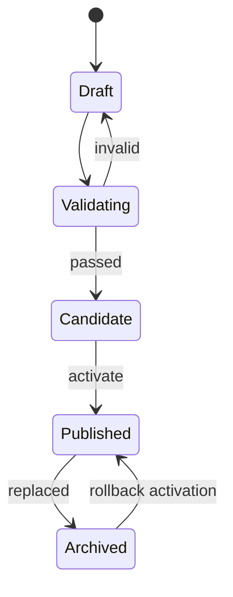

# 前端工程系统设计

假设团队反复制作结构相近的专题页。我们先实现一个最小配置：标题、主题色和两个内容模块；编辑后只能生成预览，审核通过才能发布一个不可变版本。随后故意发布坏配置，验证能否切回上一版本。

本篇保留“数据、模块、模板、页面”四类实体，但把重点放在 Schema、权限、版本、发布状态和渲染安全上。页面数量不是唯一指标，失败率、修改耗时和回滚能力同样重要。

先约定两个词。**Schema** 是配置必须遵守的结构规则，**不可变版本** 是发布后不再原地修改的快照。我们的输入是一份页面配置，期望输出是一份通过校验、可预览且能恢复到上一版的页面，而不是让配置直接控制任意组件和接口。

## 步骤一：定义最小页面协议

```ts
type PageDocument = {
  schemaVersion: 1
  title: string
  theme: { accent: string }
  blocks: Array<
    | { id: string; type: 'rich-text'; content: string }
    | { id: string; type: 'image'; assetId: string; alt: string }
  >
}
```

代码定义了标题、主题和两种内容块的最小输入，`schemaVersion` 为后续兼容提供判断依据；输出是渲染器能够穷尽处理的配置形状。配置属于外部输入，编辑器做即时反馈，服务端在保存和发布时仍要校验 Schema、长度、资源所有权和权限。富文本还需白名单清洗，URL 和图片引用不能成为脚本或内部网络访问入口。

## 步骤二：拆开四种实体

| 实体 | 责任 | 版本语义 |
| --- | --- | --- |
| 数据 | 页面内容与配置 | 草稿可编辑，发布快照不可变 |
| 模块 | 某种 block 的 Schema、编辑器和 renderer | 按兼容协议演进 |
| 模板 | 允许的区域、模块与主题约束 | 页面显式绑定版本 |
| 页面 | 路由、状态、发布版本和所有权 | 一次只激活一个版本 |

模块不直接调用任意业务 API。动态数据通过受控数据源适配器读取，声明参数 Schema、权限范围、超时、缓存和失败 UI。

## 步骤三：从 Schema 生成编辑器

基础字符串、数字、布尔、枚举和数组可由 JSON Schema 映射通用控件；图片、链接、日期范围、资源选择等需要领域控件。通用编辑器负责结构，领域控件负责业务约束。

```json
{
  "type": "object",
  "required": ["title", "blocks"],
  "properties": {
    "title": { "type": "string", "minLength": 1, "maxLength": 80 },
    "blocks": { "type": "array", "maxItems": 40 }
  }
}
```

编辑器预览与线上 renderer 应消费同一协议和组件版本。若预览另写一套渲染逻辑，发布前看到的结果就不是将要上线的结果。

## 步骤四：把发布建成状态机



发布保存配置快照、模板/模块版本、资源清单、操作者和时间。激活只切换当前版本指针，不覆盖历史内容；静态渲染时先生成候选目录，完整后再原子切换。

## 步骤五：设计渲染失败语义

一个模块失败时要预先决定：隐藏模块、显示占位、阻止整页发布，还是使用上次可用数据。决定依据是页面核心程度，不能由组件随意 catch 后返回空白。

客户端渲染需要限制模块数量、递归深度、资源大小和异步请求。服务端/构建时渲染还要防止模板执行任意代码；模块通过登记表选择，不从配置拼接 import 路径。

## 故意制造一次失败

发布一个引用不存在图片的候选版本。验证阶段应根据资源清单发现缺口，页面保持旧版本。若问题只在切换后暴露，回滚操作只恢复上一个版本指针和静态目录，不重新编辑草稿。

再让旧页面读取新版模块。若模块做了破坏性字段变更，它应拒绝渲染并报告协议不兼容；正确演进是新增 schemaVersion 和迁移/兼容适配器。

## 系统验收

1. 草稿、候选、已发布和归档状态不能越级跳转；
2. 同一发布请求重试不会生成多个活动版本；
3. 预览与线上使用相同 renderer 和锁定模块版本；
4. 权限在保存、预览、发布和读取分别校验；
5. 回滚不依赖重新构建已验证旧版本；
6. 审计日志能说明谁在何时激活了哪个版本。

工程系统的价值是把高频重复工作变成受控产品，同时保留异常处理与人工判断。若页面差异很大、需求频率低，维护平台的成本可能高于直接开发，应该先用数据验证是否值得建设。

## 参考资料

- [JSON Schema](https://json-schema.org/specification)
- [OWASP XSS Prevention Cheat Sheet](https://cheatsheetseries.owasp.org/cheatsheets/Cross_Site_Scripting_Prevention_Cheat_Sheet.html)
- [MDN: Content Security Policy](https://developer.mozilla.org/en-US/docs/Web/HTTP/CSP)
