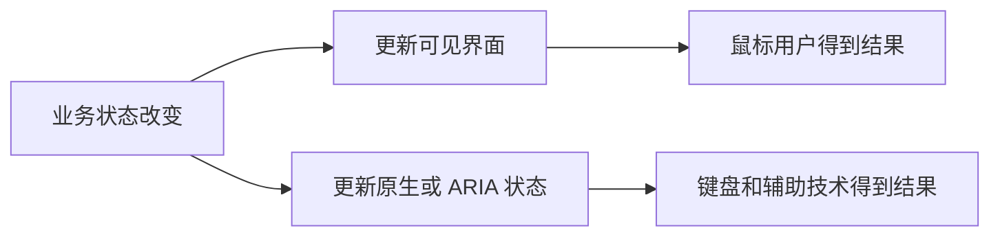

# ARIA 与可访问性语义

一个“固定到顶部”按钮，鼠标点击后图标变色，但读屏软件仍说它是普通按钮。问题不在 CSS，而在状态没有暴露给无障碍 API。ARIA 用来补充角色、名称、状态和元素关系；它不会替我们实现点击、键盘或焦点管理。

## 先理解四个概念

- **Role**：元素是什么，例如 button、dialog、status。
- **Name**：这个元素叫什么，例如“关闭设置”。
- **State**：当前处于什么状态，例如是否按下、展开或选中。
- **Relationship**：它与谁有关，例如哪个说明文字描述输入框。

原生 HTML 往往已经提供 role 和行为。ARIA 的首要用法是补充原生语义没有表达的部分，而不是给每个元素都添加属性。



视觉与 ARIA 应来自同一个业务状态。只更新其中一边，就会让不同用户看到两个互相矛盾的界面。

## 步骤一：实现一个切换按钮

目标结果是：按钮默认未按下，点击后界面与 `aria-pressed` 同步变化；再次点击恢复。原生 `button` 已处理焦点以及 Enter、Space 激活，我们只补充“可切换”和当前状态。

```html
<button id="pin-button" type="button" aria-pressed="false">
  固定到顶部
</button>
<script>
  const button = document.querySelector('#pin-button')

  button.addEventListener('click', () => {
    const pressed = button.getAttribute('aria-pressed') === 'true'
    button.setAttribute('aria-pressed', String(!pressed))
  })
</script>
```

输入是一次按钮激活，关键逻辑是读取旧状态并写回相反值；输出可以在 accessibility tree 中观察到 `pressed` 状态变化。使用原生按钮的原因是复用浏览器行为，只维护业务独有的切换状态。

## 步骤二：让控件拥有准确名称

可访问名称可能来自关联的 `label`、按钮内容、`aria-labelledby` 或 `aria-label`，优先级由 Accessible Name 规范定义。名称应描述用途，并尽量与屏幕上的可见文字一致。

有文字的“保存”按钮通常无需重复 `aria-label`；只有图标而没有可见文字时，可以提供“关闭”等名称。对话框适合用 `aria-labelledby` 引用可见标题，用 `aria-describedby` 连接补充说明。不要同时堆叠互相冲突的名称来源。

## 步骤三：把关系和行为分开

`aria-controls` 表达“这个按钮控制哪个区域”，不会自动显示区域。`aria-expanded` 描述当前是否展开，也不会切换 `hidden`。应用仍要修改实际 DOM，并让视觉状态和 ARIA 状态使用同一个布尔值。

同理，`role="dialog"` 不会创建完整模态框。原生 `dialog.showModal()` 能进入 top layer 并使外部文档 inert，但应用还要设置名称、选择初始焦点、支持关闭，并在关闭后把焦点还给触发按钮。

## 动态消息什么时候需要朗读

保存结果等与当前操作直接相关、又不会获得焦点的消息，可以放进 `role="status"` 区域。严重且需要立即打断的告警才考虑 alert。高频进度、流式 token 和鼠标移动不适合逐条播报，应节流成有意义的阶段。

实践中通常先把空状态容器放入 DOM，再更新其文本。辅助技术对动态插入整个容器的支持存在差异，不能只看屏幕上是否出现文字。

## 失败结果：ARIA 写对了，交互仍不可用

如果把 `div` 标记为 button，它仍不会自动获得 Tab 焦点、Enter/Space 激活和 disabled 行为。如果 checkbox 使用不合法的 `aria-checked="checked"`，辅助技术也可能忽略状态。ARIA 角色对允许和要求的属性有明确约束。

这类失败说明 DOM 属性存在不等于可访问。测试至少分四层：只用键盘完成任务、在 accessibility tree 检查计算后的 role/name/state、运行自动规则、使用真实读屏走一次流程。自动测试能防止明显回退，无法替代人工判断名称是否清楚、焦点是否自然。

## 常见组件的选择顺序

| 界面任务 | 优先元素 | 需要补充的状态或行为 |
| --- | --- | --- |
| 普通动作 | `button` | 通常无需 ARIA |
| 切换动作 | `button` | `aria-pressed` 与业务状态同步 |
| 布尔输入 | `input[type=checkbox]` | 原生 checked/indeterminate |
| 展开区域 | `button` | `aria-expanded`，并实际隐藏目标 |
| 模态对话框 | `dialog` 或 APG 模式 | 名称、初始焦点、关闭和焦点恢复 |

## 参考资料

- [WAI-ARIA 1.2](https://www.w3.org/TR/wai-aria-1.2/)：角色、状态和属性约束。
- [ARIA Authoring Practices Guide](https://www.w3.org/WAI/ARIA/apg/)：组件交互与键盘模式。
- [Accessible Name and Description Computation](https://www.w3.org/TR/accname-1.2/)：名称和描述计算。
- [ARIA-AT](https://github.com/w3c/aria-at)：辅助技术互操作性测试。
