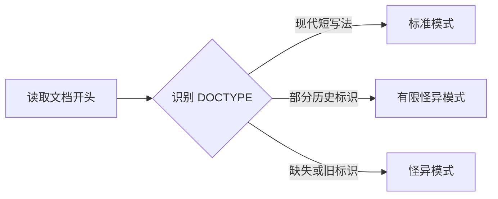

# DOCTYPE、DTD 与标准模式

同一份 CSS，在一个旧页面里宽度不对，复制到新页面却正常，原因可能只是旧页面缺少 `<!doctype html>`。这一行不负责下载规则文件，它告诉浏览器：请按现代标准模式处理当前文档。

## DOCTYPE 解决什么问题

早期网站依赖旧浏览器的非标准布局。浏览器升级后，如果全部改用新行为，大量页面会损坏；如果永远保留旧行为，新页面又无法统一。于是浏览器在创建文档时先选择一种兼容模式。



新页面的目标很简单：使用短 DOCTYPE，让浏览器进入 no-quirks mode。它应位于文档最前面，前面不要插入会干扰识别的内容。

## 写出一个现代文档骨架

在代码之前先看结果：页面创建后，`document.compatMode` 应为 `CSS1Compat`。这代表 no-quirks 或 limited-quirks；现代短写法会进入前者。

```html
<!doctype html>
<html lang="zh-CN">
  <head>
    <meta charset="utf-8">
    <title>示例页面</title>
  </head>
  <body>
    <p>页面内容</p>
  </body>
</html>
```

输入是一个完整的现代 HTML 骨架，关键点只有第一行。浏览器读取它后选择标准模式，再继续解析页面；控制台读取 `document.compatMode` 会得到 `CSS1Compat`。DOCTYPE 不会限制你能使用哪些新标签，也不会触发远程 DTD 下载。

## DTD 为什么会出现在旧代码里

HTML 4.01 曾按照 SGML application 描述，DOCTYPE 中常包含很长的 public identifier 和 DTD 地址，并区分 Strict、Transitional、Frameset。XHTML 1.0 又使用 XML 语法表达相近词汇表。

这些字符串今天仍可能被浏览器识别，是为了兼容历史文档。浏览器解析现代 `text/html` 时使用自己的 tokenizer 和 tree builder，不会逐页联网获取 W3C DTD。新项目也无需在三套 HTML 4 词汇表中做选择。

## 三种模式有什么区别

| 文档模式 | 用途 | 常见来源 | 新项目怎么做 |
| --- | --- | --- | --- |
| no-quirks | 现代标准行为 | `<!doctype html>` | 采用 |
| limited-quirks | 保留少量历史规则 | 部分 XHTML/Transitional 标识 | 只在迁移时研究 |
| quirks | 模拟早期浏览器 | 缺失或特定旧标识 | 修复并退出 |

怪异模式会影响一部分盒模型、表格和字体行为。失败的处理方式不是继续添加浏览器条件分支，而是补齐现代 DOCTYPE，找出暴露出来的旧布局依赖，再用视觉回归确认修改范围。

## 不要把 XML 规则套进 HTML

DOCTYPE 的历史常让人误以为 HTML 仍按 XML 处理。实际上，在 `text/html` 中：

- `img`、`meta`、`link` 等 void element 本来就没有结束标签。
- `<div />` 不会让普通 `div` 自闭合。
- `<![CDATA[...]]>` 不是包住任意 HTML 文本的通用办法。
- `<?target data?>` 不会稳定产生 XML 的处理指令节点。

确实需要 XML 行为时，应使用 XML MIME 类型和 XML 工具链，而不是只改变标签末尾的斜线。

## 字符引用也不是由 DTD 临时提供

`&lt;`、`&amp;`、十进制和十六进制字符引用属于 HTML 语法，命名集合由现行标准定义。浏览器识别 `&nbsp;` 时不会下载实体文件。

字符引用只解决字符表达，不等于完整 XSS 防护。HTML 文本、属性、URL、JavaScript 和 CSS 的上下文不同，应优先使用框架转义、`textContent`、可信模板和 CSP。

## 做一次正常与失败检查

正常页面应使用短 DOCTYPE，并在控制台显示 `CSS1Compat`。故意删掉第一行重新加载，常见结果会变为 `BackCompat`；这证明模式在创建文档时决定，运行后动态插入 DOCTYPE 无法补救。

实验只用于理解差异，不建议让生产页面保留怪异模式。真实迁移还要比较计算样式和截图，因为 `compatMode` 只能告诉你大类，不能列出每一项受影响规则。

## 参考资料

- [WHATWG HTML：The DOCTYPE](https://html.spec.whatwg.org/multipage/syntax.html#the-doctype)：现代作者语法。
- [WHATWG HTML：Determining the document mode](https://html.spec.whatwg.org/multipage/parsing.html#the-initial-insertion-mode)：模式选择算法。
- [WHATWG Quirks Mode Standard](https://quirks.spec.whatwg.org/)：历史兼容行为清单。
- [Web Platform Tests：quirks](https://github.com/web-platform-tests/wpt/tree/master/quirks)：公开回归测试。
