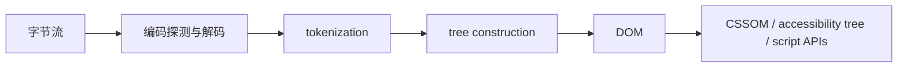

# HTML 标准与语言设计

HTML 不是“标签清单”，而是一组把字节流转换为可交互文档的协议。它同时规定作者可以写什么、浏览器遇到错误输入怎样恢复、元素暴露什么 DOM 接口，以及这些元素怎样参与导航、表单、脚本和可访问性。理解这几个层次，可以避免把“浏览器能显示”误认为“文档符合标准”。

## 一份文档经历了什么

服务端首先通过 `Content-Type` 声明表示类型。`text/html` 进入 HTML 解析器；`application/xhtml+xml` 进入 XML 解析器，两者对大小写、未闭合标签和错误恢复的行为不同。文件扩展名并不能覆盖 HTTP 响应头。



HTML tokenizer 根据当前状态把字符转换为 start tag、end tag、comment、character 等 token。tree builder 再按 insertion mode 和“打开元素栈”等状态构造 DOM。它不是简单地见到开始标签就压栈、见到结束标签就弹栈；表格、模板、格式化元素和外来内容都有专门规则。

下面的源码虽然不符合作者规范，HTML 解析器仍会确定性恢复：

```html
<p>第一段<div>块级内容</div>段尾
```

在浏览器控制台检查：

```js
const host = document.createElement('div')
host.innerHTML = '<p>第一段<div>块级内容</div>段尾'
console.log(host.innerHTML)
```

解析算法会在处理 `div` start tag 时关闭 `p`，结果不会等同于源码的视觉缩进。这说明 DOM 是解析结果，不是源文本的机械映射；操作 `innerHTML` 还会走 fragment parsing，而不是复用页面导航的所有步骤。

## 一致性要求与错误恢复

标准面向至少两类实现者：页面作者和用户代理。作者一致性要求帮助工具及早发现无效结构；用户代理要求让互联网上已有的错误页面仍能以一致方式工作。浏览器容错不代表错误无成本：无效嵌套可能导致 DOM 与预期不同、辅助技术语义丢失、SSR hydration 不一致。

| 层次 | 示例问题 | 验证方式 |
| --- | --- | --- |
| 语法 | 属性是否允许无引号 | HTML syntax 章节与 validator |
| 解析 | 错误嵌套生成何种 DOM | parsing algorithm 与最小页面 |
| DOM | `HTMLButtonElement` 暴露什么接口 | Web IDL、控制台与类型定义 |
| 行为 | 按钮何时提交表单 | 元素 activation behavior |
| 映射 | 元素如何进入可访问树 | HTML-AAM 与浏览器 accessibility 面板 |

## HTML 与 DOM 不是同一个东西

DOM 是宿主无关的节点和事件接口；HTML 在它之上定义具体元素、解析算法和行为。脚本可以创建不可能由 HTML 源码直接解析得到的结构，也可以创建自定义元素。反过来，源码中的字符实体、可省略标签和注释不会一一成为同名 DOM 对象。

```js
const element = document.createElement('button')
console.log(element instanceof HTMLElement) // true
console.log(element instanceof HTMLButtonElement) // true
element.type = 'button'
element.textContent = '保存'
```

这里 `type="button"` 很重要：按钮关联到表单且未指定 `type` 时，默认可能成为提交按钮。语义元素同时携带键盘、焦点、表单和无障碍行为，用 `div` 加点击事件无法自动获得这些契约。

## HTML、SVG 与 MathML 的边界

HTML 可以嵌入 SVG 和 MathML 外来内容，但解析状态会切换，大小写和属性处理规则也随之变化。`<svg/>` 在 SVG 外来内容中可以闭合元素；`<div/>` 在 `text/html` 中的斜线不会给普通 HTML 元素创造 XML 自闭合语义。

```html
<div id="host" />后续文本
<svg viewBox="0 0 10 10" aria-label="状态图">
  <circle cx="5" cy="5" r="4" />
</svg>
```

用 Elements 面板观察会发现“后续文本”仍位于 `div` 内。这类差异也是 JSX 生成 HTML、服务端模板和富文本清洗器必须谨慎处理的原因。

## 如何验证一个 HTML 结论

先固定响应 MIME 与字符编码，保存最小输入，再分别观察源文本、解析后的 DOM、元素属性与可访问树。需要跨浏览器结论时，查询或编写 Web Platform Test；只在单个 DevTools 中看到结果，最多证明该版本实现的行为。

```js
const snapshot = (selector) => {
  const node = document.querySelector(selector)
  return {
    outerHTML: node?.outerHTML,
    nodeName: node?.nodeName,
    constructor: node?.constructor.name
  }
}
console.table(snapshot('#host'))
```

## 常见误区

- “HTML5 是固定版本”不准确。工程上应跟随 HTML Living Standard，并检查具体特性的兼容性和测试状态。
- “能渲染就是合法 HTML”混淆了错误恢复与作者一致性。
- “DOM 树就是源码树”忽略了解析器自动插入、重排和关闭元素。
- “所有 `/>` 都是自闭合”把 XML 规则错误套到了 `text/html`。

## 参考资料

- [WHATWG HTML：Infrastructure](https://html.spec.whatwg.org/multipage/infrastructure.html)：HTML 的术语、符合性和依赖模型。
- [WHATWG HTML：Parsing HTML documents](https://html.spec.whatwg.org/multipage/parsing.html)：tokenization、tree construction 与错误恢复算法。
- [WHATWG DOM Standard](https://dom.spec.whatwg.org/)：节点、事件和 DOM 接口的独立规范。
- [Web Platform Tests：html 目录](https://github.com/web-platform-tests/wpt/tree/master/html)：HTML 解析和元素行为的跨实现测试。
