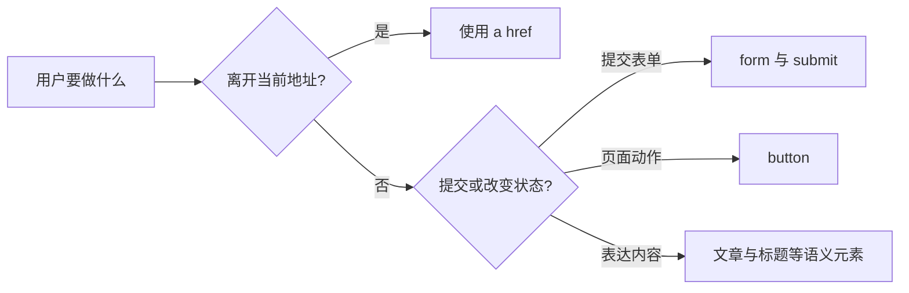

# 语义化 HTML

一张文章卡片里既有“查看详情”，又有“收藏”。整个区域看起来都能点击，我们该用链接、按钮，还是给 `div` 绑定事件？语义化 HTML 解决的正是这种选择：先判断用户要完成的任务，再选择已经实现对应行为的元素。

## 元素不只决定外观

链接负责导航到地址，按钮负责触发当前页面动作，checkbox 表达布尔输入，form 负责提交一组字段。浏览器还会为这些元素提供 DOM 接口、键盘操作、焦点行为、表单协议和无障碍映射。



CSS 可以让链接长得像按钮，也能让按钮看起来像图标，但不应因此交换它们的职责。关闭 CSS 后，文档结构和操作目的仍应说得通。

## 步骤一：按任务拆开文章卡片

期望结果是：标题链接可以在新标签页打开，收藏按钮只改变当前卡片状态；按 Tab 能分别聚焦它们，辅助技术也能识别两个操作。不要用一个大链接包住收藏按钮，因为交互元素嵌套会产生焦点和事件冲突。

```html
<article class="article-summary">
  <h2>
    <a href="/docs/reliability-patterns">重试、去重与降级</a>
  </h2>
  <p>理解有副作用操作失败后如何恢复。</p>
  <button type="button" aria-pressed="false">收藏</button>
</article>
```

输入是一张同时包含导航和页面动作的卡片。关键逻辑是把链接与按钮设为同级：链接保留浏览器导航能力，按钮用显式 `type="button"` 避免进入表单后意外提交。输出的焦点顺序清晰，视觉上仍可用 CSS 组合成一张卡片。

## 步骤二：用内容模型检查父子关系

HTML 把内容分为 flow、phrasing、interactive、heading、sectioning 等类别，并规定每种元素允许出现在哪里。这些规则能提前发现按钮嵌套链接、段落包含不允许结构等问题。

静态模板通过不代表运行时一定正确，组件组合也可能生成无效结构。复杂组件应同时运行 HTML validator、键盘操作和 accessibility tree 检查；其中任意一项都无法独自覆盖全部问题。

## 步骤三：建立可读的标题与区域

`main` 表示页面主要内容，`article` 表示可独立分发的内容，`nav` 表示主要导航集合，`section` 表示带主题的区域。不要为了获得默认样式而使用它们，也不要把每个容器都改成 `section`。

标题级别应反映实际层级。早期设想的 HTML5 outline algorithm 没有被浏览器和辅助技术一致实现，所以每个 `section` 都写 `h1` 并不会自动得到可靠大纲。样式大小交给 CSS，`h1` 至 `h6` 用来表达结构。

多个同类区域需要名称，例如主导航与文章目录可以分别使用 `aria-label`。`header` 和 `footer` 是否映射为页面级 landmark 还取决于上下文；页面通常只保留一个主要 `main`。

## 表单为什么更需要原生语义

输入框需要可见 `label`、稳定的 `name`、合适类型以及与错误说明的关联。placeholder 输入后会消失，不能替代 label。客户端校验改善反馈，服务端仍要重新验证，因为请求可以绕过浏览器提交。

语义元素也不等于视觉粗体。`em` 表示语气强调，`strong` 表示重要或紧急，`b` 表示吸引注意；只想改变字重时用中性元素和 CSS。相同原则适用于 `blockquote`、`table` 和 `i`，不要把语义元素当纯布局工具。

## 失败结果：用 div 模拟按钮

给 `div` 增加 `role="button"` 只改变对辅助技术的描述，不会自动加入 Tab 顺序，也不会处理 Enter、Space、禁用和表单行为。你需要重写并维护整套交互契约，任何遗漏都会造成鼠标可用、键盘不可用的分裂体验。

原生控件无法满足复杂 widget 时再参考 ARIA Authoring Practices，并把键盘矩阵、焦点移动和状态同步纳入测试。下一篇会继续解释 ARIA 能补什么，以及它为什么不能替代 HTML 行为。

## 验证清单

1. 只用键盘完成导航、输入、提交和关闭。
2. 关闭 CSS，检查阅读顺序与标题层级。
3. 在 accessibility tree 查看 role、name、state。
4. 运行 validator 和自动无障碍检查，再完成人工任务流。
5. 覆盖加载、空、错误、禁用和动态更新状态。

## 参考资料

- [WHATWG HTML：Semantics](https://html.spec.whatwg.org/multipage/dom.html#semantics-2)：内容模型与元素语义。
- [WHATWG HTML：Sections](https://html.spec.whatwg.org/multipage/sections.html)：区域与标题规范。
- [HTML Accessibility API Mappings](https://www.w3.org/TR/html-aam-1.0/)：HTML 到平台无障碍 API 的映射。
- [Web Platform Tests：HTML semantics](https://github.com/web-platform-tests/wpt/tree/master/html/semantics)：公开测试用例。
