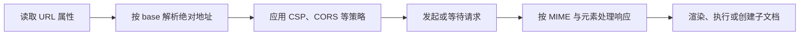

# 链接、资源与嵌入内容

链接、图片、脚本、视频和 iframe 都会让浏览器处理 URL，但结果完全不同：链接等待用户导航，图片进入渲染，脚本获得执行能力，iframe 创建新的文档环境。学习资源标签的关键不是背属性，而是判断响应将进入哪里、拥有什么权限、失败后怎样降级。

## 先看一条资源决策链

浏览器读取元素后，会解析绝对 URL，再结合元素类型、安全策略和响应信息决定处理方式。



调试时要沿这条链检查，而不是只看 Network 中有没有 200。状态成功但 MIME 错误、CORS 不允许或 CSP 拒绝，资源仍可能无法使用。

## 步骤一：分清源码 URL 与最终 URL

相对地址根据文档的 base URL 解析。HTML attribute 保存作者写下的值，DOM property 通常返回解析后的绝对地址。预期结果是：下面链接保留 `../guide` 原文，同时能得到包含协议和域名的最终 URL。

```html
<a id="guide-link" href="../guide/start?from=article#install">
  安装指南
</a>
<script>
  const link = document.querySelector('#guide-link')
  console.log(link.getAttribute('href'))
  console.log(link.href)
</script>
```

输入是一个相对链接。关键逻辑由浏览器 URL 解析器完成；第一个输出是源码属性，第二个输出是基于 `document.baseURI` 的绝对地址。使用 DOM property 检查最终请求目标，使用 attribute 检查模板原文，两者不能混为一谈。

新标签页链接还要考虑 opener 和 Referer 策略。现代浏览器通常为 `target="_blank"` 提供隐式 noopener，公共组件仍可显式表达 `rel` 策略；是否发送来源信息应按安全和分析需求选择。

## 步骤二：让图片和音视频可选择、可降级

响应式图片使用 `srcset` 提供候选，`sizes` 告诉浏览器预期布局宽度，`picture` 用于格式协商或 art direction。`sizes` 写错会下载过大图片；显式 `width`、`height` 能提前保留比例并减少布局偏移。

首屏 LCP 图片通常不应 lazy-load，非首屏资源才适合延迟加载。`alt` 描述图片承担的信息；邻近文字已完整表达的装饰图使用空 `alt`。Data URL 会失去独立缓存并扩大 HTML/CSS，是否内联要根据真实测量决定。

音视频可以提供多个 source 供浏览器选择。视频还应有字幕或同页文字替代，自动播放不应成为核心流程。`preload` 只是提示；长视频、鉴权媒体、Range 和 CDN 缓存都需要在真实网关上验证。

## 步骤三：把脚本当成执行权限

外部脚本获得页面执行环境，因此来源、CSP、CORS 与完整性比“能下载”更重要。Subresource Integrity 适合锁定版本固定的第三方制品，更新文件时要同步 hash；动态变化脚本不适合伪装成固定制品。

`async` 适合互不依赖的 classic script，谁先下载完谁执行；`defer` 保持文档顺序并等待解析完成；module script 按依赖图准备。选择属性前先画出依赖关系，不能给所有脚本机械添加同一个选项。

## 步骤四：把 iframe 当作独立文档

iframe 适合预览、第三方页面和独立应用。它创建新的导航与文档上下文，需要标题、尺寸、加载失败处理以及清楚的通信边界。`sandbox` 默认施加限制，再通过 token 按需要开放；`allow` 控制部分 Permissions Policy 能力，不能替代 CSP。

跨源 iframe 受同源策略保护，父子页面协作应使用 `postMessage`，接收方验证 `event.origin`、消息类型与字段范围。`srcdoc` 只是内联来源，不会自动清洗不可信 HTML。

不要对同源内容同时开放 `allow-scripts` 与 `allow-same-origin` 后仍假设存在强隔离。父页面要限制谁能嵌入自己，应发送 `Content-Security-Policy: frame-ancestors ...`。

## 正常结果与失败演练

正常链路应在 Network 中看到预期最终 URL、initiator、MIME、缓存和优先级，页面也有图片替代文本、视频字幕与 iframe title。

故意让首选图片返回 404，可检查候选和后备内容；伪造一条 `postMessage`，接收方应因 origin 不匹配而忽略；让脚本返回错误 MIME 或违反 CSP，即使状态码为 200 也不应执行。这些失败比“资源是否下载成功”更接近真实安全边界。

`object` 和 `embed` 的历史能力很宽，但插件时代已经结束。PDF 等内嵌能力受浏览器与响应头影响，关键流程应保留下载或独立打开的后备路径。

## 验证清单

1. 检查最终 URL、请求发起者、MIME、CORS、CSP 与缓存。
2. 使用慢网和窄屏观察图片候选、LCP 与布局偏移。
3. 制造格式不支持、404 和跨域失败，确认降级路径。
4. 覆盖 iframe 的 sandbox、消息伪造与加载失败。
5. 用键盘和读屏检查链接目的、替代文本、字幕与子文档标题。

## 参考资料

- [WHATWG HTML：Links](https://html.spec.whatwg.org/multipage/links.html)：链接和抓取语义。
- [WHATWG HTML：Embedded content](https://html.spec.whatwg.org/multipage/embedded-content.html)：图片、音视频与 iframe。
- [WHATWG HTML：The script element](https://html.spec.whatwg.org/multipage/scripting.html#the-script-element)：脚本准备和执行。
- [W3C CSP Level 3](https://www.w3.org/TR/CSP3/)：脚本与嵌入内容的策略边界。
