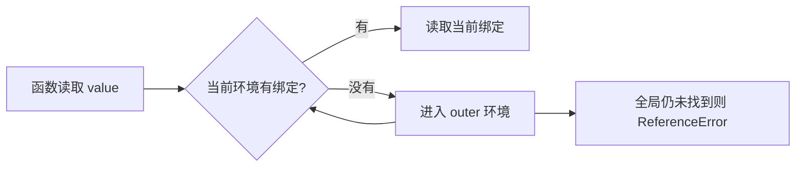

# 作用域与闭包

函数已经离开创建它的调用，为什么仍能记住计数？因为函数会关联创建时的词法环境，只要返回函数仍可达，它使用的外层绑定也会继续存活。闭包不是复制变量，而是函数与可访问词法环境的组合。

## 先看一次作用域查找

标识符解析从当前 Lexical Environment 开始，找不到就沿 outer 环境继续。规范用 Environment Record 描述声明绑定；它是语义模型，不要求引擎按同形对象实现。



函数嵌套常产生可观察闭包，但“嵌套”不是核心定义。关键在于函数是否跨越原调用生命周期继续引用外层绑定。

## 步骤一：创建两个独立计数器

预期结果是 first 连续得到 1、2，second 重新从 1 开始。两个返回函数来自同一段代码，却关联两次不同调用创建的环境。

```js
function createCounter() {
  let value = 0
  return {
    next() { value += 1; return value },
    current() { return value }
  }
}

const first = createCounter()
const second = createCounter()

console.log(first.next(), first.next()) // 1 2
console.log(second.next())              // 1
```

输入是两次工厂调用，关键逻辑是每次创建独立 value 绑定，方法通过闭包访问它；输出证明状态不共享。这个模式能封装不变量，但外部看不到状态迁移时也会增加调试成本，公共 API 应提供必要的读取、重置或诊断能力。

## 步骤二：为什么 var 循环容易出错

`var` 是函数或全局作用域，同一个循环中的回调共享同一绑定；回调稍后运行时，循环已经结束。`let` 在 `for` 循环中按迭代创建新的词法绑定，所以每个回调得到当次值。

早期代码常用立即调用函数人为创建作用域。现代代码优先使用 let/const：const 限制绑定重新赋值，不代表对象深度不可变；let 允许更新。二者存在 temporal dead zone，在声明初始化前访问会抛 ReferenceError，而 var 绑定会提升并以 undefined 初始化。

全局 script 中的顶层 var 与 global object 属性还有历史联系，顶层 let/const 进入不同声明记录；ES module 拥有自己的模块作用域，不创建同样的全局属性。新项目使用模块能减少全局绑定冲突。

## 步骤三：闭包为何可能延长内存生命周期

垃圾回收依据可达性，不依据函数是否“执行完”。事件监听器、定时器或缓存引用函数，函数又引用 DOM 或大对象时，这条可达链会保留相关值。闭包本身不是泄漏；生命周期超出产品需要才是问题。

一个可取消的订阅可以把释放动作写进 API：注册时返回 unsubscribe，或接受 AbortSignal。组件卸载时解除监听、取消计时器并清除缓存键。Heap Snapshot 中应沿 Retainers 查看是谁仍在引用目标，不凭“用了闭包”直接下结论。

## 步骤四：Realm 为什么影响对象身份

每个 Realm 拥有自己的全局对象和一组 Intrinsics。iframe 中创建的 Array 与当前页面的 Array 构造器身份不同，因此跨 Realm 的 `value instanceof Array` 可能为 false，`Array.isArray(value)` 更适合这个判断。

Realm 不等于权限沙箱。iframe 是否隔离还取决于 origin、sandbox、CSP 和通信协议；同源页面可能互相访问对象。跨边界传值时优先使用结构化克隆与显式 Schema，不共享带复杂原型和闭包的对象图。

## 故意制造一次失败

创建一个按钮监听器，让回调引用已从页面移除的大容器，但没有解除监听。DOM 虽然不再连接到 document，仍可能通过 EventTarget 到回调再到闭包环境保持可达。正常修复是让拥有者在销毁时 abort/unsubscribe，并用快照确认引用链消失。

另一个失败是把模块内闭包缓存当永久真相。用户退出或租户切换后若没有失效，旧状态会跨会话继续返回。缓存的 key、过期、主动清理和权限边界应成为显式协议。

## 参考资料

- [ECMAScript：Environment Records](https://tc39.es/ecma262/#sec-environment-records)
- [ECMAScript：The Global Environment Record](https://tc39.es/ecma262/#sec-global-environment-records)
- [MDN：Closures](https://developer.mozilla.org/docs/Web/JavaScript/Guide/Closures)
- [MDN：Memory management](https://developer.mozilla.org/docs/Web/JavaScript/Memory_management)
