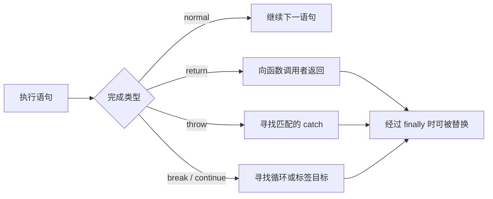

# Completion Record 与控制流

`try` 已经 return 1，`finally` 再 return 2，调用者为什么得到 2？“return 立即结束函数”只是日常简化。规范需要一种统一方式，让 return、throw、break 和 continue 穿过语句结构，这就是 Completion Record。

## Completion Record 是什么

规范把求值完成概括为 `[[Type]]`、`[[Value]]` 和 `[[Target]]`。Type 可以是 normal、return、throw、break 或 continue；Target 用于带标签的跳转。它是说明语义的抽象记录，不要求引擎在内存里创建同形对象。



语句块会依次处理子语句，遇到 abrupt completion 就停止正常推进，并把记录向外传播，直到合适结构处理它。

## 步骤一：观察 finally 如何覆盖结果

预期结果是 `withOverride()` 返回 2，`withoutOverride()` 返回 1。finally 总会在离开 try/catch 前执行；若 finally 自己正常完成，保留原 completion，若它产生新的 abrupt completion，就替换原结果。

这里的“替换”描述规范求值结果，不表示先把数字写入某个隐藏变量再覆盖。调用者只会收到穿过整个 try/finally 结构后的最终完成结果。为了让差异只来自 finally，两个函数不包含异步操作，也不涉及 Promise rejection；异步函数仍沿用语句求值规则，但结果会由 Promise 协议交付。

```js
function withOverride() {
  try {
    return 1
  } finally {
    return 2
  }
}

function withoutOverride() {
  try {
    return 1
  } finally {
    console.log('cleanup')
  }
}

console.log(withOverride(), withoutOverride())
```

输入是两个仅 finally 行为不同的函数。关键逻辑是第二个 finally 以 normal 完成，第一个以 return 完成；输出为 2 和 1。工程中 finally 适合释放锁和清理资源，通常避免在其中 return 或 throw，以免隐藏原始错误。

## 步骤二：理解语句怎样消费完成记录

if 根据条件选择分支；循环会处理 continue 和 break；函数边界消费 return；try/catch 只捕获执行期间的 throw，语法错误若在代码整体解析阶段发生，业务 catch 还没有机会运行。

带标签语句允许 break/continue 指向外层结构，但层级过深会降低可读性。`with` 会动态改变标识符解析，严格模式已禁止，现代代码不应采用；旧代码审计时要认识它造成的静态分析困难。

Promise rejection 不是同步 throw 在另一个线程里的名字。async 函数把抛出的异常转换为 rejected Promise，调用方用 await/try-catch 或 rejection handler 处理；遗漏 await 时，外层同步 try/catch 捕获不到后续 rejection。

## 步骤三：表达式如何参与控制流

表达式求值得到值，也可能产生副作用或 throw。成员访问与调用属于左侧表达式体系，赋值需要合法引用；普通函数调用不是可赋值目标。可选链在 nullish 时短路，不能作为普通赋值左侧。

运算符优先级决定语法分组，求值顺序仍按各产生式规定。乘方比一元负号的语法关系特殊，`-2 ** 2` 需要写成 `-(2 ** 2)` 或 `(-2) ** 2` 来明确意图。更新表达式 `++`/`--` 同时产生值并修改绑定，应避免在复杂表达式里叠加副作用。

## 步骤四：数值、关系和逻辑表达式

乘法、加法、移位、关系、相等、位运算和逻辑运算各有转换规则。`+` 可能执行字符串连接；位运算通常把 Number 转成 32 位整数，不是通用性能优化；BigInt 位运算又遵循 BigInt 规则。

`&&`、`||` 和 `??` 会短路，并返回操作数值而不只是 Boolean。条件表达式 `condition ? a : b` 也只求值一个分支。这些能力适合默认值和条件调用，但包含副作用时要让分支足够清楚。

`==` 触发抽象相等转换，`===` 不做该转换；关系比较也涉及原始值转换和字符串/数值路径。遇到混合类型输入，先在边界验证，不让表达式转换规则承担数据清洗。

## 故意制造一次失败

在 finally 中抛出新的 Error，原来 try 中的异常会被覆盖，日志只剩清理错误。改进方式是让清理尽量不抛，确需报告时保留原始 cause 或聚合错误，并测试两个操作同时失败的路径。

另一个失败是用 `flags & value` 代替清楚领域对象，却没有限定整数范围与位含义。位掩码适合稳定、有限的协议标志；普通业务状态更适合 enum、Set 或具名字段，避免 32 位转换和不可读组合。

## 验证方法

对控制流问题先画出每层产生的 completion，再看哪一层消费或替换。对表达式问题用 parser 查看分组，拆出中间变量记录实际值和副作用顺序。资源清理测试至少覆盖正常返回、同步异常、异步拒绝和清理自身失败。

## 参考资料

- [ECMAScript：The Completion Record Specification Type](https://tc39.es/ecma262/#sec-completion-record-specification-type)
- [ECMAScript：ECMAScript Language Statements and Declarations](https://tc39.es/ecma262/#sec-ecmascript-language-statements-and-declarations)
- [ECMAScript：ECMAScript Language Expressions](https://tc39.es/ecma262/#sec-ecmascript-language-expressions)
- [MDN：Control flow and error handling](https://developer.mozilla.org/docs/Web/JavaScript/Guide/Control_flow_and_error_handling)
