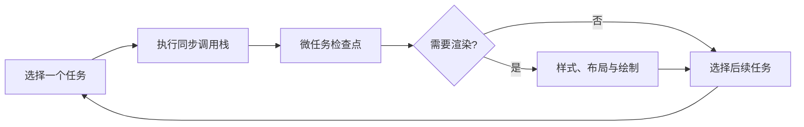

# 事件循环与任务队列

定时器写了 0ms，为什么仍在 Promise 后执行？状态先改成“处理中”，为什么用户只看到“完成”？答案不在一张固定输出顺序表里，而在浏览器怎样依次处理任务、微任务和渲染机会。

## 先认识浏览器主线程上的三件事

**任务（task）** 是浏览器安排的一次工作，例如运行脚本、处理点击或执行计时器回调。**微任务（microtask）** 包括 Promise reaction、`queueMicrotask` 和 MutationObserver 回调。浏览器还需要合适时机执行样式、布局、绘制。



“宏任务”是教学中常见叫法，HTML 标准使用 task。计时器、网络与用户交互来自不同 task source，也不是一个叫“宏任务栈”的统一容器。

## 步骤一：预测一次最小输出

先看输入：同步日志 A、B，中间注册一个 0ms 计时器和一个微任务。预期结果是同步代码先结束，随后清空微任务，最后才有机会选择计时器任务。

```js
console.log('A: script start')

setTimeout(() => console.log('D: timer task'), 0)

queueMicrotask(() => {
  console.log('C: microtask')
  queueMicrotask(() => console.log('C2: nested microtask'))
})

console.log('B: script end')
```

输入是当前 script 任务中的四项操作，输出顺序为 A、B、C、C2、D。关键规则是：调用栈先清空；微任务检查点会持续处理新加入的微任务，直到队列为空；`setTimeout(..., 0)` 只表示达到最短延迟后可被调度，不表示立即插队。

## 步骤二：解释为什么界面可能来不及绘制

在点击事件里把文字改为“处理中”，再用微任务执行 120ms 同步计算并改成“完成”。浏览器通常会先跑完点击任务和全部微任务，之后才绘制，所以中间文字可能从未出现在屏幕上。

Promise 并不会创建并行线程。Promise executor 在构造时同步执行，`.then` 注册的 reaction 才进入微任务；`async` 函数运行到 `await` 前也是同步的，恢复部分以 Promise reaction 继续。

如果产品需要先展示反馈再继续工作，应把 CPU 工作拆成有界批次并让出主线程，或放进 Web Worker。`Promise.resolve().then(...)` 仍然是微任务，不会主动让浏览器绘制；`requestAnimationFrame` 面向绘制时机，Worker 面向移出主线程，两者用途不同。

## 步骤三：把异步顺序用于真实请求

搜索框连续输入时，旧请求可能比新请求晚返回。如果谁完成就渲染谁，页面会倒退到旧结果。我们需要同时处理“调用方不再需要旧请求”和“旧结果不能覆盖新状态”。

```ts
let latestVersion = 0
let activeRequest: AbortController | undefined

async function search(query: string): Promise<void> {
  const version = ++latestVersion
  activeRequest?.abort()
  activeRequest = new AbortController()

  try {
    const response = await fetch(`/search?q=${encodeURIComponent(query)}`, {
      signal: activeRequest.signal
    })
    if (!response.ok) throw new Error(`HTTP ${response.status}`)
    const result: unknown = await response.json()
    if (version === latestVersion) renderResult(result)
  } catch (error) {
    if (error instanceof DOMException && error.name === 'AbortError') return
    if (version === latestVersion) renderError(error)
  }
}
```

输入是可能连续发生的搜索请求。AbortController 取消调用方已不需要的网络消费，版本号阻止无法及时取消的旧操作覆盖当前结果；输出只对应最后一次输入。取消 fetch 不等于服务端业务自动停止，长任务还要有服务端任务 ID、取消状态和 Deadline。

## 故意制造两个失败

第一种失败是递归追加微任务。因为检查点要持续到队列为空，页面可能长时间无法处理输入和绘制，这叫微任务饥饿。修复方向是限制每批工作量并让出调度机会，而不是换成更多 Promise。

第二种失败是在主线程同步循环 300ms，同时注册 0ms 计时器。计时器至少要等当前任务退出，还受最短延迟、嵌套钳制、页面可见性和系统调度影响，因此不能用它承诺关键事务精确时刻。

## 浏览器和 Node.js 为什么不能混讲

浏览器事件循环由 HTML 标准定义任务、微任务和渲染机会。Node.js 基于 libuv，具有 timers、poll、check 等阶段，`process.nextTick` 还是 Node 特有机制。服务端示例要注明 Node 版本并查 Node 官方文档，不能用其阶段顺序推导页面绘制。

## 如何验证

1. 在目标 Chrome 或 Firefox 运行步骤一，记录版本与实际顺序。
2. 用 Performance 面板观察一次点击中的 Task、微任务与 Paint。
3. 为搜索函数构造“后发请求先完成”，断言只渲染新结果。
4. Node.js 行为另建脚本验证，不复用浏览器渲染结论。

规范承诺的是可观察行为，不要求浏览器内部采用某个具体队列类。遇到差异时，最小页面、运行环境版本和 Trace 才是可复现证据。

## 参考资料

- [HTML Standard：Event loops](https://html.spec.whatwg.org/multipage/webappapis.html#event-loops)
- [MDN：Microtask guide](https://developer.mozilla.org/docs/Web/API/HTML_DOM_API/Microtask_guide)
- [ECMAScript：Jobs and Host Operations](https://tc39.es/ecma262/#sec-jobs-and-host-operations-to-enqueue-jobs)
- [Node.js：The Node.js Event Loop](https://nodejs.org/en/learn/asynchronous-work/event-loop-timers-and-nexttick)
