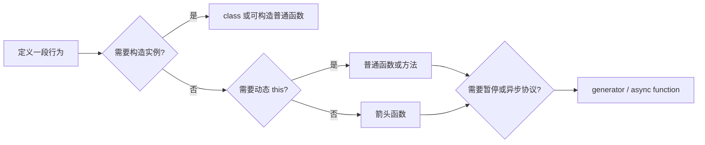

# JavaScript 函数

把对象方法赋值给一个变量再调用，`this` 为什么丢了？因为普通函数的 `this` 主要由调用方式决定，不由它写在哪个对象里决定。箭头函数又采用外层词法 `this`，所以两者不能机械互换。

## 先认识函数家族

普通函数拥有 `[[Call]]`，通常也能被 `new` 构造；对象或 class 方法可调用但不是构造器；箭头函数没有自己的 `this`、`arguments`、`super` 和 `new.target`，也不能构造。生成器可以暂停并返回迭代器，async 函数总是返回 Promise。



这张图是选择入口，不是语法优劣排名。函数种类应根据调用契约决定。

## 步骤一：观察 this 怎样被绑定

预期结果是作为方法调用时得到对象名称，通过 `call` 时得到显式对象；把方法拆出来直接调用，在 module/strict 环境中 `this` 为 undefined。

```js
function describe(prefix) {
  return `${prefix}: ${this?.name ?? 'no receiver'}`
}

const profile = { name: 'Jiang', describe }
const detached = profile.describe

console.log(profile.describe('method'))
console.log(describe.call({ name: 'Example' }, 'call'))
console.log(detached('plain'))
```

输入是同一个函数的三种调用表达式。关键逻辑是调用点提供 receiver；输出依次对应 profile、显式 call 参数和无 receiver。`bind()` 会创建固定 this 与部分参数的新函数，`apply()` 则用数组式参数调用；生产代码直接使用原生方法，不需要手写版本替代规范边界。

## 步骤二：箭头函数何时合适

箭头函数从创建位置捕获词法 this，适合作为需要沿用外层接收者的回调。它不会因 `call`、`apply` 或 `bind` 改变 this，也没有构造能力。

把对象方法直接写成箭头函数时，它不会自动绑定该对象；把 class 实例回调写成字段箭头会为每个实例创建函数，却可避免传给事件系统后丢 receiver。是否采用要比较实例数量、身份稳定性和解除监听需求，不能只用“箭头更现代”判断。

## 步骤三：理解 new 与 class 方法

普通函数经 `new` 调用时，运行时创建对象、把它连到函数的 prototype、以新对象为 this 执行，并按构造返回规则决定结果。函数体可读取 `new.target` 区分普通调用与构造调用。

class constructor 只能经 `new` 调用，实例方法位于 prototype；派生 constructor 在使用 this 前要先 `super()`。static 方法的 receiver 是类构造器，不是实例。私有字段还会做品牌检查，拆借方法到不兼容对象会抛错。

## 步骤四：生成器和异步函数解决什么

生成器函数调用后返回 iterator，执行在 `next()` 时推进，`yield` 暂停并交换值。它适合表达惰性序列和可暂停遍历，不表示后台并行。

async 函数调用后立即返回 Promise；同步 return 成为 fulfilled 值，抛错成为 rejection，`await` 暂停当前 async 函数并在 Promise reaction 中恢复。取消不属于 Promise 内建状态，需要 AbortSignal 或领域任务协议另行表达。

下面把“逐项拉取”写成 async generator，调用方既能等待异步来源，也能逐项消费，而不是一次把全部内容读进内存。

```js
async function* pages(loadPage) {
  for (let page = 1; ; page += 1) {
    const items = await loadPage(page)
    if (items.length === 0) return
    yield items
  }
}

for await (const items of pages(fetchPage)) {
  render(items)
}
```

输入是一个返回 Promise 的分页加载函数，关键逻辑是每次 await 一页并 yield 一批；输出由 `for await` 按到达顺序消费。失败会以 rejection 传播，调用方还需决定重试、取消和已渲染内容的保留方式。

## 常见失败

- 把方法传给事件系统后无法正确移除，因为 add/remove 使用了两个不同 bind 结果。
- 用箭头函数实现需要动态 receiver 的公共方法，导致 call 无效。
- 只捕获同步 throw，遗漏 async 函数的 rejected Promise。
- 把 generator 当成并行任务，忽略它仍在调用线程推进。
- 在回调中隐式依赖 this，使重构调用方式后行为改变。

公共函数应通过参数、返回类型、副作用、同步抛错、异步拒绝、取消和超时说明完整契约。

## 参考资料

- [ECMAScript：ECMAScript Function Objects](https://tc39.es/ecma262/#sec-ecmascript-function-objects)
- [ECMAScript：Arrow Function Definitions](https://tc39.es/ecma262/#sec-arrow-function-definitions)
- [MDN：Functions](https://developer.mozilla.org/docs/Web/JavaScript/Guide/Functions)
- [MDN：Iterators and generators](https://developer.mozilla.org/docs/Web/JavaScript/Guide/Iterators_and_generators)
