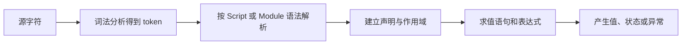

# JavaScript 语法结构

同一行 `await load()` 放进 module 可以合法解析，放进普通 script 却可能报 SyntaxError。语法是否有效不仅取决于字符，还取决于当前 **Parse Goal**：浏览器把源码当 Script、Module 还是函数体解析。

## 从源码到执行要经过什么



语法错误发生在求值前。打包器可以转换源码，但转换后的产物仍要符合目标 JavaScript 环境；“工具能编译”不等于浏览器原生支持原写法。

## 步骤一：比较 Script 与 Module

目标结果是：classic script 通过普通 script 标签执行，module 通过 `type="module"` 执行，并能使用静态 import/export。module 默认采用严格模式，顶层 this 为 undefined，顶层声明也不会像 classic script 的部分 var 声明那样成为 window 属性。

阅读示例前还要确认运行环境。这里以现代浏览器为准，两个文件都通过 HTTP 提供；直接双击本地文件时，module 可能受 origin 与 CORS 限制。classic 与 module 也有不同的下载、执行和错误上报语义，示例只先观察解析目标、作用域和依赖入口，网络细节放到浏览器 HTTP 文章处理。

```html
<script src="/classic.js"></script>
<script type="module" src="/entry.js"></script>
```

```js
// entry.js
import { formatTitle } from './format.js'

export const title = formatTitle('Agent 教程')
console.log(this) // undefined
```

输入是两种脚本元素和一个模块文件。关键区别是 module 使用独立语法目标、依赖图和作用域；输出会等待模块依赖准备后执行。模块请求遵循 CORS，默认 defer 式执行，并且同一 URL 在一个模块图中按模块语义处理。

## 步骤二：理解 import 与 export

静态 import/export 只允许出现在模块顶层，使工具和浏览器能在执行前建立依赖与 live binding。导出绑定是“活的”：导出方更新绑定，导入方读取会看到新值；导入者不能直接给导入绑定赋值。

default export 每个模块最多一个，named export 可以多个。`export *` 不自动转发 default，并可能遇到同名冲突。动态 `import()` 是表达式，返回 Promise，适合条件或按需加载；它不要求写在模块顶层。

Top-level await 会让当前模块的完成依赖异步结果，并向依赖它的模块传播等待。它适合确实需要在模块初始化完成前取得的状态，滥用会拉长整条依赖链，甚至形成难排查的循环等待。

## 步骤三：区分声明、语句和表达式

声明建立绑定，例如 `let`、`const`、`function`、`class` 和 import；语句控制执行，例如 if、for、return、throw、try；表达式求值得到值，例如调用、成员访问、赋值和条件表达式。

相同 token 在上下文中可能属于不同语法。例如 `{}` 可以是 block，也可以出现在对象字面量表达式中；`function` 开头可能是声明或函数表达式。需要把表达式放在容易被解析成声明的位置时，可用括号明确语法目的。

## 步骤四：声明为什么会表现出“提升”

执行代码前，环境会按声明实例化算法建立绑定。`var` 绑定会初始化为 undefined；let/const/class 绑定已创建但在初始化前处于 temporal dead zone；function 声明的处理还取决于 Script、Module、函数体和 block 等上下文。

“提升”是描述现象的教学词，不代表源码被移动。下面结果来自绑定创建与初始化时机不同：var 在赋值前可读到 undefined，let 在声明行前读取会抛 ReferenceError，class 也存在 TDZ。

函数体还有参数环境、arguments、默认参数与函数声明的交互。默认参数在自己的参数作用域求值，不能简单用“函数体最前面赋值”模拟全部行为。

## 指令序言是什么

函数体或 Script 开头连续的字符串字面量表达式可组成 Directive Prologue，`"use strict"` 是标准识别的指令。它只有在序言位置才生效；普通字符串写在其他语句之后不会切换严格模式。

ES module 天然严格。严格模式会让某些静默失败变成异常，普通函数无 receiver 调用时 this 为 undefined，并禁止部分历史语法。它不是安全沙箱，也不会自动验证输入。

## 故意制造一次失败

把静态 import 放进 if 语句，解析阶段就会失败，因为静态依赖只能位于模块顶层。条件加载应使用动态 import，并处理加载失败与版本不匹配。

另一个失败是把 classic script 改成 module 后仍依赖顶层 var 出现在 window。修复方式是显式 import/export 或显式公共接口，而不是把模块行为改回隐式全局共享。

## 参考资料

- [ECMAScript：ECMAScript Language Scripts and Modules](https://tc39.es/ecma262/#sec-ecmascript-language-scripts-and-modules)
- [ECMAScript：Declarations and the Variable Statement](https://tc39.es/ecma262/#sec-declarations-and-the-variable-statement)
- [MDN：JavaScript modules](https://developer.mozilla.org/docs/Web/JavaScript/Guide/Modules)
- [HTML Standard：Scripting](https://html.spec.whatwg.org/multipage/scripting.html)
