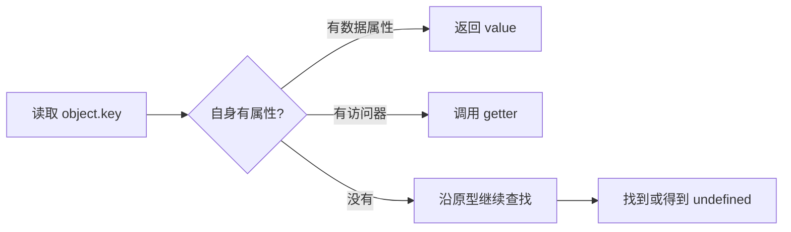

# JavaScript 对象模型

两个对象都写着 `{ count: 1 }`，比较结果却是 false；一个属性能读取，却不出现在 `Object.keys()` 中。把对象只理解为 key-value Map，解释不了这些现象。JavaScript 对象既有独立身份，也用属性描述符决定每个属性怎样读、写、枚举和删除。

## 先建立对象的基本模型

对象有三个容易观察的特征：身份、状态和行为。两个内容相同的对象仍有不同身份；属性保存状态；方法或 setter 可以改变状态。规范还使用 `[[Prototype]]`、`[[Call]]` 等内部槽描述引擎行为，这些不是普通属性，无法用 `Object.keys()` 读取。



原型查找会在下一篇展开。本篇先聚焦“对象自己拥有的属性为什么行为不同”。

## 步骤一：观察一个属性描述符

预期结果是：`token` 可以读取，重新赋值会失败，不会出现在 `Object.keys()` 中，却可以删除。严格模式下给只读属性赋值会抛出 TypeError。

```js
'use strict'

const session = {}
Object.defineProperty(session, 'token', {
  value: 'public-example',
  writable: false,
  enumerable: false,
  configurable: true
})

console.log(Object.getOwnPropertyDescriptor(session, 'token'))
console.log(Object.keys(session))
delete session.token
console.log('token' in session)
```

输入是一个数据属性描述符。`value` 保存值，`writable` 控制赋值，`enumerable` 控制常见枚举，`configurable` 控制删除和多数描述符修改；输出依次展示描述符、空键列表和删除后的 false。对象字面量和普通赋值创建的属性，这三个布尔特征通常都是 true。

## 步骤二：区分数据属性与访问器属性

数据属性含 `value` 和 `writable`。访问器属性改用 getter、setter，在读取或写入时执行函数；两类都可以设置 enumerable 和 configurable。同一个描述符不允许同时混用 `value` 与 `get`。

访问器适合派生值或受控赋值，但读取属性会执行代码，也可能抛错或产生副作用。公共 API 不应让一个看似普通的字段读取暗中发起网络请求。使用 `Object.getOwnPropertyDescriptor()` 能确认当前属性属于哪一类。

## 步骤三：认识不同来源的对象

ECMAScript 提供 Array、Map、Date、RegExp、Promise、Proxy、TypedArray 等内建对象；浏览器还提供 Window、Document、Element 等宿主对象。它们可能拥有规范定义的内部槽，例如 Map 的内部数据或 Date 的时间值。

这解释了为什么只把原型接到 `Map.prototype` 上，普通对象仍不会获得可用的 Map 内部数据。内建对象是否可子类化要看具体规范与构造过程，不适合概括为“全部都能”或“全部都不行”。DOM 对象还受 Web IDL、浏览器实现和 Realm 边界影响。

Array 的 length 会随数组索引变化，String 包装对象能暴露字符索引，模块 namespace、arguments、Proxy 也有特殊内部方法。遇到反射边界时应查询对应规范，不要从普通对象推导全部对象。

## 步骤四：函数为什么也是对象

函数对象拥有 `[[Call]]`，所以可以用 `fn()` 调用；构造器还拥有 `[[Construct]]`，所以能被 `new` 调用。普通 function 通常同时支持两者，箭头函数没有构造能力，class 构造器则不能脱离 `new` 直接调用。

`new Constructor()` 大致会以 `Constructor.prototype` 创建对象，把它作为 `this` 执行构造器；若构造器显式返回对象，则使用该对象，否则返回新建实例。这里的 `prototype` 属性和实例内部 `[[Prototype]]` 不是同一个概念，下一篇会用图说明它们的连接。

## Proxy 能做什么，不能做什么

Proxy 可以拦截读取、写入、删除等内部操作，适合验证、观察或虚拟对象。它仍要遵守不变量，例如目标上不可配置、不可写的数据属性不能被 get trap 谎报成另一个值。

Proxy 也不是外部数据校验器。网络 JSON 仍需按 Schema 验证字段和类型；代理只能改变当前 JavaScript 对象的操作表现，无法证明数据来源可信。

## 失败结果与工程边界

把不可枚举误认为私有，会导致敏感值仍能被直接读取；把 `Object.freeze()` 当成深冻结，会遗漏嵌套对象；把宿主对象展开为普通对象，可能丢失原型方法和内部能力。

需要封装实例私有状态时可使用 class 私有字段或闭包。需要传输时定义显式序列化协议，不要依赖枚举“碰巧”得到正确字段。Realm 不同还会影响构造器身份，跨 iframe 的数据更适合做结构化检查。

## 参考资料

- [ECMAScript：Objects](https://tc39.es/ecma262/#sec-objects)
- [ECMAScript：Property Descriptor Specification Type](https://tc39.es/ecma262/#sec-property-descriptor-specification-type)
- [MDN：Working with objects](https://developer.mozilla.org/docs/Web/JavaScript/Guide/Working_with_objects)
- [MDN：Proxy](https://developer.mozilla.org/docs/Web/JavaScript/Reference/Global_Objects/Proxy)
