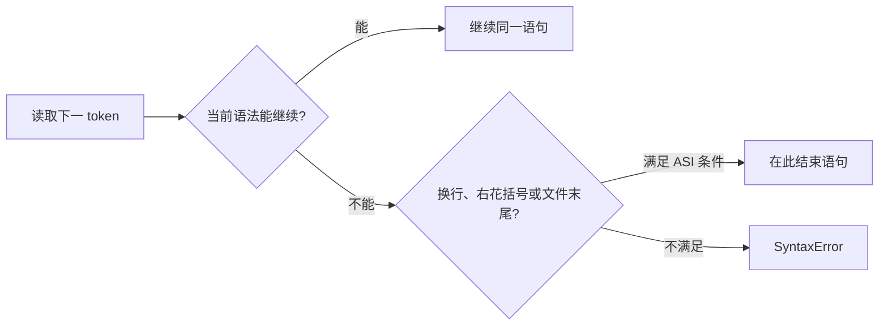

# 自动分号插入

JavaScript 可以省略很多分号，但这不表示解析器会在每个换行后补一个字符。Automatic Semicolon Insertion（ASI）是一组语法解析规则，只在规定条件下让某些语句结束。代码看起来分成两行，仍可能被解析为一个表达式。

## ASI 什么时候参与

可以用三个问题理解：当前 token 继续下去是否违反语法？这里是否遇到 `}` 或输入结束？前一个产生式是否规定此处不能有 LineTerminator？满足规范条件时，解析器按规则把语句视为结束。



ASI 有保护条件，不会为了让任意错误程序变合法而无限插入。空语句、for 头部分号等位置也有各自语法。

## 步骤一：运行两个危险边界

预期结果是 first 返回 undefined，因为 return 与表达式之间有换行；第二段若直接连接，`[1, 2]` 可能被当作前一表达式的属性访问/后续操作，而不是天然的新语句。

```js
function first() {
  return
  { ok: true }
}

const value = getValue()
;[1, 2].forEach((item) => console.log(item))

console.log(first(), value)
```

输入含 return 后换行和数组开头行。关键规则是 return、throw、break、continue、yield 等部分语法对 LineTerminator 敏感；数组前的显式防御分号保证它开始新语句。输出 first 为 undefined，数组按两项遍历。

## 哪些行首需要特别留意

省略分号风格中，以 `(`、`[`、模板标签反引号、正则相关斜线、`+` 或 `-` 等开头的行可能继续前一表达式。IIFE、数组处理和 tagged template 最常见。不是看到这些字符就一定错误，而是要检查前一语句能否与它组合成合法语法。

postfix `++`/`--` 与操作数之间不能有 LineTerminator。箭头函数参数和 `=>` 之间也有限制。`async` 与 function/箭头之间的换行会改变解析。了解受限产生式比背“换行自动加分号”更准确。

## 加分号还是不加

两种团队风格都可以生成正确程序：显式分号风格让边界更直观；无分号风格依赖格式化器并在危险行首增加防御分号。关键是仓库统一，由 formatter 和 lint 自动执行。

压缩器、转译器和代码生成器不能只拼字符串。生成片段之间要保留语法边界，并通过 parser/打印器输出；库制品还需在目标 module 格式和压缩配置中运行测试。

## 故意制造一次失败

删除数组行前的防御分号，让前一行变为一个返回函数或可索引值的表达式。代码可能不报语法错，却在运行时调用/索引出意外结果。AST 会直接显示两行被组合成同一个 ExpressionStatement。

另一个失败是 `throw` 后换行。与 return 不同，它会形成 SyntaxError，而不是抛出 undefined。这个差异说明 ASI 受具体产生式约束，不能用一条“换行即结束”规则推导。

## 如何验证

1. 用目标版本 parser 输出 AST，确认语句边界。
2. 让 formatter 处理最小样例，观察它是否加括号或分号。
3. 在经过同一转译、压缩和 bundling 的产物上测试。
4. 对 IIFE、数组行首和 return/throw 换行保留回归用例。

## 参考资料

- [ECMAScript：Rules of Automatic Semicolon Insertion](https://tc39.es/ecma262/#sec-rules-of-automatic-semicolon-insertion)
- [ECMAScript：Restricted Productions](https://tc39.es/ecma262/#sec-automatic-semicolon-insertion)
- [MDN：Lexical grammar - ASI](https://developer.mozilla.org/docs/Web/JavaScript/Reference/Lexical_grammar#automatic_semicolon_insertion)
- [Prettier：Semicolons](https://prettier.io/docs/options#semicolons)
