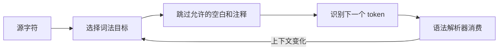

# JavaScript 词法系统

`a / b / g` 中的斜线是除法，`/a/g` 中却开始一个正则字面量。JavaScript 分词不能只用一条正则从左到右切割，解析器会根据当前语法上下文选择合适的词法目标。

## token 是什么

Token 是解析器能识别的词法单元，包括标识符、关键字、数字、字符串、模板、正则和标点。空白与注释通常不成为语法节点，但换行会影响自动分号插入和受限产生式。



ECMAScript 规范用不同 InputElement 目标处理 `/`、模板尾部等歧义。工程里使用成熟 parser，不要手写正则去改写任意 JavaScript。

## 步骤一：观察斜线和换行

预期结果是前两行都能解析，但斜线角色不同；第三个例子中换行位于 return 后，函数返回 undefined，而对象字面量成为后续 block/label 语法的一部分。

```js
const divided = total / count / scale
const matched = /agent/giu.test('Agent')

function build() {
  return
  { status: 'ready' }
}

console.log(divided, matched, build())
```

输入包含除法、正则和一个敏感换行。关键逻辑是解析上下文决定斜线 token，LineTerminator 又触发 return 的受限语法；输出中 build 为 undefined。下一篇会完整解释 ASI，当前先记住“换行不是永远等价于空格”。

## 空白、换行和注释

空格、Tab、NBSP 与部分 Unicode 空白可分隔 token。LineTerminator 包括 LF、CR、行分隔符和段落分隔符，会影响行号、单行注释结束以及受限产生式。多行注释若包含换行，在相关语法位置也可能产生换行效应。

注释不是在执行前简单删除字符串。`//` 到行尾，`/* ... */` 可跨行；它们仍参与词法边界。构建许可证和 source map 注释还可能被工具链特殊处理，压缩器应使用 parser。

## 标识符与 Unicode

IdentifierName 允许 Unicode 字符和转义，关键字也属于 IdentifierName，但在不同语法位置受限制。看起来相同的字符可能有不同码点，用户输入名称还可能涉及规范化与同形字符风险。

属性名可比变量标识符宽松，例如保留字常能用于对象属性。私有标识符以 `#` 开头，只能在声明它的 class 词法范围中使用；它不是普通字符串属性。

## 数字、字符串和模板

数字字面量支持十进制、二进制、八进制、十六进制、指数、分隔符以及 BigInt 后缀。`12.toString()` 的点会与数字词法产生歧义，可写 `(12).toString()` 或 `12..toString()`；实际项目优先采用前者以提高可读性。

字符串字面量用引号并处理转义，源码换行不能直接出现在普通字符串中。模板字面量支持多行和 `${expression}`，tagged template 会收到模板片段与表达式值；标签函数不自动提供 HTML/SQL 安全，仍需按输出上下文编码或参数化。

正则字面量的 pattern 和 flags 由专门语法解析。用户输入拼进 RegExp 构造器前要明确是否按字面文本转义，并限制可能造成高成本回溯的模式。

## 标点和最长匹配

`=>`、`===`、`?.`、`??`、`**` 等由标点组合而成。解析器通常按规范识别可用 token，而不是逐字符独立执行。可选链不能出现在所有赋值左侧，nullish coalescing 与 `&&`/`||` 直接混写还需要括号消除语法歧义。

## 失败与验证

用字符串替换删除注释，可能误删 URL、正则或模板中的相同字符；用正则寻找函数调用，也会遗漏可选链、注释和嵌套语法。代码转换应使用与目标 ECMAScript 版本匹配的 parser，并对输出重新解析、运行测试和生成 source map。

遇到分词争议时保存最小源码，标明 Script/Module、目标引擎与构建链，查看 AST/token 输出。格式化结果帮助阅读，但不能代替规范语法事实。

## 参考资料

- [ECMAScript：ECMAScript Language Lexical Grammar](https://tc39.es/ecma262/#sec-ecmascript-language-lexical-grammar)
- [ECMAScript：ECMAScript Language Expressions](https://tc39.es/ecma262/#sec-ecmascript-language-expressions)
- [MDN：Lexical grammar](https://developer.mozilla.org/docs/Web/JavaScript/Reference/Lexical_grammar)
- [ESTree specification](https://github.com/estree/estree)
