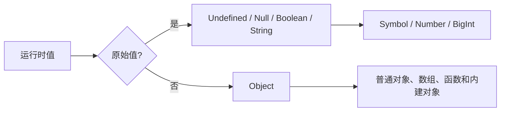

# JavaScript 类型系统

接口返回 `{ count: "10" }`，TypeScript 写着 `count: number`，运行时它会自动变成数字吗？不会。TypeScript 类型通常在编译后消失，JavaScript 仍按实际值执行。理解语言类型、转换和数值边界，是正确校验外部输入的前提。

## 先看 ECMAScript 有哪些语言类型

原始值包括 Undefined、Null、Boolean、String、Symbol、Number 和 BigInt；Object 是另一类语言值。对象按引用身份比较，原始值没有可变属性。函数是可调用对象，不是独立的 `typeof` 语言类型。



`typeof` 是历史悠久的操作符，不是完美类型检查器。`typeof null` 返回 `"object"` 是兼容历史；数组、日期和普通对象也都得到 object。检查具体协议时应组合空值判断、`Array.isArray()`、字段校验或 Schema。

## 步骤一：运行一次边界实验

预期结果分别展示 null 的历史行为、NaN 判断、二进制浮点误差、安全整数边界和 Number/BigInt 不允许隐式混算。

```js
console.log(typeof null)                         // object
console.log(Number.isNaN(NaN))                  // true
console.log(0.1 + 0.2 === 0.3)                 // false
console.log(2 ** 53 === 2 ** 53 + 1)           // true

try {
  console.log(1n + 1)
} catch (error) {
  console.log(error instanceof TypeError)       // true
}
```

输入是五组边界值。关键结果来自规范：Number 使用 IEEE 754 双精度，无法安全区分超过 `2 ** 53 - 1` 的所有整数；BigInt 表达任意精度整数，但算术时不会与 Number 自动混合。选择哪一种取决于协议，不能在金额或 ID 已丢精度后再补救。

## 步骤二：逐个理解原始类型

`undefined` 常表示缺少值或未初始化结果；`null` 通常由程序显式表达“没有对象”。现代代码无需为了防止全局 undefined 被改写而统一改用 `void 0`，模块与严格工程约束已经不同于早期环境。

String 按 UTF-16 code unit 索引，一个用户感知字符可能由多个 code unit 或 grapheme 组成。长度上限由具体引擎和内存决定，ECMAScript 不给应用一个通用可依赖数字。处理 emoji 截断和字数时，应使用 Intl.Segmenter 等符合产品定义的分段方式。

Symbol 每次创建通常具有独立身份，适合作为不易冲突的属性键；全局 Symbol registry 使用 `Symbol.for()` 显式共享。它不等于私有字段，`Reflect.ownKeys()` 仍能发现 Symbol key。

Boolean 只有 true 和 false。对象包装值如 `new Boolean(false)` 本身是对象，在条件中仍为 truthy，因此日常业务避免使用原始类型包装构造器。

## 步骤三：理解转换与相等

显式转换使用 `Number()`、`String()`、`Boolean()` 等，隐式转换会由运算符触发。`+` 同时承担数值相加和字符串连接，因此接口字段类型错误很容易产生 `"101"`。先验证再计算，比依赖隐式规则更可靠。

严格相等 `===` 不做类型转换，`Object.is()` 又对 NaN 和正负零采用不同判断。宽松相等 `==` 有规范化转换规则，并非随机，但阅读成本较高；只有在明确利用某条规则时才使用，例如 `value == null` 同时匹配 null 与 undefined，并在团队约定中写清意图。

`Number.isNaN()` 只判断实际 NaN，global `isNaN()` 会先做 Number 转换。浮点比较也不应机械使用固定 `Number.EPSILON`，误差容忍要结合数值尺度、运算次数和业务领域。

## 步骤四：把外部输入变成可信值

URL、表单、localStorage 和 JSON 都是运行时数据。TypeScript 注解无法改变它们，应在边界处验证类型、范围、枚举、长度和缺失字段，再把通过的数据交给内部逻辑。

错误路径也要设计：`count` 是数字字符串时，是拒绝请求、显式转换，还是提示用户修正？答案属于业务协议，不能让 `+`、truthy 或默认值碰巧决定。

## 常见失败

- 用 `typeof value === 'object'` 后直接读取字段，遗漏 null。
- 把超大整数 JSON 先解析为 Number，再转换成 BigInt，精度已经不可恢复。
- 用 truthy 判断区分“未填写”和合法的 `0`、空字符串或 false。
- 认为 Symbol 属性天然保密，忽略反射 API。
- 把 TypeScript `as User` 当成运行时校验。

## 参考资料

- [ECMAScript：ECMAScript Language Types](https://tc39.es/ecma262/#sec-ecmascript-language-types)
- [ECMAScript：Type Conversion](https://tc39.es/ecma262/#sec-type-conversion)
- [MDN：JavaScript data types](https://developer.mozilla.org/docs/Web/JavaScript/Data_structures)
- [MDN：Numbers and dates](https://developer.mozilla.org/docs/Web/JavaScript/Guide/Numbers_and_dates)
