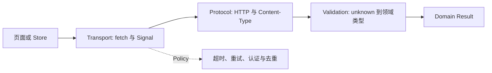

# 前端请求客户端：契约、取消、重试与一致性

前端请求客户端是 UI 与服务端 API 之间的协议适配层。它负责发送 HTTP 请求、解析响应、统一错误和取消，并执行经过约束的重试、认证刷新与缓存策略。页面只消费领域结果，不需要反复猜测 `fetch`、状态码和未知 JSON 的含义。

这层如果只统一 `baseURL` 和 Header，仍然解决不了真实故障：用户切换查询后旧响应覆盖新结果，支付请求超时后自动重试又创建两单。请求客户端要把数据解析、资源所有权和未知提交结果写成可判断的契约。

## 分层数据流

传输层负责 URL、method、headers、body、AbortSignal 和原始 Response；协议层判断 HTTP、Content-Type 和错误结构；解析层把 unknown 校验成领域数据；业务层决定 loading、重试和用户提示。把 Toast 写进底层 fetch 会让批处理和 SSR 难以复用。



```ts
type RequestError =
  | { kind: 'network'; cause: unknown }
  | { kind: 'timeout' }
  | { kind: 'http'; status: number; body: unknown }
  | { kind: 'invalid-response'; issues: string[] }
  | { kind: 'cancelled' }
```

调用方根据 kind 处理输出：network 没有状态码，timeout 表示等待期限到达，http 保留响应状态，invalid-response 表示协议数据未通过解析，cancelled 是所有者主动终止。这个联合避免 catch 中猜字符串；新增错误类型时，穷尽分支会要求页面补充反馈和恢复策略。

稳定错误联合让调用方按终态处理。网络错误没有 HTTP status，取消不应弹成系统故障，非法响应要进入观测而不是断言成成功。

下面的最小实现把响应保持为 `unknown`，直到调用方提供的解析器验证成功。示例依赖现代浏览器的 `AbortSignal.timeout/any`；目标环境不支持时，应在同一适配层用 `AbortController` 组合信号，而不是让每个页面各写一份计时器。

```ts
type Parser<T> = (value: unknown) => T

async function request<T>(
  input: RequestInfo | URL,
  parse: Parser<T>,
  options: { signal?: AbortSignal; timeoutMs?: number } = {}
): Promise<T> {
  const timeout = AbortSignal.timeout(options.timeoutMs ?? 10_000)
  const signal = options.signal
    ? AbortSignal.any([options.signal, timeout])
    : timeout

  let response: Response
  try {
    response = await fetch(input, { signal })
  } catch (cause) {
    if (options.signal?.aborted) {
      throw { kind: 'cancelled' } satisfies RequestError
    }
    if (timeout.aborted) throw { kind: 'timeout' } satisfies RequestError
    throw { kind: 'network', cause } satisfies RequestError
  }

  let body: unknown = null
  try {
    body = await response.json()
  } catch {
    // 空响应和非法 JSON 由状态码或解析器分类。
  }

  if (!response.ok) {
    throw { kind: 'http', status: response.status, body } satisfies RequestError
  }

  try {
    return parse(body)
  } catch (error) {
    throw {
      kind: 'invalid-response',
      issues: [error instanceof Error ? error.message : 'unknown_schema_error']
    } satisfies RequestError
  }
}
```

## 取消与超时

AbortSignal 从页面/任务所有者传到 fetch 和解析步骤。超时通过组合 Signal 触发，并在 finally 清理 timer。取消旧请求防止浪费，但仍用 request sequence 或状态所有者检查，防止不支持取消的下游晚返回。

## 重试判断

GET 等幂等请求可对临时网络/特定 5xx 做有限指数退避加抖动；Retry-After 优先遵守。创建订单等非幂等命令只有服务端支持幂等键和结果查询时才可安全重试。超时代表结果未知，不等于失败。

| 结果 | 默认动作 | 前提 |
| --- | --- | --- |
| 用户主动取消 | 不重试 | 请求所有者已经放弃结果 |
| DNS/连接失败且未收到响应 | 有限重试查询 | 方法幂等，仍在 Deadline 内 |
| `429` | 等待后重试 | 解析并限制 `Retry-After`，设置次数上限 |
| `502/503/504` | 仅重试幂等操作 | 指数退避加抖动 |
| `400/401/403/404/409/422` | 不做通用重试 | 交给认证或领域逻辑处理 |
| 命令超时、连接中断 | 结果未知 | 用幂等键查询结果，不能直接再创建一次 |

## Token 刷新单飞

多个请求同时 401 时共享一个 refresh Promise，成功后各自重放一次；refresh 也失败则统一退出，不能拦截自身形成循环。重放前检查 body 是否可再次发送、请求是否仍被页面需要。

## 缓存与去重

相同查询可共享 in-flight Promise，但 key 必须包含影响响应的参数与权限范围。调用方取消不能无条件取消其他消费者。客户端缓存要有 stale/expiry/invalidation，不与 HTTP 缓存混为一层。

## 验证

用可控假服务器测试乱序、断网、超时、429、503、非法 JSON、并发 401、刷新失败、幂等重试和取消。断言请求次数、Signal、错误类型和最终 UI，不只断言 Promise reject。

评审 axios/fetch 封装时，先检查协议状态机、未知结果和资源所有权。拦截器只是承载机制，不是正确性的证明。

## 请求客户端是状态机

每次调用至少经历 created、queued、sent、headers、body、decoded、validated、committed 或 aborted/failed。`fetch` 只在网络响应到达时 resolve，HTTP 4xx/5xx 不自动 reject；JSON 解析、Schema 校验、业务错误和取消必须映射成稳定的错误联合，UI 才能区分重试、登录和不可恢复。

```text
request key + auth snapshot
 -> timeout/AbortSignal
 -> fetch response
 -> status/content-type/size check
 -> decode -> runtime schema
 -> requestId/version guard
 -> commit cache/store
```

并发刷新 token 时只允许一个 refresh owner，其余请求等待同一 Promise；刷新失败应清空等待者并进入匿名终态，避免每个 401 再开一个 refresh。重试只对可判断的网络/429/503 和幂等方法启用，指数退避带随机抖动；未知提交结果不能盲目重试，优先查询幂等键状态。

客户端缓存键必须包含 URL、方法、序列化参数、身份/权限范围和协议版本。共享 in-flight 请求时，单个调用取消不能取消其他消费者；引用计数或每消费者 signal 决定何时真正 abort。缓存失效要由 mutation、TTL、ETag 和服务端版本共同定义，不能把内存 cache 当授权缓存。

## 官方依据

- [Fetch Standard](https://fetch.spec.whatwg.org/)
- [MDN: AbortSignal](https://developer.mozilla.org/en-US/docs/Web/API/AbortSignal)
- [RFC 9110: HTTP Semantics](https://www.rfc-editor.org/rfc/rfc9110)

## 迁移复核：前端请求客户端：契约、取消、重试与一致性
把这套机制迁移到真实前端时，先确认它运行在哪一层：浏览器解析与调度、框架渲染、构建工具、网络协议或应用状态。相邻层可以互相影响，却不能用框架术语替代浏览器事实，也不能用一次视觉正确推断生命周期和资源已经正确释放。

验证同时覆盖首次加载、更新、卸载或离开页面、错误恢复和低性能设备。交互组件保留键盘路径、焦点、可访问名称与响应式边界；异步逻辑检查取消、竞态和迟到结果；构建结果检查产物图、缓存和 Source Map。

性能优化先用 Performance、Network、Memory 或框架 Profiler 找到时间和资源归属，再改变代码。示例中的阈值、设备与数据规模只用于解释机制，项目结论需要在目标浏览器和真实产物上复测。
