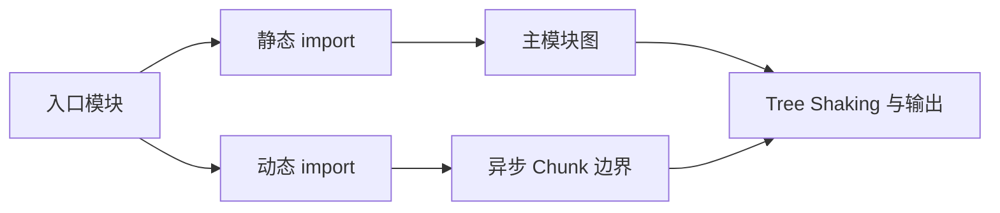

# Rollup、esbuild、模块图与代码分割

Rollup 和 esbuild 都是前端构建工具。它们从入口读取 ES Module，建立模块依赖图，再把源码转换成浏览器或其他运行环境能够加载的产物；Rollup 更强调可控的打包输出，esbuild 更强调解析与转换速度。代码分割发生在这条构建链的输出阶段，用独立 Chunk 延后加载暂时用不到的模块，减少首屏必须下载和执行的代码。

首页并不需要图表编辑器，却在首屏下载了整套图表库。把编辑器改成动态导入后，构建产物出现一个独立 Chunk，只有用户进入编辑页才请求它。这就是代码分割最直观的结果。

这次产物变化来自模块图、Tree Shaking 和 Chunk 分配。Rollup、esbuild 各有不同设计取舍，它们在项目中的角色要以当前工具链配置为准。

## 构建器先画模块图



静态 import 在构建时可分析，通常进入同步依赖图；动态 import 创建异步边界。构建器解析、加载和转换模块，再根据入口、共享依赖与配置生成 Chunk。

## 按用户路径设计代码分割

路由、重型编辑器、语言包和只在特定操作出现的能力适合按需加载。不要为了追求 Chunk 数量把每个组件都拆开；小 Chunk 过多会增加请求、调度和运行时开销，共享依赖也可能重复。

下面的输入是一个动态导入，预期编辑器代码不进入首页同步 Chunk。加载失败要有用户可见恢复，而不是点击后静默空白。

```ts
export async function openEditor(container: HTMLElement) {
  try {
    const { mountEditor } = await import('./editor/mount-editor')
    await mountEditor(container)
  } catch (error) {
    container.textContent = '编辑器加载失败，请重试。'
    throw error
  }
}
```

动态 import 返回 Promise。网络失败、旧 HTML 引用已清理 Chunk 或发布切换都可能导致加载失败，因此部署要保留旧哈希资源一段时间，并采集 ChunkLoadError。`catch` 先给当前容器提供可理解状态，再把错误继续抛出，让监控和上层路由仍能记录失败，而不是把空白误当成功。

## Tree Shaking 的静态分析前提

Tree Shaking 依赖静态 ESM 语义与副作用判断。未使用导出可以删除，但模块顶层副作用、动态属性访问和不准确的 `sideEffects` 声明会影响结果。把有副作用文件错误标为无副作用，可能让样式注册或初始化在生产消失。

包作者提供清晰 ESM 入口、正确 exports 和副作用声明；消费者用 Bundle 分析验证结果，不从 import 写法猜最终体积。

## Rollup 与 esbuild 的职责

esbuild 使用 Go 实现，擅长高速解析、转换和打包；Rollup 以插件生态、输出控制和库构建见长。Vite 开发阶段常使用 esbuild 处理依赖与部分转换，生产构建使用 Rollup 体系；具体版本可能引入其他构建后端，应以当前官方配置为准。

工具速度、兼容性、插件语义、Source Map 和输出质量需要在同一项目测量。不能从简单基准推断所有大型应用。

Rollup 插件的 `resolveId、load、transform` 先共同建立模块内容和依赖，`moduleParsed` 之后才有完整 AST 信息；输出阶段的 `renderChunk、generateBundle、writeBundle` 面向 Chunk 和 Asset。把需要模块上下文的转换放到输出阶段，或在 transform 阶段猜最终文件名，都会破坏多输出配置。

esbuild 的并行架构和插件回调模型不同。它能高速完成解析、转换和常见打包，但复杂代码分割、插件兼容和输出控制要以项目当前版本实测。把 esbuild 称为“只转译不打包”或把 Rollup 称为“只适合库”都不准确。

## Source Map 如何穿过多次转换

TypeScript、JSX、框架编译、用户插件和压缩都可能改变行列。每个阶段需要返回与输入对应的 Source Map，再由工具组合成最终映射。某个插件返回修改后代码却不给 map，后续即使生成 `.map` 文件，错误位置也可能偏移。

验证时在源码放一个可预测异常，使用生产产物和私有 Source Map 还原函数、文件和行列。只检查 map 文件存在，不能证明映射正确。发布还要用同一 release 的产物与 map，避免跨版本符号化。

## 使用性能预算验证分割结果

构建报告检查入口 gzip/Brotli 大小、初始请求数、重复依赖和最大异步 Chunk。浏览器再测实际缓存、网络优先级、解析执行和交互。体积变小不一定让交互更快，若关键代码被拆到串行瀑布，结果可能更慢。

| 失败 | 排查方向 |
| --- | --- |
| 动态 Chunk 仍很大 | 共享依赖与边界位置 |
| 首屏出现串行请求 | preload、入口设计与嵌套 import |
| 生产功能缺失 | sideEffects 与条件导出 |
| Source Map 偏移 | 插件转换是否返回正确映射 |
| 发布后 Chunk 404 | 静态资源保留与 HTML 缓存 |

性能预算接入 CI，但阈值来自产品基线，不套固定 KB。依赖升级时同时比较体积与运行指标，保留可回退版本。

## 从构建清单验证分割是否有效

先保存修改前的构建产物清单：入口文件、同步 Chunk、异步 Chunk、压缩后大小和共享依赖。把编辑器改成动态导入后重新构建，预期首页同步链减少，编辑器形成异步边界；同时检查公共依赖是否被复制进多个 Chunk。

| 检查项 | 需要回答的问题 |
| --- | --- |
| 入口同步体积 | 首次路由真正下载和执行多少 |
| 异步 Chunk | 是否只在进入功能时请求 |
| 共享 Chunk | 是否造成所有路由都提前下载 |
| 请求数量 | 分割是否过细，出现大量小文件 |
| Source Map | 错误是否仍能映射回源码 |
| 旧资源保留 | 发布切换时旧 HTML 是否还能加载 |

Tree Shaking 实验可以新增一个未使用导出，并在模块顶层加一个可观察副作用，比较 `sideEffects` 声明前后产物。若错误声明导致副作用消失，说明包元数据破坏了语义。优化时以实际 Bundle 分析和用户路径为准，不按 import 行数猜体积。

最后用网络限速访问首页和编辑页，观察请求瀑布、解析执行和失败恢复。代码分割把成本移动到需要它的时刻，不会消灭成本；常用功能过度懒加载也会把延迟推给每位用户。

## 模块图到 Chunk 的决策

Rollup 先解析静态 import 形成同步图，再把动态 import 作为异步入口；tree-shaking 根据 export 使用关系和 side effect 分析删除不可达语句。manualChunks、输出 format、external 和 preserveModules 会改变 Chunk 归属。共享依赖是否抽成公共 Chunk，要同时看入口复用、首屏下载和缓存稳定，而不是只追求文件数少。

esbuild 的 parser/transform/bundler 由 Go 实现，默认并行且速度高；其插件生命周期和 tree-shaking 语义与 Rollup 不完全相同。把 Rollup 插件直接塞进 esbuild 通常会丢失 resolve/load、输出生成和 watch 语义，应使用目标工具的适配层并补产物测试。

```text
main -> feature (dynamic import) -> shared
unused export -> removed if pure
feature load -> feature-[hash].js + shared-[hash].js
HTML/manifest -> runtime resolves chunk URL
```

动态 Chunk 的失败是用户可观察状态：网络断开、旧 HTML 引用已删除 hash、CSP/跨域或 Service Worker 缓存都可能导致 import rejection。提供重试但限制次数，必要时刷新前先判断新 manifest；回滚必须保留旧资源窗口，否则 HTML 与 Chunk 版本不兼容。

## 官方依据

- [Rollup Code Splitting](https://rollupjs.org/features/code-splitting/)
- [Rollup Tree-Shaking](https://rollupjs.org/faqs/#tree-shaking)
- [esbuild Code Splitting](https://esbuild.github.io/api/#splitting)
- [MDN: dynamic import](https://developer.mozilla.org/en-US/docs/Web/JavaScript/Reference/Operators/import)

## 迁移复核：Rollup、esbuild、模块图与代码分割
把这套机制迁移到真实前端时，先确认它运行在哪一层：浏览器解析与调度、框架渲染、构建工具、网络协议或应用状态。相邻层可以互相影响，却不能用框架术语替代浏览器事实，也不能用一次视觉正确推断生命周期和资源已经正确释放。

验证同时覆盖首次加载、更新、卸载或离开页面、错误恢复和低性能设备。交互组件保留键盘路径、焦点、可访问名称与响应式边界；异步逻辑检查取消、竞态和迟到结果；构建结果检查产物图、缓存和 Source Map。

性能优化先用 Performance、Network、Memory 或框架 Profiler 找到时间和资源归属，再改变代码。示例中的阈值、设备与数据规模只用于解释机制，项目结论需要在目标浏览器和真实产物上复测。
