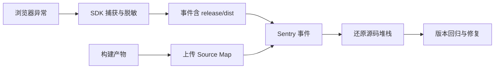

# Sentry、Source Map 与前端观测

生产错误里只有 `app-8f3c.js:1:91822`，开发者无法知道用户点了哪个按钮，更无法定位 TypeScript 源码。Source Map 能把压缩后的堆栈映射回源码，但上传错版本、路径不一致或把 Map 放进公开目录，都会让定位失败或泄露源代码。

本文从一次 JavaScript 异常开始，建立事件、发布版本、Source Map 和用户行为的关系。示例使用匿名占位配置，不把真实 DSN、用户数据或项目名写进代码。

## 先看观测链路

事件和 Source Map 通过 release、dist、文件 URL 和 debug ID 对齐。只有“上传过 Map”而没有一致的版本和文件名，服务端仍可能无法还原。

## 第一步：事件里应该有什么

一个可排障事件至少需要：错误类型与消息、浏览器/OS、应用版本、路由模板、Trace ID、用户操作面包屑和是否发生网络/资源错误。用户 ID、URL 查询参数、表单、文档内容和 Token 需要按隐私策略过滤或哈希。

Sentry SDK 的 `beforeSend` 适合做最后一道脱敏，但不能代替代码层不捕获敏感数据。不要把完整请求 Body、Authorization、模型 Prompt 和服务端凭证发送到浏览器监控平台。

错误分组依赖堆栈和消息。把每条用户输入拼进错误消息会造成事件爆炸；应使用稳定错误码，把变量放在受控上下文。

## 第二步：构建版本必须稳定

构建时生成一个不可变 release，例如 Git 提交摘要或 CI 制品版本。浏览器 Bundle、Source Map 上传和应用初始化使用同一个值；重试上传不能生成另一个 release。

多部署环境可以使用 `release` 标识代码版本、`dist` 标识同一 release 的构建变体。按环境、渠道和构建目标分开，避免同名文件互相覆盖。

版本记录还应包括构建命令、Node/包管理器版本、依赖锁文件和 public path。Source Map 路径问题经常不是 Sentry API 错，而是浏览器报告的文件 URL 与上传文件名不一致。

## 第三步：Source Map 怎样映射

压缩 Bundle 的每个位置通过 source map 的 mappings 指向原始 TypeScript、Vue 或 JSX。上传工具需要看到最终发布的 Bundle 和 Map，且 `sources` 路径、sourceRoot、域名和构建前缀要能与事件中的脚本 URL匹配。

本地验证可以故意抛出一条异常，构建后使用浏览器加载生成的 Bundle，查看事件堆栈是否指向源码文件与行列。不要只在开发模式测试，开发模式通常没有相同的压缩和路径。

Source Map 不一定要对公众可访问。构建产物可以上传到 Sentry 后从静态服务器删除 `.map`，或通过服务器权限保护。`//# sourceMappingURL` 暴露路径不等于必须允许下载，仍要确认服务器配置不会公开敏感源码。

## 第四步：Trace 与前端性能

前端错误还要和后端请求关联。Fetch/XHR 传播 Trace Context 时，服务端应在可信入口提取；不要把任意客户端 Header 当作用户身份。页面性能可以采集导航、资源、长任务、Web Vitals 和关键交互，但采样、用户同意和数据保留都要写进策略。

一个错误事件如果包含 `trace_id`，后端可以在同一时间窗口查 API、检索和模型 Span。前端不要把完整页面内容或用户输入放进 Span attribute；用路由模板、结果类别和稳定版本维度。

## 第五步：测试上传与回滚

CI 中按顺序：

1. 安装锁定依赖并构建生产 Bundle。
2. 生成唯一 release，上传 Source Map 和 release 文件列表。
3. 在候选页面加载同一 Bundle，触发匿名测试异常。
4. 在 Sentry 查询事件，确认源码位置、release、环境和脱敏。
5. 删除或保护测试事件，记录结果。
6. 生产切流后保留旧 release 和旧 Map，直到观察周期结束。

上传失败应阻止把“不可定位”版本切到高风险流量，或明确接受降级并设置后续补传。回滚代码版本时不要删除旧 Map，否则旧错误再次出现时无法还原。

## 故障排查表

| 现象 | 先查 | 可能修复 |
| --- | --- | --- |
| 事件是压缩行 | release/dist、脚本 URL、Map 上传文件名 | 统一 public path 与 release |
| 只有部分栈还原 | 代码分割 Chunk 是否全部上传 | 上传全部异步 Chunk Map |
| 还原到错误版本 | release 重用或缓存 | 使用不可变版本，清理 CDN 缓存 |
| Map 可被浏览器下载 | 静态服务器规则、SourceMap Header | 上传后删除/保护 Map |
| 事件数量爆炸 | 动态消息、重复捕获 | 稳定错误码、去重与采样 |
| 事件含敏感内容 | SDK 面包屑、上下文、请求 | beforeSend + 上游不采集 |

## 迁移练习

为一个 Vite 或 Next.js 页面配置匿名 release，构建并上传 Source Map 到隔离 Sentry 项目。触发一次异常，核对源码位置与版本；然后把 Map 从静态目录移除，再确认错误仍能还原。最后写出一条不会采集用户输入的 `beforeSend` 规则。
