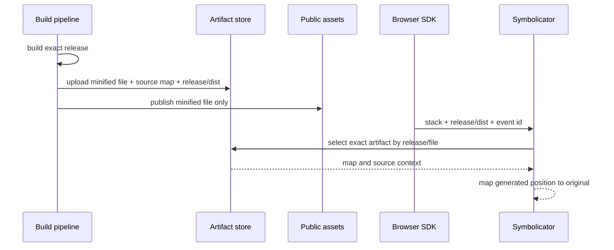

# Sentry、Source Map 与前端可观测性

前端监控系统的价值不是“捕获了 window.onerror”，而是把用户遇到的失败可靠转换成可聚合事件，并回答：发生在哪个 Release、影响哪些受控用户分群、对应哪段原始源码、前后有哪些脱敏操作、是否是新回归，以及修复后如何证明消失。

Mini Sentry 能帮助理解捕获、Breadcrumb 和 Transport，但教学代码直接 monkey patch 全局 API、把完整 URL/DOM 上传、只在 `beforeunload` flush 或用 message 作为唯一指纹，都会在生产产生隐私、兼容性和噪声问题。SDK、构建、错误平台与发布系统必须共同形成证据链。

## 端到端事件链路

```mermaid
flowchart LR
  S[Error sources] --> N[Normalize]
  N --> P[Privacy scrub]
  P --> F[Fingerprint + sampling]
  F --> Q[Bounded client queue]
  Q --> T[Transport]
  T --> I[Ingestion validate + rate limit]
  I --> G[Group / enrich]
  G --> SM[Symbolicate with release artifacts]
  SM --> A[Alert + issue workflow]
  A --> R[Fix release]
  R --> V[Regression verification]
```



| 阶段 | 必须保留 | 必须限制 |
| --- | --- | --- |
| Capture | 类型、stack、机制、时间 | DOM 正文、输入值、Token |
| Normalize | 稳定字段、因果链、循环保护 | 无限深对象、超长字符串 |
| Context | Release、环境、路由模板、受控 tags | 完整 URL、Cookie、任意业务 payload |
| Transport | 批次、重试、事件 ID | 无限队列、卸载时强保证 |
| Ingestion | Schema、认证、配额、服务端时间 | 信任客户端租户/用户字段 |
| Symbolication | Release、dist、文件名、Map | 公开 Source Map 与源码访问 |
| Alert | 影响、回归、负责人、Runbook | 每个事件一条告警 |

## 错误来源不是一个监听器

浏览器错误至少包括：

- 同步 JavaScript 异常；
- 未处理 Promise rejection；
- script/img/link 等资源加载失败（`error` 捕获阶段）；
- React Error Boundary、Vue errorHandler 等框架错误；
- 动态 import / Chunk 加载失败；
- Fetch/XHR 网络失败与受控 HTTP 错误；
- Worker、Service Worker、iframe 通道错误；
- 关键业务不变量失败，即代码未 throw 也需要记录。

`window.onerror` 和 `addEventListener('error')` 的事件形态不同，资源错误通常没有普通 Error stack。Promise rejection 的 reason 可以是字符串、对象甚至循环引用，不能假设 `.message` 存在。

```ts
type CapturedException = {
  mechanism: 'window-error' | 'unhandled-rejection' | 'framework' | 'manual'
  name: string
  message: string
  stack?: string
  handled: boolean
  cause?: CapturedException
}

function normalizeThrowable(value: unknown, depth = 0): CapturedException {
  if (depth > 4) {
    return { mechanism: 'manual', name: 'TruncatedCause', message: 'cause depth exceeded', handled: false }
  }
  if (value instanceof Error) {
    return {
      mechanism: 'manual',
      name: value.name || 'Error',
      message: truncate(value.message, 1_000),
      stack: value.stack ? truncate(value.stack, 20_000) : undefined,
      handled: false,
      cause: value.cause === undefined ? undefined : normalizeThrowable(value.cause, depth + 1)
    }
  }
  return {
    mechanism: 'manual',
    name: typeof value,
    message: safePreview(value),
    handled: false
  }
}
```

`safePreview` 要限制深度、数量、字符串长度并处理循环，且在采集前先应用字段 denylist。不能用通用 `JSON.stringify(error)`，Error 字段可能不可枚举，业务对象又可能包含敏感值。

### 网络错误不是所有非 2xx 都 throw

Fetch 只有网络层失败才 reject，404/500 会正常 resolve。SDK 包装 Fetch 时应保持原函数语义、支持 Request 对象、AbortSignal、stream body 和多次安装/卸载。不要为了监控读取 Response body，这会消耗流并泄露内容。

网络 Breadcrumb 只记录 method、路由模板/Origin allowlist、status、duration、request ID 和受控错误类别。取消请求通常不是错误；按业务定义采样 4xx/5xx，避免每个预期 404 都成为异常。

猴子补丁会与其他 SDK、测试和框架冲突。成熟 SDK 使用可恢复 instrumentation、共享原始引用和去重标记；应用尽量通过统一 HTTP Client 产生业务 span/错误，减少全局 patch。

## Breadcrumb 是有限上下文，不是录像

Breadcrumb 用于重建错误前的受控序列：路由从模板 A 到 B、点击了带稳定 action ID 的按钮、请求某路径模板返回 503、某任务状态从 running 到 failed。它不应记录 input value、页面文本、完整 DOM selector、剪贴板或请求体。

使用环形缓冲区限制数量和单项大小：

```ts
class RingBuffer<T> {
  private values: T[] = []
  constructor(private readonly capacity: number) {}

  push(value: T): void {
    if (this.values.length === this.capacity) this.values.shift()
    this.values.push(value)
  }

  snapshot(): readonly T[] {
    return this.values.slice()
  }
}
```

真实高频场景用固定数组/游标减少 shift 成本。Breadcrumb 在错误捕获时复制快照，避免上报排队期间继续变化。事件委托只捕获显式 `data-observe-action` 之类白名单标识，不根据任意 innerText 生成标签。

## 指纹和分组决定信噪比

只按 message 分组会把动态 ID 产生海量 Issue；只按第一帧又会把不同根因合并。常见指纹由错误类型、归一化消息、符号化后的应用栈关键帧、机制和可选业务错误码组成。浏览器扩展和第三方脚本帧要标记来源，但不能粗暴过滤所有跨域错误。

```ts
interface FingerprintInput {
  exceptionType: string
  normalizedMessage: string
  applicationFrames: readonly string[]
  mechanism: string
  errorCode?: string
}

function fingerprint(input: FingerprintInput): string {
  return stableHash([
    input.exceptionType,
    input.normalizedMessage,
    input.applicationFrames.slice(0, 5).join('|'),
    input.mechanism,
    input.errorCode ?? ''
  ].join('\n'))
}
```

客户端指纹只能作为建议，服务端在符号化后最终分组。分组算法变更需要版本化并能重新处理；否则同一错误会在升级前后裂成两组且无法解释。

去重也有窗口：同一 Error 被框架和 window 入口捕获可用对象 WeakSet/事件 ID 去重；相同指纹在短窗口内可聚合计数，但不能永远丢弃，因为影响率和回归需要频次。

## Source Map 需要完整转换链

TypeScript/JSX、宏、框架编译、Bundle 和压缩每一步都可能改变行列。每个 Transform 必须生成并消费上一张 Map，最终 Map 与精确的 Release、dist 和产物文件名绑定。



常见失败包括：

- SDK Release 与上传 Release 不同；
- CDN 增加前缀/重写文件名，stack URL 与 artifact name 对不上；
- CI 在上传 Map 后又重新构建发布，哈希相同假设不成立；
- 某插件返回空/错误 Map，最终只能映射到中间代码；
- Map 未包含 sourcesContent，服务器又无法访问原源码；
- Map 被公开部署，暴露源码和本机路径；
- 多地区只上传一部分制品或上传发生在切流之后。

构建一次，验证一次，发布同一份不可变制品。Source Map 上传是发布门禁的一部分，不允许线上接流量后再“尽量补”。

## Release、dist 与部署必须一致

Release 标识应来自不可变构建版本，例如 commit 加构建版本，不由浏览器当前时间生成。`dist` 用于同一 Release 的不同制品集合时要稳定定义，例如不同平台构建；不要每个实例随机一个 dist。

事件还应带 environment，但 environment 不参与选择错误源码的唯一依据。灰度时同一环境存在两个 Release，平台必须按事件 Release 匹配。回滚后旧 Release artifacts 仍要保留到事件保留期或至少观察窗口。

Source Map 与源码含知识产权和可能的路径信息，放在私有 Artifact Store，最小权限、加密、审计和保留删除。公开服务器配置明确排除 `.map`；构建产物扫描确认没有 `sourceMappingURL` 指向公开可访问位置（也可保留注释但 URL 不公开，取决于工具链）。

## 事件队列和传输没有 exactly-once

浏览器可能崩溃、离线、被系统杀死。客户端队列要有上限、批次、过期、重试预算和优先级。错误事件通常比普通性能样本优先；队列满时丢低优先级并记录 drop count。

```ts
type Envelope = {
  eventId: string
  createdAt: number
  attempts: number
  payload: Uint8Array
}

function retryDelay(attempt: number): number {
  const cap = Math.min(30_000, 500 * 2 ** attempt)
  return Math.floor(Math.random() * cap)
}
```

只重试网络失败、429 和部分 5xx；永久 Schema 错误、超大事件或认证错误不重试。遵守 `Retry-After`，使用 full jitter 防惊群。服务端用 event ID 幂等接收，客户端可能重复发送；“成功请求一次”也不证明服务端持久化，可用明确 2xx 接收协议。

`sendBeacon`/fetch keepalive 适合页面隐藏时尽力发送小批次，但有配额与大小限制。不能只监听 `beforeunload`，移动端可能没有事件。平时定时/阈值 flush，`visibilitychange/pagehide` 做最后一次尽力提交。离线持久化 IndexedDB 前评估隐私、账号切换和保留期；高敏感上下文宁可丢弃。

## 采样要保留决策一致性

错误事件、性能 Trace 和 Session Replay 的成本与敏感度不同。错误可按 fingerprint、Release、新错误和影响提高采样；Trace 通常在事务开始做 head sampling，或由平台做 tail-based 保留异常/慢样本。一个 Trace 的子 span 应继承一致采样决策，避免只有碎片。

采样率必须进入事件元数据，以便估算影响；客户端采样可被篡改，容量保护仍在服务端。安全拒绝、支付失败等关键业务事件不应只依赖可采样前端监控，服务端应有可靠审计/业务日志。

## 隐私治理从采集前开始

“上传后在后台脱敏”已经太晚。SDK 默认 deny，按 allowlist 增加字段：

- URL 转路由模板，移除 query/hash；
- User 只使用受控内部伪标识，或完全匿名；
- Header 只允许少数诊断字段，永不上传 Authorization/Cookie；
- DOM 交互只记录 action ID，不记录文本和值；
- 网络不记录 body；
- 错误消息中的邮箱、Token、路径等再做模式清洗；
- `beforeSend` 是最后防线，不是唯一防线。

不同数据类型设保留期和删除路径。用户删除请求应能找到关联伪标识数据；Session Replay 等高敏感能力需要单独同意、遮罩验证和更低采样，不能因 SDK 默认开启就上线。

## 前端 Trace 与后端关联

前端导航/交互生成 trace context，经允许的同源/受信 Origin 请求传播。后端继续 span，最终可从慢点击看到 API、队列和数据库。不能向任意第三方 Origin 注入内部 trace header，CORS 和隐私也需配置。

日志、错误事件和 Trace 使用 request/trace ID 关联，但分工不同：错误事件聚合 Issue，Trace 分析一次延迟路径，业务事件记录可靠状态。不要把前端监控当唯一审计源。

## 告警与回归工作流

每个事件告警会淹没团队。高质量规则包括：新 Release 新错误、已解决 Issue 回归、影响用户率突增、关键路径错误率、Chunk 错误、Source Map 符号化率下降。告警附带 Release、影响、代表事件、最近部署、负责人和 Runbook。

修复发布后，不是手动点 resolved 就结束。比较新 Release 是否还有事件、符号化是否正常、影响率是否下降；回归用同一 fingerprint 或明确规则重新打开。Source Map 上传失败本身必须阻止发布或高优告警，否则后续错误不可诊断。

## 验证

| 用例 | 注入 | 预期 |
| --- | --- | --- |
| 同步/Promise/资源错误 | 代表 fixture | 分类正确、只产生预期事件 |
| 框架重复捕获 | Error Boundary 后冒泡 | event ID/对象去重且 handled 语义正确 |
| Source Map | 生产压缩代码固定抛错 | 定位原文件、函数、行列和源码上下文 |
| 隐私 | URL 带 Token、表单含邮箱、请求含认证 | 出站 Envelope 扫描为零敏感值 |
| 离线与 429 | 断网、服务端 Retry-After | 有界重试、恢复发送、不惊群 |
| 页面终止 | visibility/pagehide 后快速关闭 | 尽力发送；丢失不会阻塞业务 |
| 队列溢出 | 生成大量噪声 | 丢低优先级、内存有上限、drop 可观测 |
| 回滚 | 新旧 Release 同时产生错误 | 各自选择正确 artifacts，不串 Map |

E2E 拦截监控 ingestion，检查真实浏览器发出的 Envelope，而不是只单测 scrub 函数。构建门禁执行人工错误 fixture 的符号化，并扫描公开 dist 没有 Map、私有 artifact 没有本机敏感路径。使用 mutation：删除 Release、破坏一段 Map、禁用 scrub、让 Transport 永久 429，确认测试失败。

## 常见误区

- **window.onerror 能捕获所有错误**：Promise、资源、框架、Worker 与业务失败有不同入口。
- **错误越多监控越完整**：无归一、分组、采样和所有权只会制造噪声。
- **Source Map 构建出来就能符号化**：必须与真实发布制品、Release、文件名和完整转换链匹配。
- **删除公网 `.map` 就绝对安全**：私有 Map 仍需权限、审计和保留治理，事件上下文也可能泄露。
- **beforeunload 可以保证 flush**：浏览器可能直接终止，Beacon 也只有尽力语义。
- **抓取完整请求和 DOM 有助排障**：隐私与安全风险远大于收益，应使用模板、ID 和受控元数据。
- **客户端采样能保护服务端**：攻击者可绕过客户端，ingestion 必须独立限流和验证。

## 源码与规范

- [Sentry JavaScript Source Maps](https://docs.sentry.io/platforms/javascript/sourcemaps/)：Release、Artifact、Debug ID 和 Source Map 上传。
- [Source Map Revision 3](https://sourcemaps.info/spec.html)：映射文件字段和位置语义。
- [Vue3 使用 Sentry](https://juejin.cn/post/6998887720995487758)：我的早期监控接入实践。
- 个人实验材料已匿名化；本文只抽取通用机制，不建立项目映射。
- 个人实验材料已匿名化；本文只抽取通用机制，不建立项目映射。
