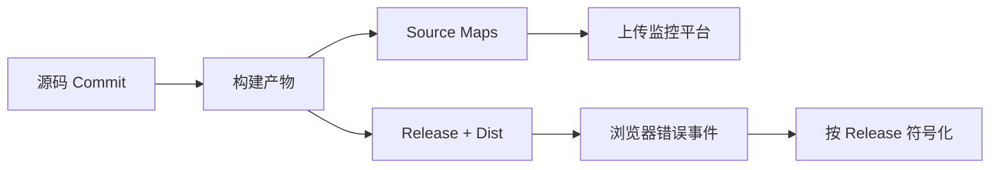

# Sentry、Source Map 与前端可观测性

本篇目标是把一条生产环境压缩堆栈还原到可修改的源码位置，并建立 Release、构建产物和部署之间的对应关系。开始前只需要知道浏览器最终运行的是打包后的 JavaScript；下面用一次可控异常作为实践场景，不要求先熟悉 Sentry 后台。

生产报错只显示 `app.a8f3.js:1:48291`，开发者不知道对应哪个源码函数。Source Map 保存生成代码到源码位置的映射；监控平台只有在事件 Release、线上文件和上传的 Map 完全对应时，才能还原堆栈。

本篇从一条压缩错误开始，建立 Release 身份、构建上传、运行事件和源码定位链路，再处理采样、错误分组与隐私。

## 定位链为什么容易断



重新构建同一 Commit、移动 Tag 或上传错误目录，都可能让 Map 与线上文件不匹配。CI 构建一次，记录不可变版本，并让运行时事件携带同一 Release。

## 步骤一：建立稳定 Release

Release 可以来自 Commit 与构建标识，Dist 区分同一 Release 的不同产物。HTML、静态 JS、监控事件和部署清单使用相同值。候选与生产提升同一构建，生产服务器不重新生成文件。

## 步骤二：私有上传 Source Map

构建阶段生成带 sourcesContent 或可访问源码的 Map，由 CI 使用短期 Token 上传。上传成功后，公开静态目录不必继续提供 `.map` 文件。Map 可能包含源码与路径，应按敏感制品管理。

下面是概念性初始化。输入是构建注入的非敏感 Release 与采样配置，输出是关联版本的错误事件。实际 DSN、环境与隐私钩子由项目配置，不能把 Secret 打进浏览器。

```ts
Sentry.init({
  dsn: import.meta.env.VITE_SENTRY_DSN,
  release: import.meta.env.VITE_RELEASE,
  environment: import.meta.env.MODE,
  sampleRate: 0.2,
  beforeSend(event) {
    if (event.request) delete event.request.cookies
    return redactKnownSensitiveFields(event)
  }
})
```

浏览器 DSN 通常是客户端配置，不等于管理 Token；上传 Token 只存在 CI。`beforeSend` 是最后一道清理，不替代源头上避免采集正文和凭证。输入是 SDK 创建的事件对象，关键逻辑是删除 Cookie 并调用脱敏函数，输出是允许发送或被丢弃的事件；它不负责修复 Release 与 Source Map 的身份不匹配。

## 步骤三：让错误可行动

错误分组依赖堆栈与指纹。不要给每次事件随机 fingerprint，否则同一故障无法聚合；也不要把所有 API 错误强行归为一组。记录路由模板、版本、功能和稳定错误码，避免 URL ID、用户 ID 等高基数标签。

捕获边界区分预期业务失败和未知异常。取消请求、表单验证和 404 不一定进入 error；真正崩溃、资源加载失败与未处理 Promise 才需要告警。用户反馈可关联事件 ID，但不自动附加页面敏感内容。

## 步骤四：验证上传与部署

候选环境主动触发一个带唯一标记的测试错误，检查平台展示正确源码文件与行号，再删除测试事件或标记。Source Map 上传成功但 Release 不一致时，符号化仍会失败。

| 失败 | 排查 |
| --- | --- |
| 仍显示压缩堆栈 | Release/Dist 与文件地址 |
| 行号偏移 | 多次 transform 的 Source Map 链 |
| Map 公开可下载 | 构建部署排除规则 |
| 事件包含 Token | SDK 集成与 beforeSend 门禁 |
| 告警风暴 | 分组、采样和环境过滤 |
| ChunkLoadError 增加 | HTML 缓存与旧静态资源保留 |

监控平台不可用不应阻塞页面。SDK 加载、队列和网络请求都有上限；性能 Trace 和 Replay 属于额外数据面，启用前单独评估同意、隐私、成本和采样。

## 从一条压缩错误完成定位演练

在测试构建中加入一个可控异常，构建 Release `web-<commit>`，上传对应 Source Map 后只部署压缩 JS，不公开 `.map` 文件。触发异常，检查事件 Release 与部署版本相同，堆栈能映射到真实源码文件、行列和函数。

| 检查项 | 预期 |
| --- | --- |
| Release | 前端事件、Source Map、部署记录一致 |
| Debug ID/文件身份 | 压缩文件与 Map 精确匹配 |
| 堆栈 | 映射到源码，不显示本机绝对路径 |
| 分组 | 同一根因稳定聚合，不按随机文本拆散 |
| 隐私 | URL、面包屑和上下文经过 allowlist/脱敏 |

如果仍显示压缩位置，依次检查事件 Release、构建产物身份、上传路径前缀和 Source Map 是否来自同一次构建。不要重新构建一份“相同源码”Map 上传，哈希、模块顺序和压缩结果可能已经不同。

随后验证错误采样、用户影响和告警动作。网络取消、浏览器扩展错误等噪声可在证据充分后过滤；真正业务错误保留请求关联 ID和功能上下文，但不上传 Token、表单正文或完整用户对象。Source Map 解决定位，修复仍需可复现路径和回归测试。

## 参考资料

- [Sentry Source Maps](https://docs.sentry.io/platforms/javascript/sourcemaps/)
- [Source Map specification](https://tc39.es/ecma426/)
- [Sentry JavaScript Configuration](https://docs.sentry.io/platforms/javascript/configuration/)
- [OWASP Logging Cheat Sheet](https://cheatsheetseries.owasp.org/cheatsheets/Logging_Cheat_Sheet.html)
