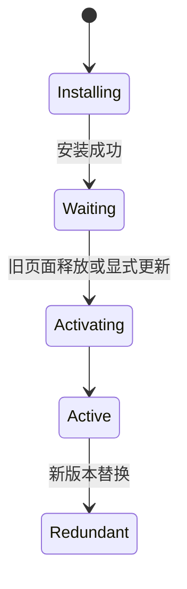

# Service Worker 与离线架构

用户打开过帮助页，断网后再次访问，希望至少看到上次成功内容。Service Worker 可以位于页面与网络之间拦截请求，但错误缓存策略也会长期返回旧 HTML，甚至缓存带用户信息的响应。

本篇先缓存一份公开静态页面，再解释 install、activate、fetch 和更新等待。离线能力按资源类型设计，不用一个“缓存优先”规则覆盖全站。

## 生命周期为什么看起来有两份版本



新 Service Worker 安装后通常等待，旧 Worker 继续控制已打开页面。这避免运行中的页面代码突然换成不兼容缓存。`skipWaiting` 和 `clientsClaim` 可以加快接管，但要先保证新旧资源协议兼容，并向用户解释刷新时机。

## 步骤一：只预缓存确定的公开资源

带哈希的 JS/CSS 可缓存优先；导航 HTML 更适合网络优先并设置离线 fallback；API 根据数据新鲜度选择网络优先、stale-while-revalidate 或完全不缓存。认证响应、支付、一次性 URL 和敏感数据默认不进入公共 Cache Storage。

下面是简化的导航策略。输入是同源 GET 导航，网络成功时保存可公开缓存的响应；断网时返回已知离线页。实际项目还要限制路径、响应类型、大小和缓存版本。

```js
self.addEventListener('fetch', event => {
  const request = event.request
  if (request.mode !== 'navigate') return

  event.respondWith((async () => {
    try {
      const response = await fetch(request)
      if (response.ok && response.headers.get('X-Offline-Cache') === 'public') {
        const cache = await caches.open('pages-v3')
        await cache.put(request, response.clone())
      }
      return response
    } catch {
      return (await caches.match('/offline.html')) || Response.error()
    }
  })())
})
```

服务端用受控响应头明确哪些导航可离线缓存，Worker 不猜 Cookie 内容。缓存写入使用 clone，因为响应流只能消费一次。代码只拦截导航请求：网络正常时原响应立即返回，只有服务端明确标记为公开才复制进 `pages-v3`；网络异常时再查离线页，因此它不会把任意 API 或认证响应自动缓存。

## 步骤二：版本更新时清理旧缓存

缓存名带 Schema 版本，activate 时只删除应用拥有且不再使用的旧缓存。不能 `caches.keys()` 后清空整个 Origin，因为同域其他模块可能有自己的缓存。

旧 HTML 引用的哈希资源要在发布观察期继续保留。若先删除旧资源，再让等待中的 Worker 或旧页面继续运行，会出现 Chunk 404。更新提示让用户在安全时刷新，表单未保存时不能强制重载。

## 步骤三：离线写操作进入明确队列

离线表单不是简单缓存 POST。需要稳定操作 ID、可序列化输入、用户可见 pending 状态、重试预算和重新认证。权限可能在离线期间撤销，恢复网络后服务端重新验证；冲突要让用户选择或按领域规则合并。

Background Sync 支持有限且受浏览器策略影响，不能作为唯一保证。应用启动时也检查 pending 队列，并允许用户取消或查看失败。

## 步骤四：处理存储配额和清理

浏览器可以清理站点存储，Service Worker 也可能停止。离线缓存是可重建副本，不保存唯一业务事实。限制条目数、总大小和保留时间，LRU 等策略只清理自己命名空间。

| 场景 | 预期 |
| --- | --- |
| 首次在线访问 | 网络响应并缓存允许内容 |
| 断网刷新已缓存公开页 | 返回最近版本或离线页 |
| 私有 API | 不进入通用缓存 |
| 新 Worker 安装 | 等待安全接管 |
| 旧 HTML 请求旧 Chunk | 观察期内资源仍存在 |
| 存储被浏览器清理 | 在线后可重新构建 |
| 离线写恢复 | 服务端重新认证并按幂等键提交 |

测试使用真实浏览器切换 Offline，覆盖首次离线、缓存后离线、Worker 更新、多个 Tab、配额不足和注销后清理。DevTools 的“Bypass for network”状态也要明确，避免调试结果被旧 Worker 影响。

## 用 DevTools 完成六步离线验收

先清空站点存储并注销 Service Worker，在线访问公开帮助页，确认安装、激活和缓存条目。切换 Offline 后刷新同一页，再访问从未缓存的页面，观察一个返回最近公开内容，另一个进入明确离线 fallback。

| 实验 | 需要确认 |
| --- | --- |
| 首次离线 | 没有伪造缓存命中，展示离线状态 |
| 缓存后离线 | 只返回允许的公开响应 |
| 登录后请求 | 私有 API 和用户页面不进入通用缓存 |
| Worker 升级 | 新版本等待或安全提示刷新 |
| 多 Tab | 接管时机一致，不破坏未保存表单 |
| 注销/权限撤销 | 敏感本地状态按策略清理 |

再部署一个新 Worker 和新 HTML，同时保留旧哈希资源。旧页面应继续运行，新页面在接管后使用新缓存；确认兼容后才清理旧资源。若直接 `skipWaiting`，必须证明新 Worker 能理解旧页面请求协议。

离线写操作单独测试幂等 ID、重新认证、冲突和取消，不把 POST 放入普通 Cache Storage。存储被浏览器清理后，应用应能从服务器重建。离线能力是可用性增强，不是唯一数据仓库。

## 参考资料

- [Service Workers specification](https://w3c.github.io/ServiceWorker/)
- [MDN Service Worker API](https://developer.mozilla.org/docs/Web/API/Service_Worker_API)
- [web.dev Service Worker lifecycle](https://web.dev/articles/service-worker-lifecycle)
- [Storage Standard](https://storage.spec.whatwg.org/)
