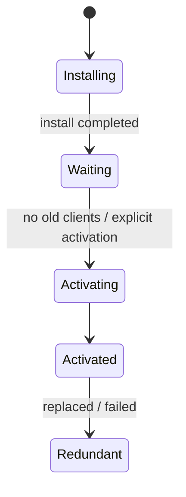

# Service Worker 与离线架构

Service Worker 是事件驱动的网络代理，不是永久后台进程。浏览器可以在事件结束后随时终止它，全局变量、Timer 和内存队列都不是持久状态。离线架构的核心不是“把所有请求放 Cache”，而是为不同资源定义一致性、版本、失败和更新体验。

## 生命周期与页面控制关系



注册脚本变化触发新 Worker install；旧 Worker 仍控制已打开页面，新 Worker waiting。`skipWaiting()` + `clients.claim()` 会加速接管，但可能让旧页面代码突然配上新缓存/协议，破坏兼容。只有页面/Worker 协议向后兼容或经过用户确认刷新时才使用。

每个 install/activate/fetch/message 的异步工作放 `event.waitUntil/respondWith`，否则事件结束后浏览器可终止 Worker。不要用 setInterval 做永久同步。

## 缓存按资源类别设计

| 资源 | 典型策略 | 关键约束 |
| --- | --- | --- |
| 哈希 JS/CSS/字体 | Cache First/Precache | URL 内容不可变 |
| HTML navigation | Network First + timeout/fallback | 避免旧入口引用缺失资源 |
| 公共可陈旧内容 | Stale While Revalidate | 最大陈旧与版本提示 |
| 用户/权限 API | Network Only 或严格分区 | 不跨账号/租户缓存 |
| 实时流/写请求 | Network Only | 不缓存响应/伪造成功 |
| 图片媒体 | Cache First + quota/LRU | 大小、来源、淘汰 |

“缓存优先”不是全局最佳。把带 Cookie 的 `/api/profile` 按 URL Cache 可能在退出/换账号后返回前用户数据。Cache API 不自动遵守 HTTP Cache 的所有语义，应用必须决定 key、Vary、认证和过期。

## 版本化 Precache 与原子安装

构建生成 Release Manifest（URL + revision）。install 创建本版本 Cache，`addAll` 任一失败会让 install 失败；可按核心/可选资源分组。activate 只删除本应用、明确旧版本 Cache，不遍历删除其他站点/功能 Cache。

```js
const RELEASE = 'app-shell-v42'
const CORE = ['/', '/assets/app.abc123.js', '/assets/app.def456.css', '/offline.html']

self.addEventListener('install', event => {
  event.waitUntil(caches.open(RELEASE).then(cache => cache.addAll(CORE)))
})

self.addEventListener('activate', event => {
  event.waitUntil((async () => {
    const names = await caches.keys()
    await Promise.all(names
      .filter(name => name.startsWith('app-shell-') && name !== RELEASE)
      .map(name => caches.delete(name)))
  })())
})
```

如果旧页面仍被旧 Worker 控制，立即删除其资源 Cache 可能造成动态加载失败。保留最近版本或在没有对应 clients 后清理；发布端也保留旧哈希资源观察窗口。

## Fetch handler 先限定范围

只处理 GET、同源/允许资源类型。Chrome Extension、浏览器内部、Range、event-stream 等请求按语义 bypass。缓存响应前检查 `ok`、type、Content-Type、大小和 Cache-Control；opaque response 无法检查正文/状态，谨慎缓存并设配额。

```js
self.addEventListener('fetch', event => {
  const request = event.request
  const url = new URL(request.url)
  if (request.method !== 'GET' || url.origin !== self.location.origin) return

  if (request.mode === 'navigate') {
    event.respondWith(networkFirstNavigation(request))
    return
  }
  if (url.pathname.startsWith('/assets/')) {
    event.respondWith(cacheFirstImmutable(request))
  }
})
```

`respondWith` 返回 Promise 必须最终是 Response。网络和缓存均失败时导航返回离线页面；API 不返回 HTML 200 冒充 JSON。

## Network First 需要 timeout 和缓存验证

```js
async function networkFirstNavigation(request) {
  const controller = new AbortController()
  const timer = setTimeout(() => controller.abort(), 3000)
  try {
    const response = await fetch(request, { signal: controller.signal })
    if (response.ok) {
      const cache = await caches.open('navigation-v42')
      await cache.put(request, response.clone())
    }
    return response
  } catch {
    return (await caches.match(request)) ?? (await caches.match('/offline.html'))
  } finally {
    clearTimeout(timer)
  }
}
```

不要对所有错误回旧缓存：401/403、明确删除等通常不应显示旧敏感值。区分离线/timeout 与服务器业务响应。导航缓存 key 还要处理 query、locale 和用户态，很多应用宁愿只缓存公共 shell。

## Stale While Revalidate 的生命周期

返回缓存后后台更新必须传给 `event.waitUntil`，否则 Worker 可终止。更新失败保留旧值并记录有限诊断。定义最大 stale；过期太久显示离线/陈旧提示而非冒充最新。

```js
async function staleWhileRevalidate(event) {
  const cache = await caches.open('public-content-v4')
  const cached = await cache.match(event.request)
  const refresh = fetch(event.request).then(async response => {
    if (response.ok) await cache.put(event.request, response.clone())
    return response
  })
  event.waitUntil(refresh.catch(() => undefined))
  return cached ?? refresh
}
```

## 更新体验与协议兼容

页面监听 `updatefound/controllerchange`，发现 waiting Worker 后展示“新版本可用”的状态动作；用户确认后发消息让 waiting skipWaiting，再 reload。进行中未保存编辑时不强制刷新。

```ts
registration.waiting?.postMessage({ type: 'SKIP_WAITING', schemaVersion: 1 })
navigator.serviceWorker.addEventListener('controllerchange', () => location.reload())
```

消息接收端校验 type/schema/source。页面 v41 与 Worker v42 短期共存，缓存名、IndexedDB Schema 和消息保持兼容。破坏性升级先让新代码能读旧数据，再迁移，最后清理。

## 离线写需要 Outbox 和冲突协议

用户离线编辑不能只把 POST 放数组，联网后无脑重发。每个操作有 operationId、baseVersion、主体/范围、创建时间、payload Schema；存 IndexedDB，不把长期凭证持久化。同步时重新认证/授权。

```ts
type OfflineOperation = {
  operationId: string
  resourceId: string
  baseVersion: number
  type: 'note.update'
  schemaVersion: 1
  payload: { content: string }
  state: 'pending' | 'syncing' | 'conflict' | 'succeeded' | 'failed'
}
```

服务端按 operationId 幂等，baseVersion 冲突返回当前版本；UI 让用户合并/放弃，不能最后写覆盖。安全撤权/账号退出清理或封存相应离线数据，禁止换用户后同步。

Background Sync 支持和调度受浏览器限制，不能保证及时/永久。页面恢复时主动触发同步作为主路径之一。周期后台工作更不应依赖 Service Worker 永久在线。

## IndexedDB、Cache 与配额

Cache Storage 保存 Response，IndexedDB 保存结构化离线状态。浏览器可在存储压力下清理数据（持久化策略/浏览器有差异）；应用监控 `navigator.storage.estimate()`，设置资产上限/LRU和数据保留。

Cache 名按产品/资源/版本命名；记录索引元数据（大小、访问、版本）时注意和 Cache 写入并非跨存储原子事务，可定期对账修复孤儿。不要缓存无界视频/大文件。

## 安全边界

Service Worker 能控制 scope 下请求，脚本必须 HTTPS（localhost 例外）、固定可信路径和严格 CSP/供应链。Worker 被 XSS/依赖污染会持久控制站点，更新与注销机制必须可靠。

- 敏感 API 默认 Network Only；
- Cache/IndexedDB 按用户/租户分区，登出清理；
- 不缓存 Authorization 响应或 Set-Cookie 语义不明内容；
- push payload 最小，点击后再认证取数据；
- Notification 文本不泄露敏感正文；
- postMessage 校验 origin/source/Schema，不执行字符串命令；
- 第三方跨源 opaque 缓存限制来源/数量。

前端“加密”但密钥同在页面代码不能抵御 XSS，只能降低静态查看；高敏感数据不做离线持久化。

## Workbox 与手写边界

Workbox 提供 Precache Manifest、策略、过期、Background Sync 等成熟实现，生产应优先使用/审查成熟库而不是重复手写边界。仍需理解其 cache key、插件顺序、更新和权限；库不会替产品决定哪些数据可离线。

自写小 Demo 适合理解生命周期，但 `skipWaiting()`、全局 Cache First、删除所有旧 Cache 的示例不能直接上线。

## 验证：生命周期和多版本

| 场景 | 预期 |
| --- | --- |
| 首次安装一个核心资源失败 | install 失败，不半接管 |
| 新 Worker waiting | 旧页面仍可用，用户可控更新 |
| 更新时旧页面动态加载 | 旧哈希资源仍存在 |
| 离线导航 | 返回正确 shell/offline，不把 API HTML 化 |
| 用户退出/切换 | 不读前一用户 Cache/Outbox |
| 离线写重复同步 | operationId 幂等 |
| baseVersion 已变化 | 进入 conflict，不覆盖 |
| Worker 被终止 | 事件数据在 IDB/Cache 可恢复 |
| 配额不足 | 有界淘汰和可见错误 |
| 敏感接口 | 从不进入 Cache |

```ts
test('old authenticated cache cannot be read after account switch', async ({ page, context }) => {
  await loginAs(page, 'fixture-user-a')
  await seedOfflineView(page)
  await logout(page)
  await loginAs(page, 'fixture-user-b')
  await context.setOffline(true)
  await page.reload()
  await expect(page.getByText('fixture-user-a private content')).toHaveCount(0)
})
```

浏览器 E2E 用真实 build/HTTPS 或 localhost，DevTools Application 检查 Worker/Cache/IDB。测试 update 时需要两版制品；Lighthouse PWA 检查只能提供部分信号，不证明数据一致性。

## 常见误区

- Service Worker 被当作永久后台线程，状态放全局变量。
- install 无条件 skipWaiting/claim，旧页面和新协议混用。
- 所有 GET Cache First，包括用户/权限 API。
- activate 删除所有 Cache，误伤其他功能/旧页面。
- Network First 对 401/403 也回旧敏感缓存。
- 后台更新不放 waitUntil，Worker 中途终止。
- 离线写恢复后无脑重放，没有 baseVersion/幂等。
- 换账号后继续使用前一用户 Cache/IndexedDB。
- 依赖 Background Sync 保证及时和一定执行。
- 缓存无限增长，不处理配额/淘汰。

## 源码与规范

- [Service Workers Specification](https://w3c.github.io/ServiceWorker/)：注册、生命周期、FetchEvent、Cache 与更新模型。
- [Cache API](https://w3c.github.io/ServiceWorker/#cache-interface)：请求/响应缓存接口与匹配语义。
- [Storage Standard](https://storage.spec.whatwg.org/)：存储桶、配额和持久化模型。
- 个人实验材料已匿名化；本文只抽取通用机制，不建立项目映射。
- 个人实验材料已匿名化；本文只抽取通用机制，不建立项目映射。
