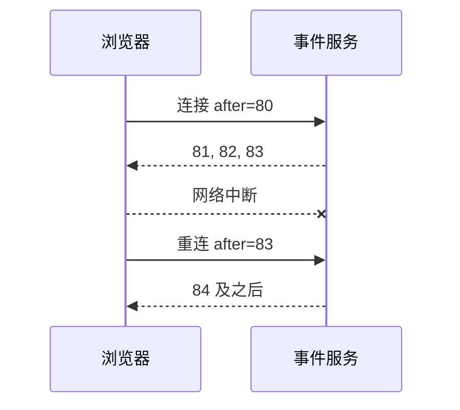

# SSE 与 WebSocket 实时通信

页面要展示后台任务进度，数据主要从服务端流向浏览器。此时 SSE 通常比 WebSocket 简单：它沿用 HTTP，以文本事件发送，并支持事件 ID 与自动重连。只有客户端也需要持续高频发送时，才需要全双工 WebSocket。

本篇先连接一条 SSE，保存最后应用的序号，断线后继续。然后说明慢消费者、页面卸载与多 Tab 应怎样处理。

## 先按方向选择协议

| 需求 | 首选 |
| --- | --- |
| 任务进度、通知、生成文本 | SSE |
| 高频双向协作或二进制 | WebSocket |
| 低频状态、兼容兜底 | 条件轮询 |



连接只负责传输，任务状态和事件序列保存在服务端。连接关闭不等于任务失败。

## 步骤一：只在应用成功后推进游标

事件包含 sequence、eventId、type 与 payload。浏览器解析并成功更新本地状态后，才保存最后 sequence。重复事件按 eventId 或 sequence 忽略，发现缺口则暂停应用并请求重放。

下面是最小 EventSource 示例。输入是任务事件 URL，输出是按序更新的状态；cleanup 关闭连接，避免组件卸载后继续接收。

```ts
export function subscribeTask(
  url: string,
  apply: (event: TaskEvent) => void
) {
  const source = new EventSource(url, { withCredentials: true })

  source.onmessage = (message) => {
    const event = TaskEventSchema.parse(JSON.parse(message.data))
    apply(event)
    sessionStorage.setItem(`task:${event.taskId}:cursor`, String(event.sequence))
  }

  source.onerror = () => {
    // EventSource 会按服务器 retry 提示或默认策略重连。
  }

  return () => source.close()
}
```

代码使用运行时 Schema 校验不可信事件。执行顺序是创建 `EventSource`，收到消息后先解析和校验，再调用 `apply` 更新页面，只有更新成功才写入 `sessionStorage` 游标，组件销毁时执行返回的 cleanup。输入是事件 URL 和状态更新函数，输出是一个关闭连接的函数；JSON 解析失败、Schema 不匹配或 `apply` 抛错时都不能推进游标。真实实现还要把保存的游标送回服务端；原生 EventSource 会发送最近收到的 `Last-Event-ID`，自定义 fetch 流则显式构造查询或请求头。

## 步骤二：处理快照和游标过期

首次进入页面先获取任务快照及 sequence，再订阅后续事件。若游标早于服务端保留窗口，接口明确返回 cursor expired，页面重新获取快照。悄悄跳到最新会漏掉不可合并状态。

终态到达后关闭连接。页面隐藏时是否保持连接取决于业务：短任务可以继续，长时间后台页可以关闭并在恢复时用快照重连。多 Tab 可以各自连接，也可以通过 BroadcastChannel 共享，但共享方案要处理 leader 退出与权限变化。

## 步骤三：客户端也有背压

生成文本事件太密时，逐条触发 React/Vue 渲染会卡住主线程。接收层先合并可合并增量，再按动画帧或固定小批更新 UI；终态与错误立即处理。浏览器 WebSocket 的 `bufferedAmount` 只能反映发送缓冲，不能证明对端已经应用消息。

重连使用指数退避与抖动，服务端给 Retry-After 时仍限制上限。网络恢复后不要让所有 Tab 同时冲击接口。

## WebSocket 多了哪些工作

WebSocket 需要应用消息协议、ACK、顺序、重放、心跳、入站限速和消息大小。握手时认证不代表每条写命令都有权限，服务端仍按当前用户与对象授权。页面发送队列有上限，断线时明确哪些命令可重试。

| 场景 | 预期 |
| --- | --- |
| SSE 正常连接 | 事件按 sequence 应用 |
| 网络中断 | 从最后成功游标补齐 |
| 重复事件 | 不重复改变 UI |
| 游标过期 | 获取新快照 |
| 组件卸载 | 连接与 Timer 清理 |
| 高频增量 | 批量渲染，主线程保持响应 |
| 权限撤销 | 停止接收并清理本地敏感状态 |

浏览器测试应穿过真实 Nginx/CDN，检查首事件延迟和缓冲，并模拟睡眠唤醒、离线、切流和后台 Tab。localhost 能工作不能证明代理链正确。

## 做一次断线、重复和慢消费实验

让测试服务每 200ms 发送递增序号事件，客户端成功应用事件后才保存游标。收到第 5 条后主动断网，服务端继续产生到第 9 条；恢复网络后从游标 5 回放 6–9，并故意重复发送第 8 条。

| 观察 | 正确行为 |
| --- | --- |
| 断线 | UI 保留最后已确认状态，不宣告任务失败 |
| 重连 | 使用最后成功游标补齐缺口 |
| 重复事件 | 按任务 ID + 序号去重 |
| 游标过期 | 获取最新快照，再建立新游标 |
| 高频文本增量 | 接收层合并后批量渲染 |
| 终态 | 立即应用并关闭连接 |

SSE 测试要经过真实 Nginx/CDN，记录首事件和分段到达时间，防止代理缓冲。WebSocket 场景再增加心跳、应用 ACK、入站限速、消息大小和发送缓冲测试。协议连接成功不代表消息业务成功，每条命令仍要认证、授权与幂等。

页面隐藏、系统睡眠和多 Tab 会改变连接生命周期。产品可以选择后台保持、关闭后恢复或共享连接，但要明确 leader 退出和权限撤销时怎样清理。先保证状态可重建，再追求连接永不断开。
