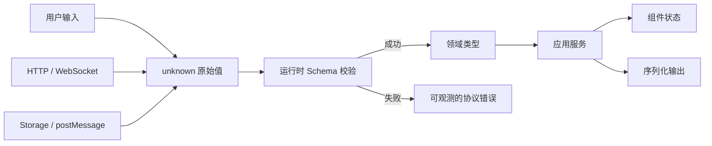

# TypeScript 工程实践

TypeScript 最容易被低估的地方，是把它理解成“给 JavaScript 变量补类型”。在真实工程中，类型系统真正有价值的对象不是某个局部变量，而是**模块之间的契约、状态能够到达的范围，以及一次变更会影响哪些消费者**。如果接口响应在入口处被 `as User` 强行断言、组件内部依然由五个布尔值拼状态、公共包随意导出内部类型，即使项目开启了 `strict`，它也只是拥有一层很薄的类型外观。

本文不罗列 `string`、`interface`、`Partial` 的语法，而是从边界、不变量、类型推导、编译配置、包发布与回归验证出发，建立一套能随系统规模增长的 TypeScript 方法。核心判断只有三个：

1. 哪些事实只存在于编译期，哪些值必须在运行时重新证明；
2. 哪些非法状态应该变得无法表示，哪些错误只能显式建模；
3. 一个类型是在减少调用者认知成本，还是把实现复杂度转嫁给调用者。

## 类型系统能保证什么

TypeScript 对 JavaScript 做静态分析，类型在发出 JavaScript 后通常被擦除。它可以证明“基于当前声明，这段代码没有检测到类型矛盾”，却不能证明网络响应可信、存储数据没有过期、对象没有被另一段 JavaScript 修改，也不能自动证明业务规则成立。



因此，类型可信度沿数据流并不相同：

| 区域 | 初始可信度 | 主要手段 | 不应该做的事 |
| --- | --- | --- | --- |
| 网络、URL、表单、存储 | 不可信 | `unknown`、Schema、长度与权限校验 | 直接 `as DomainModel` |
| 应用服务内部 | 已校验但可能失败 | 可辨识联合、不可变值、穷尽检查 | 用异常字符串代替错误协议 |
| 组件 Props 与事件 | 模块契约 | 窄接口、受控状态、泛型约束 | 暴露整个 Store 或后端 DTO |
| 公共包导出 | 跨版本契约 | `exports`、声明测试、SemVer | 导出实现路径和内部辅助类型 |
| 第三方声明 | 外部假设 | 锁版本、契约测试、局部适配器 | 全局补一个宽泛 `any` |

TypeScript 还存在刻意保留的非完全可靠边界。例如数组索引默认可能被推断为确定值；函数参数兼容性要兼顾 JavaScript 生态；类型断言允许开发者覆盖推断；结构类型让具有相同形状的对象兼容。这些不是“编译器失效”，而是工程师必须知道自己在哪些地方承担了证明责任。

## 边界一律从 unknown 开始

`response.json()`、`JSON.parse()`、`postMessage`、浏览器扩展消息和本地存储都不能因为调用者写了泛型就变得可信。下面这种客户端只制造了静态幻觉：

```ts
async function unsafeGet<T>(url: string): Promise<T> {
  const response = await fetch(url)
  return response.json() as Promise<T>
}

const record = await unsafeGet<DocumentRecord>('/api/records/1')
// 服务端即使返回 { status: null }，这里仍被当作 DocumentRecord。
```

更可靠的接口把“如何验证输出”作为端点契约的一部分。示例使用通用 Schema 接口，不绑定某一个校验库：

```ts
interface Schema<T> {
  parse(input: unknown): T
}

type HttpError =
  | { kind: 'network'; cause: unknown }
  | { kind: 'http'; status: number; requestId?: string }
  | { kind: 'protocol'; issues: readonly string[] }

type Result<T, E> =
  | { ok: true; value: T }
  | { ok: false; error: E }

async function request<T>(
  input: RequestInfo,
  schema: Schema<T>,
  init: RequestInit & { signal: AbortSignal }
): Promise<Result<T, HttpError>> {
  let response: Response
  try {
    response = await fetch(input, init)
  } catch (cause) {
    return { ok: false, error: { kind: 'network', cause } }
  }

  if (!response.ok) {
    return {
      ok: false,
      error: {
        kind: 'http',
        status: response.status,
        requestId: response.headers.get('x-request-id') ?? undefined
      }
    }
  }

  try {
    return { ok: true, value: schema.parse(await response.json()) }
  } catch (cause) {
    return {
      ok: false,
      error: {
        kind: 'protocol',
        issues: cause instanceof Error ? [cause.message] : ['unknown schema error']
      }
    }
  }
}
```

这里有几个重要区别：泛型 `T` 由 Schema 推导，不由调用者随意宣称；网络错误、HTTP 非成功状态和协议错误不会混成一个 `Error`；取消信号是必需参数，调用者不能忘记生命周期；错误中只保留可公开诊断信息，不能把响应正文、Token 或个人数据塞进日志。

如果前后端共享 Schema，需要共享的是稳定协议，而不是让前端直接依赖后端 ORM 实体。数据库的可空列、内部审计字段和关联对象不等于公开 DTO。更稳妥的流向是：服务端领域对象转换成版本化协议，客户端验证协议后再转换为页面所需模型。

## 让非法状态无法表示

类型设计最直接的收益，是消灭布尔值组合产生的无效状态。假设一个上传界面拥有 `loading`、`success`、`error`、`paused` 四个布尔值，理论组合有 16 种，其中大多数没有业务含义。可辨识联合将状态和值绑定：

```ts
type UploadState =
  | { status: 'idle' }
  | { status: 'hashing'; progress: number }
  | { status: 'uploading'; uploadId: string; uploaded: number; total: number }
  | { status: 'paused'; uploadId: string; uploaded: number; total: number }
  | { status: 'processing'; taskId: string }
  | { status: 'completed'; recordId: string }
  | { status: 'failed'; stage: 'hash' | 'upload' | 'process'; retryable: boolean }

type UploadEvent =
  | { type: 'HASHED'; uploadId: string; total: number }
  | { type: 'PART_ACCEPTED'; uploaded: number }
  | { type: 'UPLOAD_COMMITTED'; taskId: string }
  | { type: 'PROCESS_SUCCEEDED'; recordId: string }
  | { type: 'FAILED'; stage: 'hash' | 'upload' | 'process'; retryable: boolean }

function assertNever(value: never): never {
  throw new Error(`Unhandled variant: ${JSON.stringify(value)}`)
}

function transition(state: UploadState, event: UploadEvent): UploadState {
  switch (event.type) {
    case 'HASHED':
      if (state.status !== 'hashing') return state
      return { status: 'uploading', uploadId: event.uploadId, uploaded: 0, total: event.total }
    case 'PART_ACCEPTED':
      if (state.status !== 'uploading') return state
      return { ...state, uploaded: Math.min(event.uploaded, state.total) }
    case 'UPLOAD_COMMITTED':
      if (state.status !== 'uploading') return state
      return { status: 'processing', taskId: event.taskId }
    case 'PROCESS_SUCCEEDED':
      if (state.status !== 'processing') return state
      return { status: 'completed', recordId: event.recordId }
    case 'FAILED':
      return { status: 'failed', stage: event.stage, retryable: event.retryable }
    default:
      return assertNever(event)
  }
}
```

联合类型不是状态机的全部。运行时仍要拒绝不合法转换，服务端仍是持久事实来源，恢复时仍需查询快照。但它让组件无法在 `completed` 状态读取不存在的 `uploadId`，新增事件时也会推动所有穷尽分支一起更新。

同样的方法适用于权限结果、异步任务、表单提交和 Agent 工具执行。不要用 `{ allowed: boolean; reason?: string; scope?: Scope }` 表示所有情况，而应区分允许、拒绝、需要二次认证和策略不可用。调用者才能被迫处理每种安全含义。

## 类型收窄是一段证明过程

`typeof`、`in`、`instanceof` 和用户定义类型守卫都在建立证明，但守卫本身也可能写错。一个返回 `value is User` 的函数如果只检查 `id`，编译器会相信开发者的承诺。因此复杂外部对象仍应由 Schema 解析，类型守卫更适合内部小联合。

```ts
type Message =
  | { type: 'progress'; sequence: number; percent: number }
  | { type: 'completed'; sequence: number; recordId: string }

function isKnownMessage(value: unknown): value is Message {
  if (typeof value !== 'object' || value === null) return false
  const input = value as Record<string, unknown>

  if (input.type === 'progress') {
    return Number.isInteger(input.sequence) &&
      typeof input.percent === 'number' &&
      input.percent >= 0 && input.percent <= 100
  }
  if (input.type === 'completed') {
    return Number.isInteger(input.sequence) && typeof input.recordId === 'string'
  }
  return false
}
```

这里仍有一个取舍：手写守卫和类型声明可能漂移。协议复杂后，优先从单一 Schema 推导静态类型，或从正式 API Schema 生成客户端并在入口校验。生成代码也不是绝对真相，CI 需要验证生成结果没有漂移，服务端兼容策略需要覆盖旧客户端。

## 泛型表达关系，不负责制造抽象感

泛型最重要的判断是“类型参数在不同位置之间建立了什么关系”。如果 `T` 只出现一次，调用者填什么就返回什么，这通常只是类型断言的另一种写法。

```ts
// T 只出现在返回值，调用者可以谎报类型。
declare function parse<T>(text: string): T

// K 同时约束 key 和返回值，表达了真实关系。
function getProperty<T extends object, K extends keyof T>(
  object: T,
  key: K
): T[K] {
  return object[key]
}
```

高级类型也必须服务于具体契约。下面的端点表把路径、方法、请求和响应关联起来，调用者不能把创建参数传给查询端点：

```ts
interface EndpointSpec<
  TMethod extends 'GET' | 'POST',
  TRequest,
  TResponse
> {
  method: TMethod
  request: TRequest
  response: Schema<TResponse>
}

type EndpointMap = {
  getRecord: EndpointSpec<'GET', { id: string }, DocumentRecord>
  createRecord: EndpointSpec<'POST', { title: string; content: string }, DocumentRecord>
}

type RequestOf<K extends keyof EndpointMap> = EndpointMap[K]['request']
type ResponseOf<K extends keyof EndpointMap> =
  EndpointMap[K] extends EndpointSpec<string & ('GET' | 'POST'), unknown, infer R>
    ? R
    : never

async function callEndpoint<K extends keyof EndpointMap>(
  name: K,
  input: RequestOf<K>,
  signal: AbortSignal
): Promise<ResponseOf<K>> {
  // 运行时实现仍要从受控注册表读取 method、path 和 schema。
  throw new Error(`adapter not configured: ${String(name)} / ${signal.aborted}`)
}
```

这类封装需要保持可读。如果错误信息展开成数百行条件类型、编辑器每次输入都要计算深层递归、只有类型作者能修改，那么抽象已经超过收益。通常可以用命名中间类型、限制递归深度、在公共边界输出较简单类型来改善。

### 条件类型的分布行为

条件类型遇到裸类型参数时会对联合成员分布：

```ts
type ToArray<T> = T extends unknown ? T[] : never
type Distributed = ToArray<string | number> // string[] | number[]

type ToArrayTogether<T> = [T] extends [unknown] ? T[] : never
type Together = ToArrayTogether<string | number> // (string | number)[]
```

这不是语法冷知识。权限动作、事件类型和 API 联合在经过工具类型时，是否分布会直接改变契约。类型工具需要用类型测试固定预期，而不能依赖作者记忆。

### 映射类型要区分“缺少”和 undefined

`prop?: T` 表示属性可以不存在，它和 `prop: T | undefined` 的对象形状并不完全相同。开启 `exactOptionalPropertyTypes` 后，除非 `T` 明确包含 `undefined`，不能把 `{ prop: undefined }` 当成缺少属性。这对 PATCH 协议尤其重要：缺少可能表示“不修改”，`null` 可能表示“清空”，`undefined` 通常不应该出现在 JSON 中。

```ts
type RecordPatch = {
  title?: string
  summary?: string | null
}

function applyPatch(current: DocumentRecord, patch: RecordPatch): DocumentRecord {
  return {
    ...current,
    ...(Object.hasOwn(patch, 'title') ? { title: patch.title! } : {}),
    ...(Object.hasOwn(patch, 'summary') ? { summary: patch.summary ?? undefined } : {})
  }
}
```

示例中的非空断言只发生在已经用 `Object.hasOwn` 证明属性存在之后。更复杂的 PATCH 应由 Schema 精确区分缺失、空值和非法值，并由服务端再次验证业务规则。

## interface、type 与开放世界

`interface` 和对象形状的 `type` 大部分时候都能互换。工程选择不应简化成“对象永远 interface，其他永远 type”。更有用的区别是：接口支持声明合并，适合确实需要扩展的公共能力；类型别名适合联合、元组、映射和封闭组合。

声明合并也是风险。一个跨包可随意增补的全局接口会形成开放世界，所有消费者的类型可能因引入顺序而改变。插件系统若需要扩展，应提供明确注册点和命名空间，并验证运行时插件确实存在，不能只有类型层完成“注册”。领域状态通常更适合封闭联合，以便穷尽检查。

## 方差与回调边界

当类型参数出现在输出位置，它倾向协变；出现在输入位置，它倾向逆变。不了解方差，事件系统和组件回调很容易接受一个只能处理窄类型的函数，然后在运行时传入更宽的事件。

```ts
type Handler<T> = (value: T) => void

interface BaseEvent { id: string }
interface DetailedEvent extends BaseEvent { detail: string }

const detailedOnly: Handler<DetailedEvent> = (event) => {
  console.log(event.detail.toUpperCase())
}

function emitBase(handler: Handler<BaseEvent>): void {
  handler({ id: 'event-1' })
}

// strictFunctionTypes 下不应允许：emitBase(detailedOnly)
```

公共事件 API 应明确“生产什么、消费什么”，避免为了兼容把回调定义成双变或 `Function`。类方法和某些框架声明可能有兼容性例外，关键边界用类型测试和运行时测试双重约束。

## 类型不等于不可变

`readonly` 主要约束通过当前引用进行的编译期写入，不会冻结运行时对象，也通常只是浅层约束。`Readonly<T>` 不能阻止其他可写引用修改同一对象，`as const` 也不会把远程数据变可信。

对配置快照、状态机事件等值，可以在边界复制并使用只读类型；需要运行时防御时使用受控构造器或 `Object.freeze`，同时评估深冻结成本。领域不变量更适合隐藏构造过程：

```ts
declare const normalizedIdBrand: unique symbol
type NormalizedId = string & { readonly [normalizedIdBrand]: true }

function parseNormalizedId(input: string): Result<NormalizedId, 'invalid-id'> {
  const value = input.trim().toLowerCase()
  return /^[a-z0-9-]{3,64}$/.test(value)
    ? { ok: true, value: value as NormalizedId }
    : { ok: false, error: 'invalid-id' }
}
```

品牌类型的断言被限制在验证函数内部，外部不能把任意字符串自然赋给 `NormalizedId`。它仍不是安全边界：JavaScript 调用者和强制断言能够绕过，因此数据库唯一性、权限与协议校验仍要存在。

## 错误应该有稳定语义

前端常见的 `catch (error) { toast(error.message) }` 同时破坏类型、安全和用户体验。开启 `useUnknownInCatchVariables` 后，捕获值应先收窄。基础设施错误转换成稳定的应用错误，UI 再根据错误种类决定重试、登录、刷新或联系支持。

```ts
type AppError =
  | { kind: 'cancelled' }
  | { kind: 'unauthenticated' }
  | { kind: 'forbidden'; action: string }
  | { kind: 'conflict'; currentVersion: string }
  | { kind: 'unavailable'; retryAfterMs?: number }
  | { kind: 'unexpected'; incidentId: string }

function messageFor(error: AppError): string {
  switch (error.kind) {
    case 'cancelled': return '操作已取消'
    case 'unauthenticated': return '登录状态已失效'
    case 'forbidden': return `无权执行：${error.action}`
    case 'conflict': return `数据已更新，请刷新后重试（${error.currentVersion}）`
    case 'unavailable': return '服务暂时不可用'
    case 'unexpected': return `发生未预期错误，编号：${error.incidentId}`
    default: return assertNever(error)
  }
}
```

服务端原始错误不能直接展示；错误码也不能被前端当授权判定。类型化错误的作用是让恢复策略一致，并让监控可以按稳定分类聚合。

## 组件类型应约束交互协议

一个组件库如果把 Props 写成几十个互相冲突的可选项，类型只是在记录复杂度。以按钮为例，链接和提交动作的语义不同，应由联合类型阻止同时传 `href` 与 `onSubmit`：

```ts
type CommonButtonProps = {
  label: string
  disabled?: boolean
}

type ActionButtonProps = CommonButtonProps & {
  kind: 'action'
  onPress: () => void
  href?: never
}

type LinkButtonProps = CommonButtonProps & {
  kind: 'link'
  href: string
  onPress?: never
}

type ButtonProps = ActionButtonProps | LinkButtonProps
```

类型不能替代语义 HTML 和可访问性：真正的链接仍应渲染 `<a>`，提交动作使用 `<button>`，键盘和焦点行为需要浏览器验证。组件类型要描述调用者能够依赖的行为，而不是暴露内部状态管理器、DOM 节点层级或样式实现。

React、Vue 等框架中的泛型组件还要考虑 JSX/模板推断能力。一个理论上精确但调用处必须写四个显式类型参数的组件，开发体验通常比几个职责清楚的窄组件更差。

## 包边界与声明产物

源码能通过类型检查，不代表发布包可用。组件库或工具包至少需要验证：

- `package.json` 的 `exports`、`types` 和实际文件一致；
- ESM/CJS 策略与支持的运行环境一致，不出现双包状态分裂；
- `.d.ts` 没有引用仓库内部别名、测试类型或未发布文件；
- Peer Dependency 不被错误打入包内，也不过度限制宿主版本；
- 每个公开子路径都从安装后的临时消费项目验证；
- `sideEffects` 只在能够证明时声明，样式注册等副作用不能被摇掉。

```json
{
  "name": "@example/ui",
  "type": "module",
  "exports": {
    ".": {
      "types": "./dist/index.d.ts",
      "import": "./dist/index.js"
    },
    "./button": {
      "types": "./dist/button.d.ts",
      "import": "./dist/button.js"
    }
  },
  "files": ["dist"]
}
```

不要让消费者从 `@example/ui/src/internal/theme-store` 导入。内部路径一旦被使用就形成事实 API，后续重构会变成破坏性变更。可以用 lint 规则、`exports` 封锁和 API Extractor 一类声明快照工具共同治理。

## tsconfig 是风险策略，不是复制模板

推荐从 `strict` 建立基线，再根据风险启用更严格选项：

| 选项 | 暴露的问题 | 迁移注意 |
| --- | --- | --- |
| `noUncheckedIndexedAccess` | 数组、字典索引可能不存在 | 热点代码用边界检查或非空数据结构，不要遍地 `!` |
| `exactOptionalPropertyTypes` | 缺少属性与显式 `undefined` 混淆 | 先梳理 PATCH、表单和序列化语义 |
| `useUnknownInCatchVariables` | 捕获值未必是 `Error` | 建立统一错误归一化函数 |
| `noImplicitOverride` | 子类覆写因基类变化而漂移 | 公共类层次收益较高，组合通常更简单 |
| `noFallthroughCasesInSwitch` | `switch` 意外贯穿 | 状态机和协议解析应开启 |
| `verbatimModuleSyntax` | 类型导入与运行时导入混淆 | 配合真实模块输出策略迁移 |
| `noEmit` | 类型检查与构建器职责分离 | 应用交给 Vite 等构建，库另有声明产物流程 |

一个适合现代应用的核心片段可能是：

```json
{
  "compilerOptions": {
    "strict": true,
    "noUncheckedIndexedAccess": true,
    "exactOptionalPropertyTypes": true,
    "useUnknownInCatchVariables": true,
    "noImplicitOverride": true,
    "noFallthroughCasesInSwitch": true,
    "verbatimModuleSyntax": true,
    "isolatedModules": true,
    "noEmit": true
  }
}
```

`skipLibCheck` 能缩短检查并绕过第三方声明冲突，但也可能隐藏依赖间不兼容。应用可以基于性能权衡开启，公共库或升级验证任务可增加一条关闭它的检查。不要为了“全绿”长期保留大面积 `any`、`@ts-ignore` 或空声明模块；抑制项需要原因、负责人和清理期限。

### monorepo 与 Project References

大型仓库如果把所有源码放进一个无边界 `tsconfig`，任何修改都可能触发全局检查，循环依赖也更难识别。Project References 可以让包拥有明确输入输出和增量边界，但前提是包边界真实存在。不能为了加速随意拆出几十个互相穿透的包。

路径别名只影响编译器解析，不会自动让 Node、测试器和打包器理解同一规则。每个运行环境都复制一份别名配置会漂移；更稳妥的是使用正式包名和 `exports`，应用内部少量别名则由单一配置生成或在 CI 中验证一致性。

## 类型性能也是工程指标

类型级递归、巨大联合、层层交叉和自动生成的超大声明会拖慢编辑器与 CI。诊断不能凭感觉：记录 `tsc --extendedDiagnostics` 的总时间、实例化数量、内存和最慢包；用 trace 定位异常类型；比较变更前后，而不是把所有慢归因于 TypeScript。

常见改进包括：

- 为复杂条件类型命名并缩短重复实例化链；
- 避免对巨大联合反复做分布式条件类型；
- 公共 API 输出稳定、较简单的类型，复杂推导留在实现内部；
- 生成客户端按领域或端点拆分，不把整份 Schema 合成一个类型；
- 使用增量构建和真实项目引用，避免无边界全仓检查；
- 升级 TypeScript 后用同一基准重新测量，不用旧版本经验下结论。

类型精度不是越高越好。把任意 URL 字符串解析成所有合法路由参数的递归模板类型，可能只为极少量错误付出全仓编辑延迟。类型系统应承担高频、高损失且能稳定表达的约束；动态权限、外部数据和复杂业务规则仍交给运行时。

## 从 JavaScript 或宽松 TS 渐进迁移

一次性打开全部严格选项，随后用数千个断言压平错误，会把技术债从“显式红线”变成“隐形承诺”。更可靠的迁移顺序是：

1. 盘点入口：HTTP、Storage、消息、全局变量和第三方 SDK；
2. 用 `unknown` 与 Schema 封住新数据流，阻止新的 `any` 扩散；
3. 为核心状态建立联合与稳定错误模型；
4. 按目录提高严格度，每批清理真实问题并增加回归测试；
5. 统计 `any`、断言和抑制注释，门禁只允许数量下降；
6. 最后收紧索引访问、可选属性与模块语义等高影响选项。

迁移指标不是“类型错误从 5000 变 0”这一条。还要观察运行时协议错误是否被更早发现、变更影响面是否更清楚、编辑器性能是否可接受、抑制项是否减少，以及发布声明是否真实可消费。

## 测试类型契约

运行时测试证明代码行为，类型测试证明哪些调用应该被允许或拒绝。两者不能互相替代。

```ts
declare const controller: AbortController

callEndpoint('getRecord', { id: 'r-1' }, controller.signal)

// @ts-expect-error getRecord 不接受 title
callEndpoint('getRecord', { title: 'wrong input' }, controller.signal)

// @ts-expect-error createRecord 需要 content
callEndpoint('createRecord', { title: 'missing content' }, controller.signal)
```

`@ts-expect-error` 比 `@ts-ignore` 更适合负例：如果将来这行不再报错，编译器会提示预期错误消失。公共库还可以使用 `tsd`、Vitest 的类型断言或声明快照。注意不要只在源码仓库测，应对打包后的 `.d.ts` 和实际 `exports` 建立消费测试。

## 验证与故障演练

一篇类型设计不能靠“IDE 没红线”验收。建议为关键边界建立以下验证矩阵：

| 场景 | 静态验证 | 运行时验证 | 期望 |
| --- | --- | --- | --- |
| API 少字段、错枚举 | Schema 推导类型 | Mock 返回畸形 JSON | 进入 `protocol` 错误，不渲染半可信数据 |
| 新增状态分支 | `never` 穷尽检查 | 状态迁移测试 | 所有消费者在编译期暴露遗漏 |
| 数组越界 | `noUncheckedIndexedAccess` | 空集合与最后一项用例 | 不用无依据非空断言 |
| 包子路径遗漏 | 临时消费项目类型检查 | 从安装包实际 import | `exports` 与 `.d.ts` 一致 |
| 第三方声明升级 | 锁文件差异与类型检查 | 关键适配器契约测试 | 不通过全局 `any` 掩盖冲突 |
| 取消和竞态 | Signal 为契约参数 | 快速切换路由、旧请求后返回 | 旧结果不覆盖新状态 |

对关键 Schema 做 mutation test 很有效：删除必需字段、改变枚举、插入超长字符串和额外敏感字段，确认解析失败且日志已脱敏。对公共类型则故意放宽一个约束，例如让链接按钮接受 `onPress`，确认负类型测试会失败。

CI 至少分开执行：应用类型检查、运行时单元测试、生产构建、公开包声明生成、安装后消费测试。它们失败的含义不同，不应只用一次 `vite build` 代替所有类型保证。

## 常见误区与判断

**“有泛型就是类型安全的 API 客户端”**：泛型如果只由调用者填写，不能验证响应；必须绑定运行时 Schema 或可信代码生成契约。

**“`as` 是类型转换”**：断言不改变运行时值。真正转换要执行解析、规范化并处理失败。

**“`any` 只影响这一行”**：`any` 会沿属性访问、函数返回和泛型推导传播，污染远大于局部。未知值优先用 `unknown`。

**“DeepReadonly 就能递归保护所有对象”**：函数、Map、Set、Date、Promise、循环结构与类实例都有特殊语义；一个三行递归工具类型通常不等于运行时不可变。

**“枚举一定比联合常量好”**：传统 `enum` 可能产生运行时代码并有反向映射等语义。很多协议更适合 `as const` 对象或字符串联合；需要命名空间和运行时对象时再评估 enum。

**“类型越复杂，封装越高级”**：公共类型的评价标准是正确、稳定、可理解、推导快，并让错误信息能指导调用者，而不是用了多少 `infer`。

**“编译通过等于向后兼容”**：运行时协议、声明产物、模块格式、默认值、CSS 和 DOM 行为都可能破坏消费者。兼容性必须从安装后的真实使用验证。

## 源码与规范

- [TypeScript Handbook: Types from Types](https://www.typescriptlang.org/docs/handbook/2/types-from-types.html)：泛型、条件类型、映射类型和索引访问类型。
- [TypeScript tsconfig](https://www.typescriptlang.org/tsconfig/)：严格模式、模块解析和编译边界的现行选项。
- [Zod](https://zod.dev/)：运行时 Schema 校验与静态类型推导的公开实现参考。
- 个人实验材料已匿名化；本文只抽取通用机制，不建立项目映射。
