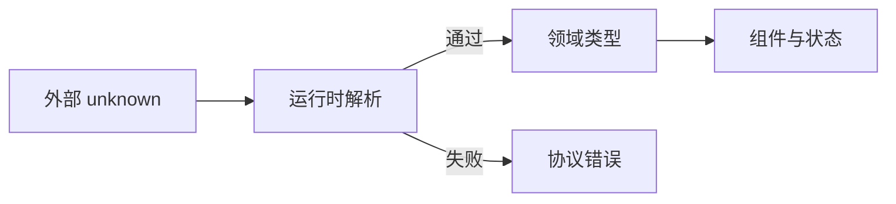

# TypeScript 类型系统、配置与运行时边界

TypeScript 是带静态类型检查的 JavaScript 开发语言。它位于源码与 JavaScript 运行时之间：编译器在构建前检查赋值、调用和控制流，浏览器或 Node 最终执行的仍是 JavaScript。它能提前发现代码内部的类型矛盾，却不会自动验证接口、本地存储或 `postMessage` 送来的数据。

接口声明 `status: 'draft' | 'published'`，线上却返回 `null`，就是这条边界最常见的表现。项目可以顺利通过 TypeScript 编译，页面仍然会崩溃。要让类型真正服务于工程，需要同时管理静态模型、外部数据校验和编译配置。

## 类型在编译后去了哪里

TypeScript 接受 JavaScript 加类型语法，完成检查后通常擦除类型，输出 JavaScript。`type`、`interface`、泛型参数和大多数断言不会成为运行时校验。`as User` 只改变编译器看法，不读取字段，也不会补全数据。

因此系统存在两条边界：内部代码通过静态类型防止不一致；网络、本地存储、URL、postMessage 和第三方 SDK 以 `unknown` 接收，经运行时 Schema 或守卫验证后才进入领域类型。



## 基础类型不是 Java 类型翻译表

`string、number、boolean、bigint、symbol、null、undefined` 对应运行时值类别；对象、数组、元组和函数描述结构。字面量类型表达精确值，联合类型表达多个可能状态，交叉类型组合同时满足的结构。

`any` 关闭检查并向外传播，不应作为“还不知道”；`unknown` 要求先收窄；`never` 表示不可能出现的值或不返回的分支；`void` 表示调用方不使用返回值，不等于函数不能返回任何内容。

枚举会生成运行时代码，字面量联合常更轻且容易与 JSON 对齐；需要反向映射或稳定运行时对象时再明确选择 enum。元组表达固定位置协议，普通数组表达同类集合。`readonly` 是静态写入限制，不会自动深冻结运行时对象。

## 从 unknown 建立信任

下面的守卫先确认对象，再逐字段检查。输入是未知 JSON，输出要么成为可信 Article，要么得到明确协议错误。

```ts
type Article = {
  id: string
  title: string
  status: 'draft' | 'published'
}

function isArticle(value: unknown): value is Article {
  if (typeof value !== 'object' || value === null) return false
  const record = value as Record<string, unknown>
  return typeof record.id === 'string'
    && typeof record.title === 'string'
    && (record.status === 'draft' || record.status === 'published')
}

async function loadArticle(id: string): Promise<Article> {
  const response = await fetch(`/api/articles/${encodeURIComponent(id)}`)
  if (!response.ok) throw new Error(`http_${response.status}`)
  const body: unknown = await response.json()
  if (!isArticle(body)) throw new Error('invalid_article_response')
  return body
}
```

loadArticle 的输入是业务 id，执行顺序是编码 URL、检查 HTTP、把响应保持为 unknown、调用守卫，再输出 Article。非成功状态和字段异常分别产生可判断错误；守卫只是这份 Schema 的最小实现，嵌套数组、版本字段和未知属性策略还需继续验证。

守卫通过后，控制流把 body 收窄为 Article。大型 Schema 应使用经过验证的库并决定未知字段、默认值、错误路径和版本兼容；静态类型可从 Schema 推导，避免校验规则与 interface 漂移。

## 用联合类型表达状态机

三个布尔值 `loading、success、error` 能组合出业务不允许的状态。可辨识联合把合法状态写成集合，并让 switch 收窄。

```ts
type PageState =
  | { kind: 'loading' }
  | { kind: 'ready'; article: Article }
  | { kind: 'failed'; message: string; retryable: boolean }

function assertNever(value: never): never {
  throw new Error(`unexpected_state: ${JSON.stringify(value)}`)
}
```

PageState 把 loading、ready 和 failed 限制为互斥输入，assertNever 的参数只在编译器认为分支遗漏时可达；运行时若外部脏值进入则抛出异常。完整渲染函数应在 switch 中返回对应 UI，并让新增状态同时触发类型错误和测试更新。

每个分支只暴露自己拥有的字段。新增 `empty` 后，穷尽 switch 会让未处理位置报错。类型系统在这里帮助维护状态转换，而不是给变量添加装饰。

## 严格配置的工程含义

`strict` 是多项严格检查的总开关；`noUncheckedIndexedAccess` 让数组/字典读取包含 undefined；`exactOptionalPropertyTypes` 区分缺失属性和显式 undefined；`useUnknownInCatchVariables` 防止直接假设异常形状。它们会暴露真实边界成本，不应只为“过编译”关闭。

`module/moduleResolution` 必须与实际运行时或 Bundler 对齐。`paths` 主要帮助编译器解析，不会自动改写 Node 或浏览器运行时路径。库项目通常需要 declaration、declarationMap 和稳定 exports；应用可使用 `noEmit` 把输出交给构建工具，但仍要单独执行类型检查。

大型仓库用 Project References 和 `tsc --build` 建立包依赖图与增量产物。每个包只导出公开类型，避免跨目录读取源文件形成隐式耦合。

## 类型安全的失效位置

断言、any、不正确声明文件、未校验 JSON、可变别名和不健全的函数赋值都可能越过检查。TypeScript 追求与 JavaScript 生态兼容，不保证形式化完全健全。资深工程实践不是消灭所有断言，而是把断言收敛到可审查适配层，并用运行时证据支撑。

## 验证链路

为正常和错误 JSON 写运行时测试；用 `tsc --noEmit` 验证非法状态和字段访问确实失败；构建后检查输出不存在类型语法；用 package consumer fixture 验证声明和 exports 能被真实调用方解析。

排查“编辑器不报错但构建报错”时，先比较编辑器 TypeScript 版本、项目 tsconfig、`include/exclude`、`moduleResolution` 和构建命令。类型注解、推断、收窄和断言都发生在静态检查阶段；Schema 校验处理的才是运行时对象。

## 从不可信响应到组件 Props 的完整轨迹

假设 `/orders/:id` 返回 JSON。网络层先得到 `unknown`，Schema 解析器把它转换为 `OrderDTO`；适配层再把时间字符串、金额最小单位和后端枚举转换成领域对象 `Order`；状态层只保存 `Order`，组件 Props 从领域对象派生。任一校验失败都停在边界并返回可展示的错误联合，而不是把半可信对象塞进 Store。

```ts
type LoadOrder =
  | { status: 'ok'; order: Order }
  | { status: 'not-found' }
  | { status: 'invalid-response'; issues: readonly string[] }

async function loadOrder(id: OrderId): Promise<LoadOrder> {
  const raw: unknown = await fetch(`/orders/${id}`).then((response) => response.json())
  const parsed = orderSchema.safeParse(raw)
  if (!parsed.success) return { status: 'invalid-response', issues: formatIssues(parsed.error) }
  return { status: 'ok', order: toOrder(parsed.data) }
}
```

输入是 `unknown`，状态变化是“未验证值 -> DTO -> 领域对象 -> 判别联合”，输出才允许进入 UI。TypeScript 负责证明分支使用正确，Schema 负责证明运行时形状，适配函数负责业务语义；三者缺一都会留下空洞。测试应分别伪造字段缺失、枚举新增、金额溢出和 `404`，并用 `assertNever` 保证新增终态会迫使所有视图更新。

## 用最小项目验证静态边界

文章里的守卫只有在编译器和测试真的执行时才有价值。最小练习可以保持四个文件，不需要先搭一个完整后台：

```text
type-boundary/
├── src/article.ts       # Article、isArticle、loadArticle
├── test/article.test.ts # 正常值、null、缺字段和未知枚举
├── test/type-errors.ts  # 用 @ts-expect-error 固定非法状态
└── tsconfig.json
```

`tsconfig.json` 至少打开 `strict`，并根据项目决定是否启用 `noUncheckedIndexedAccess` 和 `exactOptionalPropertyTypes`。先执行项目锁定版本的 `tsc --noEmit`，再运行测试；不要用全局最新版编译器代替仓库依赖。`type-errors.ts` 中的负向断言同样重要：如果某次类型改动让错误代码不再报错，`@ts-expect-error` 会反过来提示这条约束失效。

Monorepo 再增加一层验证：删除旧产物做冷构建，修改叶子包公开类型后运行 `tsc -b --verbose`，确认受影响节点被重建；最后用消费方 fixture 同时导入 JS 和 `.d.ts`，检查 `exports`、类型声明与运行时代码是否指向同一入口。这样才能区分“编辑器看起来正常”和“发布包真的可用”。

## 官方依据与版本边界

- [TypeScript Handbook: The Basics](https://www.typescriptlang.org/docs/handbook/2/basic-types.html)
- [TypeScript Handbook: Narrowing](https://www.typescriptlang.org/docs/handbook/2/narrowing.html)
- [TSConfig Reference](https://www.typescriptlang.org/tsconfig/)
- [Project References](https://www.typescriptlang.org/docs/handbook/project-references.html)

编译选项、标准装饰器和模块解析策略会随 TypeScript 版本演进。文章中的契约以项目锁定版本和官方发布说明为准；库作者还要在最低支持版本上运行 consumer 测试，不能用本机最新版通过代替兼容性证据。
