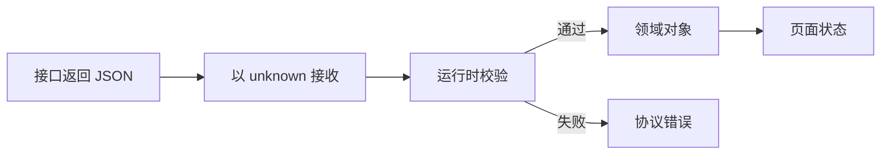

# TypeScript 工程实践

接口文档说 `status` 只有 `draft` 和 `published`，线上却返回了 `null`。代码明明通过 TypeScript 编译，页面为什么仍然报错？

这篇从这个常见问题出发。先弄清 TypeScript 能检查什么，再把外部数据挡在系统边界，最后用类型表示加载、成功和失败状态。读完后，你应该能解释为什么 `as User` 不是校验，也能写出一条从接口响应到页面状态的可信数据流。

## TypeScript 到底帮我们做了什么

JavaScript 在程序运行时才暴露很多错误。TypeScript 会在开发和构建阶段检查类型之间是否矛盾，例如把字符串传给只接收数字的函数。

这里有一个重要前提：TypeScript 检查的是**代码中的声明**。接口响应、地址栏参数和本地存储都来自程序之外，编译器没有亲眼看见它们。程序发到浏览器后，绝大多数类型信息也会被移除。

因此要区分两个动作：

- **静态检查**：编译器根据声明发现代码矛盾；
- **运行时校验**：程序真正读取数据，判断它是否符合规则。

`as User` 只是在告诉编译器“请按 User 看待这个值”，它不会查看值，也不会在运行时补齐字段。

## 先看完整数据流



这条链路里，`unknown` 表示“值已经拿到，但还不知道它是什么”。校验通过后，它才成为业务代码可以使用的对象。校验失败时，页面得到明确错误，不继续带着坏数据运行。

## 第一步：准备一个最小接口场景

假设页面要显示一篇文章，后端约定返回：

```text
输入 URL：/api/articles/42

正常结果：
{ "id": "42", "title": "TypeScript 入门", "status": "published" }

失败样本：
{ "id": 42, "title": "TypeScript 入门", "status": null }
```

失败样本里，`id` 类型错误，`status` 也不是允许值。若直接断言类型，错误会一直传到组件；若在边界校验，问题会停在请求函数附近。

## 第二步：让外部数据从 unknown 开始

下面使用一个很小的类型守卫。类型守卫是返回布尔值的函数；当它返回 `true`，TypeScript 会把参数缩小为指定类型。

```ts
type Article = {
  id: string
  title: string
  status: 'draft' | 'published'
}

function isArticle(value: unknown): value is Article {
  if (typeof value !== 'object' || value === null) return false
  const item = value as Record<string, unknown>

  return typeof item.id === 'string'
    && typeof item.title === 'string'
    && (item.status === 'draft' || item.status === 'published')
}

async function getArticle(id: string): Promise<Article> {
  const response = await fetch(`/api/articles/${id}`)
  if (!response.ok) throw new Error(`http_${response.status}`)

  const data: unknown = await response.json()
  if (!isArticle(data)) throw new Error('invalid_article_response')
  return data
}
```

输入是接口返回的未知值。`isArticle` 依次检查对象、字段类型和状态枚举；通过后，返回值在函数余下位置才是 `Article`。失败样本会得到 `invalid_article_response`，不会进入组件。

真实项目通常使用 Zod、Valibot 或 JSON Schema 等工具，避免手写大量校验。无论选择哪个库，边界原则相同：先把值当作未知数据，再通过一份可执行规则建立信任。

## 第三步：用类型写清页面可能处于什么状态

接口数据可信后，页面仍会经历加载、成功和失败。若把它们写成三个互不相关的布尔值，可能出现 `loading=true` 且 `error` 有值的矛盾组合。

可辨识联合会给每种状态一个共同的标记字段：

```ts
type PageState =
  | { kind: 'loading' }
  | { kind: 'ready'; article: Article }
  | { kind: 'failed'; message: string }

function renderTitle(state: PageState): string {
  switch (state.kind) {
    case 'loading': return '正在加载'
    case 'ready': return state.article.title
    case 'failed': return `加载失败：${state.message}`
  }
}
```

输入是页面当前状态，输出是对应文字。代码先判断 `kind`，编译器随后知道这一分支有哪些字段，所以加载状态无法误读 `article`。新增状态时，配合穷尽检查还能提醒所有使用方一起更新。

## 正常结果与失败结果

| 场景 | 边界结果 | 页面状态 | 用户看到什么 |
| --- | --- | --- | --- |
| HTTP 200 且字段正确 | 得到 `Article` | `ready` | 文章标题 |
| HTTP 404 | `http_404` | `failed` | 资源不存在 |
| HTTP 200 但字段错误 | `invalid_article_response` | `failed` | 数据暂时不可用 |
| 请求尚未结束 | 暂无数据 | `loading` | 正在加载 |

这里故意把“网络失败”和“协议失败”分开。前者说明请求没成功，后者说明请求成功但双方的数据约定不一致，排查责任和修复方式不同。

## 工程变大后再补哪些能力

小页面用类型守卫已经够用。接口增加后，可以继续补四层保护：

1. 由 OpenAPI 或 Schema 生成客户端类型，减少手工漂移；
2. 在所有 HTTP、WebSocket、`postMessage` 和 Storage 边界运行校验；
3. 开启 `strict`，并按项目风险评估 `noUncheckedIndexedAccess`；
4. 给公共包增加类型测试，避免升级时意外改变导出契约。

这些能力不能替代业务测试。类型能约束“状态字段只能取哪些值”，却无法证明“当前用户是否应该看到这篇文章”或“金额计算是否符合业务规则”。

## 容易踩的三个坑

- 用 `as` 消除错误，却没有证明数据可信；
- 为了省事把外部值写成 `any`，导致未知风险扩散到整个调用链；
- 只生成接口类型，不在运行时处理后端版本不一致和脏数据。

下一步可以把同样方法应用到组件 Props、浏览器扩展消息和公共 SDK。先画出数据从哪里进入，再决定哪一层负责校验，TypeScript 才会从“语法提示”变成工程约束。
