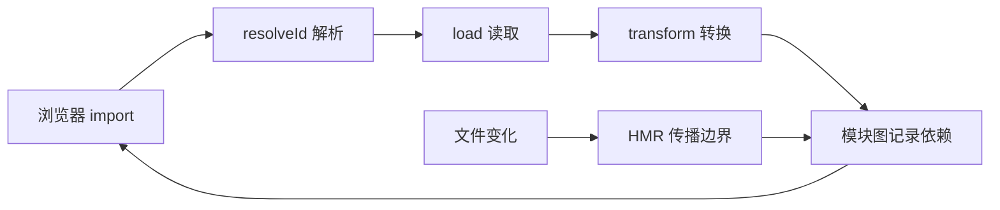

# Vite 开发服务器与插件机制

Vite 开发服务器在开发阶段按浏览器请求读取、转换并返回源码模块；插件通过钩子参与解析、加载、转换或热更新。它们连接项目源码与浏览器的 ESM 请求，既能缩短修改后的反馈时间，也能接入虚拟模块和特殊文件类型。生产打包是另一条流程，不能从开发服务器快直接推断发布产物快。

运行 Vite 后，浏览器打开入口页面，再逐个请求导入的源码模块。修改一个组件时，开发服务器只更新相关模块，不重新打完整 Bundle。这就是 Vite 开发阶段反馈快的基础，但插件、依赖扫描和转换仍会影响启动速度。

一次模块请求会依次经过解析、加载、转换与 HMR。只处理虚拟模块的最小插件可以观察每个钩子的输入输出；生产构建由 Rollup 等构建能力完成，开发服务器行为与生产 Bundle 不能混为一谈。

## 一次源码请求怎样返回浏览器

示例插件只提供内存模块，浏览器请求和构建结果分别验证开发与生产路径。插件钩子第一次出现时会明确输入和输出。



浏览器原生 ESM 负责按 URL 请求模块，Vite 在服务器端改写裸模块导入、转换 TypeScript/Vue/JSX 并维护模块图。源码按访问转换，不表示启动时间与项目规模无关；插件、配置、文件扫描和依赖数量都会产生成本。
## 依赖预构建与缓存

一些依赖以 CommonJS 发布，或内部包含很多小模块。Vite 使用 esbuild 将它们转换成浏览器可消费的 ESM，并把大量请求合并成更稳定的依赖结果。依赖预构建缓存由依赖、锁文件和配置共同决定。

源码频繁变化，按请求转换；依赖相对稳定，预先处理。两类策略不同，解释了冷启动、首次请求和热更新的时间为何不能只看一个数字。
## 插件钩子的执行链路

Vite 插件扩展 Rollup 风格钩子，并增加开发服务器相关能力。常用主线是 `resolveId` 决定模块身份，`load` 提供内容，`transform` 修改已有代码。钩子返回 `null` 表示交给后续插件，不要无条件吞掉所有模块。

下面是根据公开插件 API 编写的虚拟模块。输入 `import 'virtual:build-info'`，输出一个只在内存存在的 ESM。使用 `\0` 前缀标记内部解析 ID，避免与真实 URL 冲突。

```ts
import type { Plugin } from 'vite'

export function buildInfoPlugin(version: string): Plugin {
  const publicId = 'virtual:build-info'
  const internalId = '\0' + publicId

  return {
    name: 'build-info',
    resolveId(id) {
      return id === publicId ? internalId : null
    },
    load(id) {
      if (id !== internalId) return null
      return `export const version = ${JSON.stringify(version)}`
    }
  }
}
```

`JSON.stringify` 避免版本字符串破坏生成代码。插件只处理精确 ID，不读 Secret，也不把本机路径写进浏览器 Bundle。

调用方导入公开 ID 后会得到一个普通 ESM 字符串导出；其他模块 ID 返回 `null`，继续进入后续插件链。这个示例适合构建信息等非敏感常量，不适合把服务端密钥或机器环境原样暴露给浏览器。
## HMR 的更新边界

文件变化后，Vite 沿模块图找到接受 HMR 的边界。Vue SFC、React Fast Refresh 等框架插件会定义组件级更新语义；普通模块可以使用 `import.meta.hot.accept`。无法安全接受时回退到页面刷新。

HMR 保留状态不是正确性保证。模块副作用、全局单例和事件监听需要 dispose 清理，否则每次热更新都会重复注册。生产环境也不会运行 HMR 逻辑。

模块图中的节点不是简单文件路径。Vite 会区分浏览器 URL、解析后的 ID、查询参数和虚拟模块；同一文件的 `?raw`、`?url` 或框架子请求可能对应不同转换结果。插件缓存若只按绝对路径作为 key，会把不同请求错误合并。

HMR 更新先定位变化模块，再沿 importers 向上寻找接受边界。自接受模块可以处理自身更新，依赖接受者可以指定依赖，框架插件还会按组件签名判断能否保留状态。走到入口仍没有边界时，全页刷新是正确性降级，不是 HMR 系统失败。
## 插件顺序与性能诊断

插件有执行顺序和 apply 条件。开发与构建都运行的 transform 应产生等价语义；只适用 serve 或 build 时明确声明。Source Map 在多次转换中继续组合，否则错误位置会偏移。

排查慢启动先观察 debug 日志、插件耗时、依赖优化和模块请求，不先删除缓存宣称解决。插件测试覆盖 resolve、load、transform、Source Map、HMR 和生产构建，必要时使用最小 Fixture。
## 正常结果和失败结果

虚拟模块能在开发与构建中解析；其他 ID 继续交给后续插件；文件变更只更新合法边界；dispose 后没有重复监听。插件生成无效代码、泄露绝对路径或 Source Map 丢失时，测试应失败。

开发服务器的按需模块图与生产构建的 Chunk 图服务于不同阶段，验收插件时必须同时跑 serve 和 build，不能用开发请求正常推断生产产物一定正确。
## 用网络面板观察一次模块请求

建立只有入口、一个本地模块和一个第三方依赖的最小项目。冷启动后记录浏览器实际请求：入口 HTML、`/src/main.ts`、本地依赖以及预构建依赖。第二次启动观察依赖缓存命中，再修改锁文件或优化配置，确认缓存为何失效。

| 观察 | 对应机制 |
| --- | --- |
| 裸导入被改写 | 依赖解析与预构建 |
| 源码首次访问才转换 | 按请求 transform |
| 文件修改只请求更新模块 | 模块图与 HMR 边界 |
| 修改全局副作用后重复监听 | dispose 未清理 |
| 构建能过、开发失败 | serve 专用钩子或插件顺序差异 |

给虚拟模块插件写四个测试：公开 ID 能解析，其他 ID 返回 `null`，load 只接受内部 ID，生成内容对引号和换行安全。再运行一次生产构建，确认虚拟模块也能被 Rollup 阶段解析，Source Map 没有丢失。

遇到启动变慢时开启 Vite debug 信息，比较配置加载、依赖扫描、预构建和首批模块转换。先缩小到具体插件或目录，再修改 include/exclude。删除缓存只能作为验证步骤，若没有解释缓存为什么失效，下一次仍会复发。
## 浏览器一条请求如何变成模块

浏览器请求 `/src/main.ts` 时，Vite 中间件先判断 HTML、裸导入、源码或资产；插件容器按 enforce/order 运行 `resolveId`，再由 `load` 取得内容，`transform` 链逐个返回 code 与 Source Map。返回内容被转换为浏览器可执行 ESM，导入的下一模块继续走同一链路。

```text
GET /src/main.ts -> resolveId -> load(file) -> transform(ts -> js)
  -> import graph URL rewrite -> browser evaluates module
```

裸包依赖通常先被依赖预构建为缓存产物，以统一 CJS/复杂包并减少重复转换；预构建 key 受 lockfile、Vite 版本、配置和环境影响。HMR 通过模块图向上寻找 accept 边界，边界外的副作用可能触发整页刷新。`handleHotUpdate` 返回模块集合不是保证状态可保留的承诺。

开发插件可以使用 `configureServer`、文件监听和虚拟模块，但生产由 Rollup 兼容插件容器构建静态产物；只在 serve 钩子注册的模块可能开发正常、生产找不到。插件应声明 apply 阶段，分别测试 dev/build，并检查 Source Map。
## 官方依据

- [Vite Plugin API](https://vite.dev/guide/api-plugin.html)
- [Vite Dependency Pre-Bundling](https://vite.dev/guide/dep-pre-bundling.html)
- [Vite HMR API](https://vite.dev/guide/api-hmr)
- [Vite Build](https://vite.dev/guide/build)
